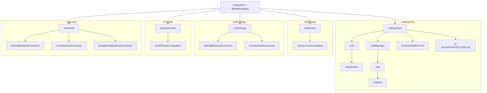

# @webex/calling - AI Documentation Hub

> AI-focused documentation for the `@webex/calling` package to enable LLM agents to effectively understand, modify, and generate calling SDK code.

---

## Package Purpose

`@webex/calling` provides browser-based telephony via the Webex Calling platform:

- Line registration with Mobius signaling backend
- WebRTC call management (dial, answer, hold, transfer, mute, DTMF)
- Call history retrieval and management
- Call settings (forwarding, voicemail configuration)
- Contacts resolution (SCIM, People API)
- Voicemail management (list, playback, delete, transcription)

---

## Technology Stack

| Technology                 | Purpose                                 | Version |
| -------------------------- | --------------------------------------- | ------- |
| TypeScript                 | Language (strict mode)                  | 4.x     |
| xstate                     | Call & ROAP state machines              | 4.30.6  |
| Jest                       | Unit testing (co-located `.test.ts`)    | 29.x    |
| async-mutex                | Serialized registration/call operations | 0.4.0   |
| @webex/internal-media-core | WebRTC media engine                     | 2.22.1  |
| typed-emitter              | Typed event emitters                    | -       |
| uuid                       | Unique ID generation                    | 8.3.2   |

---

## Quick Links

| Resource                | Path                                                                                                   | Purpose                                 |
| ----------------------- | ------------------------------------------------------------------------------------------------------ | --------------------------------------- |
| Root AGENTS.md          | [`../AGENTS.md`](../AGENTS.md)                                                                         | Task routing and critical rules         |
| RULES.md                | [`RULES.md`](RULES.md)                                                                                 | Coding standards and conventions        |
| TypeScript Patterns     | [`patterns/typescript-patterns.md`](patterns/typescript-patterns.md)                                   | Type, interface, and code patterns      |
| Testing Patterns        | [`patterns/testing-patterns.md`](patterns/testing-patterns.md)                                         | Jest test conventions                   |
| Event Patterns          | [`patterns/event-patterns.md`](patterns/event-patterns.md)                                             | Event-driven architecture patterns      |
| Error Handling Patterns | [`patterns/error-handling-patterns.md`](patterns/error-handling-patterns.md)                           | Error handling patterns                 |
| New Module Template     | [`templates/new-module/00-master.md`](templates/new-module/00-master.md)                               | Create new module (planned)             |
| New Method Template     | [`templates/new-method/00-master.md`](templates/new-method/00-master.md)                               | Add method to existing module (planned) |
| Bug Fix Template        | [`templates/existing-module/bug-fix.md`](templates/existing-module/bug-fix.md)                         | Fix bug in existing module (planned)    |
| Feature Enhancement     | [`templates/existing-module/feature-enhancement.md`](templates/existing-module/feature-enhancement.md) | Enhance existing module (planned)       |

---

## For AI Agents

### Starting a Task

Start with the root [`AGENTS.md`](../AGENTS.md) — it contains the full Quick Start Workflow, task classification decision tree, and critical rules. Do not skip to templates directly.

---

## Directory Structure

```
packages/calling/
├── AGENTS.md                  # Main orchestrator (start here — at package root)
└── ai-docs/
    ├── README.md              # This file - navigation hub
    ├── RULES.md               # Coding standards
    ├── patterns/              # Pattern documentation
    │   ├── typescript-patterns.md
    │   ├── testing-patterns.md
    │   ├── event-patterns.md
    │   ├── error-handling-patterns.md
    │   └── architecture-patterns.md
    └── templates/             # Code generation templates (planned)
        ├── new-module/        # Creating new modules
        ├── new-method/        # Adding methods to existing modules
        └── existing-module/   # Bug fixes and feature enhancements
```

---

## Package Commands

```bash
yarn build           # TypeScript compilation
yarn build:src       # Build source only
yarn test:unit       # Run Jest tests (--runInBand)
yarn test:style      # ESLint style check
yarn fix:lint        # Auto-fix lint issues
yarn fix:prettier    # Auto-fix formatting
yarn build:docs      # Generate TypeDoc docs
```

---

## Module Architecture



---

## Module-Level AI Docs

| Module            | AGENTS.md                                                                       | ARCHITECTURE.md                                                                             | Description                                        |
| ----------------- | ------------------------------------------------------------------------------- | ------------------------------------------------------------------------------------------- | -------------------------------------------------- |
| **CallingClient** | [`src/CallingClient/ai-docs/AGENTS.md`](../src/CallingClient/ai-docs/AGENTS.md) | [`src/CallingClient/ai-docs/ARCHITECTURE.md`](../src/CallingClient/ai-docs/ARCHITECTURE.md) | Core calling - registration, call lifecycle, media |
| CallHistory       | -                                                                               | -                                                                                           | Call history retrieval and management              |
| CallSettings      | -                                                                               | -                                                                                           | Call forwarding and voicemail settings             |
| Contacts          | -                                                                               | -                                                                                           | Contact resolution via SCIM/People                 |
| Voicemail         | -                                                                               | -                                                                                           | Voicemail management with multi-backend            |

_Modules without ai-docs links are planned for future phases._

---

## Contributing to AI Docs

When modifying the calling package:

1. **New public API** - Update the relevant module's `AGENTS.md` with the new method signature, parameters, return type, and events.
2. **Architecture change** - Update the relevant module's `ARCHITECTURE.md` with new flows, state changes, or component relationships.
3. **New module** - Create `ai-docs/AGENTS.md` and `ARCHITECTURE.md` in the module directory.
4. **New pattern** - Add to the appropriate file in `ai-docs/patterns/`.
5. **New template** - Add to `ai-docs/templates/` if a reusable workflow is identified.

Always ensure documentation references actual code - no fabricated details.
