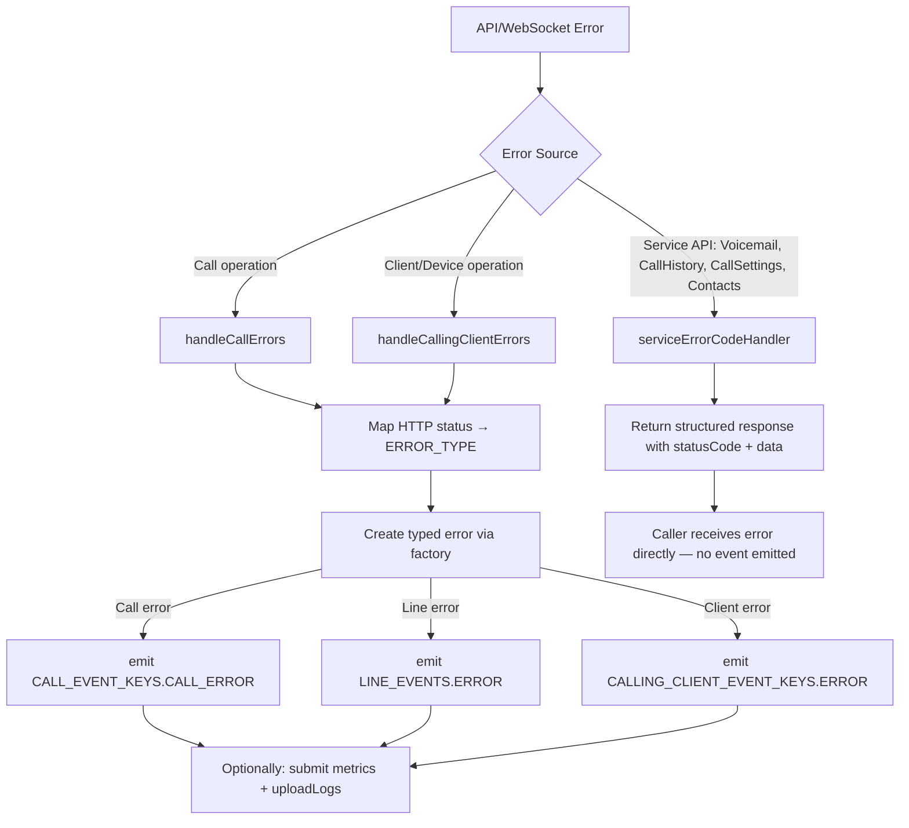

# Error Handling Patterns

> Quick reference for LLMs working with errors in the `@webex/calling` package.

---

## Rules

- **MUST** use the error class hierarchy (`ExtendedError` → `CallError` / `LineError` / `CallingClientError`)
- **MUST** use factory functions (`createCallError`, `createLineError`, `createClientError`) to instantiate errors
- **MUST** use `ERROR_TYPE` enum for error classification
- **MUST** use `ERROR_LAYER` enum to distinguish call control layer vs media layer errors
- **MUST** emit errors via typed events (e.g., `CALL_EVENT_KEYS.CALL_ERROR`, `LINE_EVENTS.ERROR`)
- **MUST** include `ErrorContext` (file and method) for traceability
- **MUST** use `handleCallErrors()` / `handleCallingClientErrors()` for HTTP/API error mapping
- **MUST** log errors and optionally upload logs for diagnostics
- **MUST** create a dedicated Error class for each module/object whose API errors need handling
- **NEVER** throw raw `Error` objects — always use the typed error classes
- **NEVER** swallow errors silently — emit, log, or propagate

---

## Error Flow Overview



> **Note:** `serviceErrorCodeHandler` operates on a **separate path** from the event-based error flow. The call/line/client handlers create typed error objects and **emit** them as events for application listeners, while `serviceErrorCodeHandler` maps HTTP status codes to structured response objects that are **returned directly** to the caller. See the [serviceErrorCodeHandler](#serviceerorcodehandler) section below for the full signature and usage.

---

## Error Class Hierarchy

```
Error (native)
  └── ExtendedError
        ├── CallError          (call-level errors with correlationId + errorLayer)
        ├── LineError           (line/registration errors with status)
        └── CallingClientError  (client/device errors with status)
```

### ExtendedError (Base)

The base error class for all calling errors. It exists to provide a common structure (`type`, `context`) that all error subclasses share, enabling consistent error handling and logging across the package.

Each child class inherits `message`, `type`, and `context` from `ExtendedError` and adds domain-specific fields:

| Parameter | Type                    | Description                                  |
| --------- | ----------------------- | -------------------------------------------- |
| `msg`     | `ErrorMessage` (string) | Human-readable error description             |
| `context` | `ErrorContext`          | File and method where the error originated   |
| `type`    | `ERROR_TYPE`            | Classification of the error (see enum below) |

```typescript
// src/Errors/catalog/ExtendedError.ts
export default class ExtendedError extends Error {
  public type: ERROR_TYPE;
  public context: ErrorContext;

  constructor(msg: ErrorMessage, context: ErrorContext, type: ERROR_TYPE) {
    super(msg);
    this.type = type || ERROR_TYPE.DEFAULT;
    this.context = context;
  }
}
```

### CallError

For errors occurring during an active call. Carries `correlationId` to associate with the specific call and `errorLayer` to indicate whether the issue is in the call control layer or the media layer.

Provides both `getCallError()` and `setCallError()` methods:

```typescript
// src/Errors/catalog/CallError.ts
export class CallError extends ExtendedError {
  private correlationId: CorrelationId;
  private errorLayer: ERROR_LAYER;

  constructor(
    msg: ErrorMessage,
    context: ErrorContext,
    type: ERROR_TYPE,
    correlationId: CorrelationId,
    errorLayer: ERROR_LAYER
  ) {
    super(msg, context, type);
    this.correlationId = correlationId;
    this.errorLayer = errorLayer;
  }

  public getCallError(): CallErrorObject {
    /* returns error fields */
  }
  public setCallError(error: CallErrorObject) {
    /* updates error fields */
  }
}
```

### LineError

For line registration and deregistration errors. Carries `status` to indicate the registration state.

Provides both `getError()` and `setError()` methods:

```typescript
// src/Errors/catalog/LineError.ts
export class LineError extends ExtendedError {
  public status: RegistrationStatus = RegistrationStatus.INACTIVE;

  constructor(
    msg: ErrorMessage,
    context: ErrorContext,
    type: ERROR_TYPE,
    status: RegistrationStatus
  ) {
    super(msg, context, type);
    this.status = status;
  }

  public getError(): LineErrorObject {
    /* returns error fields */
  }
  public setError(error: LineErrorObject) {
    /* updates error fields */
  }
}
```

### CallingClientError

For client and device-level errors (device registration, Mobius discovery, etc.).

Provides both `getError()` and `setError()` methods:

```typescript
// src/Errors/catalog/CallingDeviceError.ts
export class CallingClientError extends ExtendedError {
  public status: RegistrationStatus = RegistrationStatus.INACTIVE;

  constructor(
    msg: ErrorMessage,
    context: ErrorContext,
    type: ERROR_TYPE,
    status: RegistrationStatus
  ) {
    super(msg, context, type);
    this.status = status;
  }

  public getError(): ErrorObject {
    /* returns error fields */
  }
  public setError(error: ErrorObject) {
    /* updates error fields */
  }
}
```

### Creating Dedicated Error Classes

To handle errors for a new module or object (e.g., a `Line` object or `Call` object):

1. Create a new class extending `ExtendedError` in `src/Errors/catalog/`
2. Add domain-specific fields (e.g., `status`, `correlationId`)
3. Implement `getError()` and `setError()` methods
4. Create a factory function for instantiation
5. Export from `src/Errors/index.ts`

Example: `LineError` handles errors thrown by methods on the `Line` object (registration failures, etc.) while `CallError` handles errors thrown during active call operations (dial, hold, resume, etc.).

---

## Instantiation of Error Objects

Always use factory functions instead of `new` for error instantiation.

```typescript
// Call error — see src/Errors/catalog/CallError.ts
const error = createCallError(
  'Hold operation failed',
  {file: CALL_FILE, method: 'doHoldResume'},
  ERROR_TYPE.CALL_ERROR,
  this.correlationId,
  ERROR_LAYER.CALL_CONTROL
);

// Line error — see src/Errors/catalog/LineError.ts
const error = createLineError(
  'Registration failed',
  {file: 'line/index.ts', method: 'register'},
  ERROR_TYPE.REGISTRATION_ERROR,
  RegistrationStatus.INACTIVE
);

// Client error — see src/Errors/catalog/CallingDeviceError.ts
const error = createClientError(
  'Device creation failed',
  {file: CALLING_CLIENT_FILE, method: 'createDevice'},
  ERROR_TYPE.DEFAULT,
  RegistrationStatus.INACTIVE
);
```

---

## Error Type Enums

### ERROR_TYPE

```typescript
export enum ERROR_TYPE {
  CALL_ERROR = 'call_error',
  DEFAULT = 'default_error',
  BAD_REQUEST = 'bad_request',
  FORBIDDEN_ERROR = 'forbidden',
  NOT_FOUND = 'not_found',
  REGISTRATION_ERROR = 'registration_error',
  SERVICE_UNAVAILABLE = 'service_unavailable',
  TIMEOUT = 'timeout',
  TOKEN_ERROR = 'token_error',
  TOO_MANY_REQUESTS = 'too_many_requests',
  SERVER_ERROR = 'server_error',
}
```

### ERROR_LAYER

```typescript
export enum ERROR_LAYER {
  CALL_CONTROL = 'call_control',
  MEDIA = 'media',
}
```

### ERROR_CODE (HTTP status mapping)

```typescript
export enum ERROR_CODE {
  UNAUTHORIZED = 401,
  FORBIDDEN = 403,
  DEVICE_NOT_FOUND = 404,
  INTERNAL_SERVER_ERROR = 500,
  NOT_IMPLEMENTED = 501,
  SERVICE_UNAVAILABLE = 503,
  BAD_REQUEST = 400,
  REQUEST_TIMEOUT = 408,
  TOO_MANY_REQUESTS = 429,
}
```

### CALL_ERROR_CODE (domain-specific)

```typescript
export enum CALL_ERROR_CODE {
  INVALID_STATUS_UPDATE = 111,
  DEVICE_NOT_REGISTERED = 112,
  CALL_NOT_FOUND = 113,
  ERROR_PROCESSING = 114,
  USER_BUSY = 115,
  PARSING_ERROR = 116,
  TIMEOUT_ERROR = 117,
  NOT_ACCEPTABLE = 118,
  CALL_REJECTED = 119,
  NOT_AVAILABLE = 120,
}
```

---

## Error Object Types

```typescript
// src/Errors/types.ts
export interface ErrorContext extends IMetaContext {}

// IMetaContext (src/common/types.ts) — fields are optional
export interface IMetaContext {
  file?: string;
  method?: string;
}

export type ErrorObject = {
  message: ErrorMessage;
  type: ERROR_TYPE;
  context: ErrorContext;
};

export interface LineErrorObject extends ErrorObject {
  status: RegistrationStatus;
}

export interface CallErrorObject extends ErrorObject {
  correlationId: CorrelationId;
  errorLayer: ERROR_LAYER;
}
```

---

## Error Callback Type Definitions

These typed callbacks wire error handlers to emitters:

```typescript
// src/CallingClient/calling/types.ts
export type CallErrorEmitterCallBack = (error: CallError) => void;

// src/CallingClient/types.ts
export type CallingClientErrorEmitterCallback = (
  err: CallingClientError,
  finalError?: boolean
) => void;

// src/CallingClient/line/types.ts
export type LineErrorEmitterCallback = (err: LineError, finalError?: boolean) => void;
```

---

## Error Handler Utilities

### handleRegistrationErrors

Handles registration and keepalive error flows by mapping HTTP status codes to `LineError` and deciding whether to emit a final error, trigger a retry, or restore registration. Used by `Registration` for both initial registration failures and keepalive failures received from the web worker. Returns `Promise<boolean>` indicating whether to abort. See `src/common/Utils.ts`.

Signature: `handleRegistrationErrors(err, emitterCb, loggerContext, retry429Cb?, restoreRegCb?): Promise<boolean>`

```typescript
// Real usage from register.ts — initial registration error path
abort = await handleRegistrationErrors(
  body,
  (clientError, finalError) => {
    if (finalError) {
      this.lineEmitter(LINE_EVENTS.ERROR, undefined, clientError);
    }
    this.metricManager.submitRegistrationMetric(
      METRIC_EVENT.REGISTRATION_ERROR, ...
    );
  },
  loggerContext,
  retry429Cb,
  restoreRegCb
);

// Real usage from register.ts — keepalive failure path (web worker message handler)
if (event.data.type === WorkerMessageType.KEEPALIVE_FAILURE) {
  const abort = await handleRegistrationErrors(
    error,
    (clientError, finalError) => {
      if (finalError) {
        this.lineEmitter(LINE_EVENTS.ERROR, undefined, clientError);
      }
      this.metricManager.submitRegistrationMetric(
        METRIC_EVENT.KEEPALIVE_ERROR,
        REG_ACTION.KEEPALIVE_FAILURE, ...
      );
    },
    loggerContext,
    retry429Cb,
    restoreRegCb
  );
}
```

Key behaviors by status code:
- **400 Bad Request** — final error, emits `LINE_EVENTS.ERROR`
- **401 Unauthorized** — final error, emits token error
- **403 Forbidden** — inspects `errorCode` in body for device-limit-exceeded (triggers `restoreRegCb`), device-creation-disabled (final error), or device-creation-failed (non-final)
- **404 Device Not Found** — final error; on keepalive, triggers `handle404KeepaliveFailure` which re-attempts registration
- **429 Too Many Requests** — non-final, invokes `retry429Cb` with the `Retry-After` header value
- **500 / 503** — non-final, emits error and allows retry

### handleCallErrors

Maps HTTP/API failures to `CallError` and optionally triggers retries. Returns `Promise<boolean>` indicating whether to abort. See `src/common/Utils.ts`.

Signature: `handleCallErrors(emitterCb, errorLayer, retryCb, correlationId, err, caller, file): Promise<boolean>`

```typescript
// Real usage from call.ts — handleOutgoingCallSetup error path
const abort = await handleCallErrors(
  (error: CallError) => {
    this.emit(CALL_EVENT_KEYS.CALL_ERROR, error);
    this.submitCallErrorMetric(error);
    this.sendCallStateMachineEvt({type: 'E_UNKNOWN', data: errData});
  },
  ERROR_LAYER.CALL_CONTROL,
  /* istanbul ignore next */ (interval: number) => undefined,
  this.getCorrelationId(),
  errData,
  METHODS.HANDLE_OUTGOING_CALL_SETUP,
  CALL_FILE
);
```

### handleCallingClientErrors

Maps errors to `CallingClientError` and returns `Promise<boolean>` indicating whether to abort. See `src/common/Utils.ts`.

Signature: `handleCallingClientErrors(err, emitterCb, loggerContext): Promise<boolean>`

```typescript
// Real usage from CallingClient.ts — getMobiusServers error path
abort = await handleCallingClientErrors(
  err as WebexRequestPayload,
  (clientError) => {
    this.metricManager.submitRegistrationMetric(
      METRIC_EVENT.REGISTRATION_ERROR,
      REG_ACTION.REGISTER,
      METRIC_TYPE.BEHAVIORAL,
      GET_MOBIUS_SERVERS_UTIL,
      'UNKNOWN',
      (err as WebexRequestPayload).headers?.trackingId ?? '',
      undefined,
      clientError
    );
    this.emit(CALLING_CLIENT_EVENT_KEYS.ERROR, clientError);
  },
  {method: GET_MOBIUS_SERVERS_UTIL, file: CALLING_CLIENT_FILE}
);
```

### emitFinalFailure

Emits a terminal `LINE_EVENTS.ERROR` after all registration retry attempts are exhausted. Creates a `LineError` with `ERROR_TYPE.SERVICE_UNAVAILABLE` and `RegistrationStatus.INACTIVE`. See `src/common/Utils.ts`.

Signature: `emitFinalFailure(emitterCb, loggerContext): void`

```typescript
// Real usage from register.ts — after exhausting all primary + backup Mobius URIs
if (!abort && !this.isDeviceRegistered()) {
  await uploadLogs();
  emitFinalFailure((clientError: LineError) => {
    this.lineEmitter(LINE_EVENTS.ERROR, undefined, clientError);
  }, loggerContext);
}
```

### serviceErrorCodeHandler

Utility that maps HTTP status codes to structured error response objects. Used by voicemail, call settings, contacts, and call history modules — **not** for the call/line/client error hierarchy.

Full signature (`src/common/Utils.ts`):

```typescript
export async function serviceErrorCodeHandler(
  err: WebexRequestPayload,
  loggerContext: LogContext
): Promise<
  | JanusResponseEvent
  | VoicemailResponseEvent
  | CallSettingResponse
  | ContactResponse
  | UpdateMissedCallsResponse
  | UCMLinesResponse
  | DeleteCallHistoryRecordsResponse
> {
  const errorCode = Number(err.statusCode);
  switch (errorCode) {
    case ERROR_CODE.BAD_REQUEST:
      return {statusCode: 400, data: {error: '400 Bad request'}, message: 'FAILURE'};
    case ERROR_CODE.UNAUTHORIZED:
      return {statusCode: 401, data: {error: 'User is unauthorised...'}, message: 'FAILURE'};
    // ... other status codes mapped similarly
  }
}
```

### Internal Helper Functions

These private (non-exported) helpers update error context on existing error instances. Found in `src/common/Utils.ts`:

- `updateCallErrorContext()` — updates `CallError` fields via `setCallError()`
- `updateLineErrorContext()` — updates `LineError` fields via `setError()`
- `updateErrorContext()` — updates `CallingClientError` fields via `setError()`

---

## Error Emission Pattern

### Call Errors

```typescript
this.emit(CALL_EVENT_KEYS.CALL_ERROR, callError);
this.emit(CALL_EVENT_KEYS.HOLD_ERROR, holdError);
this.emit(CALL_EVENT_KEYS.RESUME_ERROR, resumeError);
this.emit(CALL_EVENT_KEYS.TRANSFER_ERROR, transferError);
```

### Line Errors

The `lineEmitter` method accepts `deviceInfo` as an optional second parameter:

```typescript
this.lineEmitter(LINE_EVENTS.ERROR, deviceInfo, lineError);
```

### CallingClient Errors

```typescript
this.emit(CALLING_CLIENT_EVENT_KEYS.ERROR, callingClientError);
```

---

## Log Upload Pattern

For critical errors, upload diagnostic logs to the server:

```typescript
try {
  await someOperation();
} catch (err) {
  const callError = createCallError(
    'Operation failed',
    {file: CALL_FILE, method: 'someOperation'},
    ERROR_TYPE.CALL_ERROR,
    this.correlationId,
    ERROR_LAYER.CALL_CONTROL
  );
  this.emit(CALL_EVENT_KEYS.CALL_ERROR, callError);
  uploadLogs(this.webex);
}
```

---

## Related

- [Architecture Patterns](./architecture-patterns.md)
- [Event Patterns](./event-patterns.md)
- [Testing Patterns](./testing-patterns.md)
- [TypeScript Patterns](./typescript-patterns.md)
