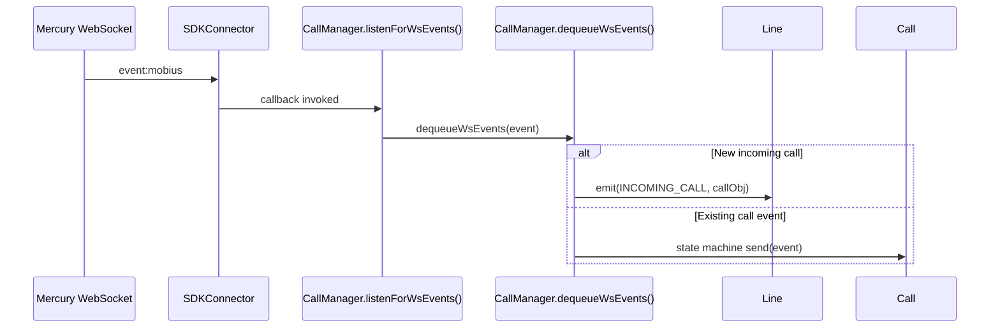

# Event Patterns

> Quick reference for LLMs working with the typed event system in the `@webex/calling` package.

This document describes the typed event system used throughout the `@webex/calling` package.

- Built on Node.js `EventEmitter` (from `events`) with compile-time type enforcement via `typed-emitter`.
- The `Eventing<T>` generic base class (`src/Events/impl/index.ts`) is extended by every event-emitting class: `CallingClient`, `Call`, `CallManager`, `Line`, `CallHistory`, and `Voicemail`.
- Each class is parameterized with a dedicated event type map defined in `src/Events/types.ts`:
  - `CallingClientEventTypes`
  - `CallEventTypes`
  - `LineEventTypes`
  - `CallHistoryEventTypes`
  - `VoicemailEventTypes`
- The type maps statically associate string-valued enum keys to their corresponding callback signatures.
- All event keys are defined as TypeScript `enum` members — raw string keys are never used directly:
  - `CALL_EVENT_KEYS`
  - `LINE_EVENTS`
  - `LINE_EVENT_KEYS`
  - `CALLING_CLIENT_EVENT_KEYS`
  - `COMMON_EVENT_KEYS`
  - `MOBIUS_EVENT_KEYS`
  - `MEDIA_CONNECTION_EVENT_KEYS`

Events originate from two sources: **local state changes** (e.g., call state machine transitions, line registration) and **remote server events** arriving over the Webex Mercury WebSocket. The `SDKConnector` singleton (`src/SDKConnector/index.ts`) bridges Mercury to the calling SDK by wrapping `webex.internal.mercury.on()` / `.off()` via its `registerListener` / `unregisterListener` methods. Components such as `CallManager` register for Mercury events (e.g., `event:mobius` for call control, `event:janus.*` for call session/history), parse the raw payloads, drive internal state machines, and then re-emit typed events on their `Eventing<T>` instances for application consumption. Every `emit()` call is automatically logged with a UTC timestamp via the `Eventing` base class before delegation to the underlying `EventEmitter`.

---

## Rules

- **MUST** extend `Eventing<T>` for any class that emits events
- **MUST** define event type maps that associate event keys to callback signatures
- **MUST** use enum-based event keys (never raw strings)
- **MUST** register/unregister Mercury WebSocket listeners through `SDKConnector`
- **MUST** clean up listeners with `off()` when disposing resources
- **MUST** log every emitted event with timestamp in the `Eventing` base class
- **NEVER** use untyped `EventEmitter` directly — always use `Eventing<T>`
- **NEVER** emit events with raw string keys — use the corresponding enum value

---

## Eventing Base Class

All event-emitting classes extend this generic typed emitter (Source File: `src/Events/impl/index.ts`).

```typescript
import EventEmitter from 'events';
import TypedEmitter, {EventMap} from 'typed-emitter';

export class Eventing<T extends EventMap> extends (EventEmitter as {
  new <T extends EventMap>(): TypedEmitter<T>;
})<T> {
  emit<E extends keyof T>(event: E, ...args: Parameters<T[E]>): boolean {
    const timestamp = new Date().toUTCString();
    Logger.info(
      `${timestamp} ${
        LOG_PREFIX.EVENT
      }: ${event.toString()} - event emitted with parameters -> ${args}`,
      {
        file: 'Events/impl/index.ts',
        method: 'emit',
      }
    );
    return super.emit(event, ...args);
  }

  on<E extends keyof T>(event: E, listener: T[E]): this {
    return super.on(event, listener);
  }

  off<E extends keyof T>(event: E, listener: T[E]): this {
    return super.off(event, listener);
  }
}
```

---

## Event Type Maps

Each emitter class has a corresponding type map that constrains event keys and callback signatures.

### Call Events

`CallEventTypes` crosses enum boundaries — it uses keys from **three different enums** (`CALL_EVENT_KEYS`, `LINE_EVENT_KEYS`, `CALLING_CLIENT_EVENT_KEYS`):

```typescript
export type CallEventTypes = {
  [CALL_EVENT_KEYS.ALERTING]: (callId: CallId) => void;
  [CALL_EVENT_KEYS.CALL_ERROR]: (error: CallError) => void;
  [CALL_EVENT_KEYS.CALLER_ID]: (display: CallerIdDisplay) => void;
  [CALL_EVENT_KEYS.CONNECT]: (callId: CallId) => void;
  [CALL_EVENT_KEYS.DISCONNECT]: (callId: CallId) => void;
  [CALL_EVENT_KEYS.ESTABLISHED]: (callId: CallId) => void;
  [CALL_EVENT_KEYS.HELD]: (callId: CallId) => void;
  [CALL_EVENT_KEYS.HOLD_ERROR]: (error: CallError) => void;
  [LINE_EVENT_KEYS.INCOMING_CALL]: (callObj: ICall) => void;
  [CALL_EVENT_KEYS.PROGRESS]: (callId: CallId) => void;
  [CALL_EVENT_KEYS.REMOTE_MEDIA]: (track: MediaStreamTrack) => void;
  [CALL_EVENT_KEYS.RESUME_ERROR]: (error: CallError) => void;
  [CALL_EVENT_KEYS.RESUMED]: (callId: CallId) => void;
  [CALL_EVENT_KEYS.TRANSFER_ERROR]: (error: CallError) => void;
  [CALLING_CLIENT_EVENT_KEYS.ALL_CALLS_CLEARED]: () => void;
};
```

### Line Events

```typescript
export type LineEventTypes = {
  [LINE_EVENTS.CONNECTING]: () => void;
  [LINE_EVENTS.ERROR]: (error: LineError) => void;
  [LINE_EVENTS.RECONNECTED]: () => void;
  [LINE_EVENTS.RECONNECTING]: () => void;
  [LINE_EVENTS.REGISTERED]: (lineInfo: ILine) => void;
  [LINE_EVENTS.UNREGISTERED]: () => void;
  [LINE_EVENTS.INCOMING_CALL]: (callObj: ICall) => void;
};
```

### CallingClient Events

```typescript
export type CallingClientEventTypes = {
  [CALLING_CLIENT_EVENT_KEYS.ERROR]: (error: CallingClientError) => void;
  [CALLING_CLIENT_EVENT_KEYS.USER_SESSION_INFO]: (event: CallSessionEvent) => void;
  [CALLING_CLIENT_EVENT_KEYS.OUTGOING_CALL]: (callId: string) => void;
  [CALLING_CLIENT_EVENT_KEYS.ALL_CALLS_CLEARED]: () => void;
};
```

### CallHistory Events

```typescript
export type CallHistoryEventTypes = {
  [COMMON_EVENT_KEYS.CALL_HISTORY_USER_SESSION_INFO]: (event: CallSessionEvent) => void;
  [COMMON_EVENT_KEYS.CALL_HISTORY_USER_VIEWED_SESSIONS]: (event: CallSessionViewedEvent) => void;
  [COMMON_EVENT_KEYS.CALL_HISTORY_USER_SESSIONS_DELETED]: (event: CallSessionDeletedEvent) => void;
};
```

### Voicemail Events

```typescript
export type VoicemailEventTypes = {
  [COMMON_EVENT_KEYS.CB_VOICEMESSAGE_CONTENT_GET]: (messageId: MessageId) => void;
};
```

---

## Event Key Enums

All events in the package are identified by TypeScript `enum` members rather than raw string literals, providing compile-time safety and autocompletion. The enums are organized by scope:

- **`COMMON_EVENT_KEYS`** — shared keys used across CallHistory and Voicemail modules
- **`LINE_EVENT_KEYS`** / **`LINE_EVENTS`** — line registration state and incoming call signaling (note: these are two distinct enums with overlapping names but different string values)
- **`CALL_EVENT_KEYS`** — call lifecycle events consumed by the application (alerting, connect, hold, transfer, etc.)
- **`CALLING_CLIENT_EVENT_KEYS`** — client-level events (errors, outgoing calls, session info, all-calls-cleared)
- **`MEDIA_CONNECTION_EVENT_KEYS`** — WebRTC ROAP messaging and media type keys
- **`MOBIUS_EVENT_KEYS`** / **`WEBSOCKET_KEYS`** — internal Mercury WebSocket event names the SDK listens to for server-side call control and session updates

All enums are defined in `src/Events/types.ts` (or co-located type files) and re-exported for use across the package.

### COMMON_EVENT_KEYS

Shared event keys used across CallHistory and Voicemail modules:

```typescript
export enum COMMON_EVENT_KEYS {
  CB_VOICEMESSAGE_CONTENT_GET = 'call_back_voicemail_content_get',
  CALL_HISTORY_USER_SESSION_INFO = 'callHistory:user_recent_sessions',
  CALL_HISTORY_USER_VIEWED_SESSIONS = 'callHistory:user_viewed_sessions',
  CALL_HISTORY_USER_SESSIONS_DELETED = 'callHistory:user_sessions_deleted',
}
```

### LINE_EVENT_KEYS

Separate from `LINE_EVENTS`. Used in `CallEventTypes` for incoming call events:

```typescript
export enum LINE_EVENT_KEYS {
  INCOMING_CALL = 'incoming_call',
}
```

Note: `LINE_EVENT_KEYS.INCOMING_CALL = 'incoming_call'` differs from `LINE_EVENTS.INCOMING_CALL = 'line:incoming_call'`. The distinction matters because `CallEventTypes` uses `LINE_EVENT_KEYS`, not `LINE_EVENTS`.

### External Events (consumed by application)

```typescript
export enum CALL_EVENT_KEYS {
  ALERTING = 'alerting',
  CALL_ERROR = 'call_error',
  CALLER_ID = 'caller_id',
  CONNECT = 'connect',
  DISCONNECT = 'disconnect',
  ESTABLISHED = 'established',
  HELD = 'held',
  HOLD_ERROR = 'hold_error',
  PROGRESS = 'progress',
  REMOTE_MEDIA = 'remote_media',
  RESUME_ERROR = 'resume_error',
  RESUMED = 'resumed',
  TRANSFER_ERROR = 'transfer_error',
}

export enum LINE_EVENTS {
  CONNECTING = 'connecting',
  ERROR = 'error',
  RECONNECTED = 'reconnected',
  RECONNECTING = 'reconnecting',
  REGISTERED = 'registered',
  UNREGISTERED = 'unregistered',
  INCOMING_CALL = 'line:incoming_call',
}

export enum CALLING_CLIENT_EVENT_KEYS {
  ERROR = 'callingClient:error',
  OUTGOING_CALL = 'callingClient:outgoing_call',
  USER_SESSION_INFO = 'callingClient:user_recent_sessions',
  ALL_CALLS_CLEARED = 'callingClient:all_calls_cleared',
}
```

### MEDIA_CONNECTION_EVENT_KEYS

Media-related event keys for WebRTC ROAP messaging:

```typescript
export enum MEDIA_CONNECTION_EVENT_KEYS {
  ROAP_MESSAGE_TO_SEND = 'roap:messageToSend',
  MEDIA_TYPE_AUDIO = 'audio',
}
```

### Internal Events (Mobius WebSocket)

The `MOBIUS_EVENT_KEYS` enum defines the Mercury event names the SDK listens to:

```typescript
export enum MOBIUS_EVENT_KEYS {
  SERVER_EVENT_INCLUSIVE = 'event:mobius',
  CALL_SESSION_EVENT_INCLUSIVE = 'event:janus.user_recent_sessions',
  CALL_SESSION_EVENT_LEGACY = 'event:janus.user_sessions',
  CALL_SESSION_EVENT_VIEWED = 'event:janus.user_viewed_sessions',
  CALL_SESSION_EVENT_DELETED = 'event:janus.user_sessions_deleted',
}
```

---

## Event Emission Pattern

- Events are emitted using `this.emit()` with the enum constant as the event name and the typed payload as arguments.
- Because every emitting class extends `Eventing<T>`, the compiler enforces that the enum key and payload match the class's event type map at every call site.
- The `Eventing.emit()` override logs every emission with a UTC timestamp before delegating to the underlying `EventEmitter`.
- Emission happens across five classes:
  - `Call` — the most prolific emitter, covering call lifecycle and error events
  - `Line` — registration state and incoming calls
  - `CallManager` — incoming call signaling and all-calls-cleared
  - `CallingClient` — client-level errors and session info
  - `CallHistory` — session, viewed, and deleted events
- `Voicemail` defines `VoicemailEventTypes` in its type map but does not currently contain any `this.emit()` call sites in its implementation.

### Emitting from a Call

```typescript
// Emit with callId (verified examples from call.ts)
this.emit(CALL_EVENT_KEYS.PROGRESS, this.correlationId);
this.emit(CALL_EVENT_KEYS.CONNECT, this.correlationId);
this.emit(CALL_EVENT_KEYS.ESTABLISHED, this.correlationId);

// Emit with error
this.emit(CALL_EVENT_KEYS.CALL_ERROR, callError);

// Emit caller ID information
const emitObj = {
  correlationId: this.correlationId,
  callerId: this.callerInfo,
};
this.emit(CALL_EVENT_KEYS.CALLER_ID, emitObj);

// Emit remote media track
this.emit(CALL_EVENT_KEYS.REMOTE_MEDIA, track);
```

### Emitting from a Line

The `lineEmitter` method (`src/CallingClient/line/index.ts`) is **not** a simple pass-through — it contains important business logic via a `switch` statement:

```typescript
public lineEmitter = (event: LINE_EVENTS, deviceInfo?: IDeviceInfo, lineError?: LineError) => {
  switch (event) {
    case LINE_EVENTS.REGISTERED:
      if (deviceInfo) {
        this.normalizeLine(deviceInfo);   // Processes device info first
        this.emit(event, this);           // Emits the ILine instance, NOT deviceInfo
      }
      break;
    case LINE_EVENTS.UNREGISTERED:
    case LINE_EVENTS.RECONNECTED:
    case LINE_EVENTS.RECONNECTING:
      this.emit(event);                   // No payload
      break;
    case LINE_EVENTS.ERROR:
      if (lineError) {                    // Only emits if lineError is truthy
        this.emit(event, lineError);
      }
      break;
    default:
      break;
  }
};
```

Calling `lineEmitter` (from `src/CallingClient/registration/register.ts`):

```typescript
// On successful registration — passes device info for normalization
this.lineEmitter(LINE_EVENTS.REGISTERED, resp.body as IDeviceInfo);

// On deregistration or connection loss — no payload
this.lineEmitter(LINE_EVENTS.UNREGISTERED);

// On keepalive recovery
this.lineEmitter(LINE_EVENTS.RECONNECTED);

// While attempting reconnection
this.lineEmitter(LINE_EVENTS.RECONNECTING);

// On fatal registration failure — passes the error object
this.lineEmitter(LINE_EVENTS.ERROR, undefined, clientError);
```

Key behaviors:

- **REGISTERED**: calls `normalizeLine(deviceInfo)` then emits `this` (the `ILine` instance), not `deviceInfo`
- **ERROR**: only emits if `lineError` is truthy
- **UNREGISTERED / RECONNECTED / RECONNECTING**: emits with no args

---

## Event Listening Pattern

### Application Listening to Line Events

```typescript
const line = callingClient.getLines()[0];

line.on(LINE_EVENTS.REGISTERED, (lineInfo: ILine) => {
  console.log('Line registered:', lineInfo.deviceId);
});

line.on(LINE_EVENTS.INCOMING_CALL, (call: ICall) => {
  console.log('Incoming call from:', call.getCallerInfo());
});

line.on(LINE_EVENTS.ERROR, (error: LineError) => {
  console.error('Line error:', error.getError());
});
```

### Application Listening to Call Events

```typescript
const call = line.makeCall({type: CallType.URI, address: 'user@example.com'});

call.on(CALL_EVENT_KEYS.ESTABLISHED, (callId: CallId) => {
  console.log('Call established:', callId);
});

call.on(CALL_EVENT_KEYS.DISCONNECT, (callId: CallId) => {
  console.log('Call disconnected:', callId);
});

call.on(CALL_EVENT_KEYS.CALL_ERROR, (error: CallError) => {
  console.error('Call error:', error.getCallError());
});
```

### Removing Listeners

Always clean up listeners when they are no longer needed to prevent memory leaks:

```typescript
const handler = (callId: CallId) => {
  console.log('Call established:', callId);
};

// Register
call.on(CALL_EVENT_KEYS.ESTABLISHED, handler);

// Unregister — must pass the same function reference
call.off(CALL_EVENT_KEYS.ESTABLISHED, handler);
```

For Mercury WebSocket listeners, use `SDKConnector.unregisterListener()`:

```typescript
this.sdkConnector.unregisterListener('event:mobius');
```

---

## WebSocket Event Flow

The `SDKConnector` bridges Webex Mercury WebSocket events to the calling SDK. It wraps `webex.internal.mercury.on()` to register listeners for specific events.



### Registering Mercury Listeners

```typescript
// In SDKConnector (src/SDKConnector/index.ts)
public registerListener<T>(event: string, cb: (data?: T) => void): void {
  instance.getWebex().internal.mercury.on(event, (data: T) => {
    cb(data);
  });
}

public unregisterListener(event: string): void {
  instance.getWebex().internal.mercury.off(event);
}
```

### CallManager Subscribes to WebSocket Events

The actual code in `callManager.ts` uses the raw string `'event:mobius'` rather than the enum constant:

```typescript
// src/CallingClient/calling/callManager.ts:130
private listenForWsEvents() {
  this.sdkConnector.registerListener('event:mobius', async (event) => {
    this.dequeueWsEvents(event);
  });
}
```

### Session Listener Pattern in CallingClient

The actual `registerSessionsListener` (`src/CallingClient/CallingClient.ts:665-691`) contains important filtering logic — it filters out non-`WEBEX_CALLING` sessions before emitting:

```typescript
private registerSessionsListener() {
  this.sdkConnector.registerListener<CallSessionEvent>(
    MOBIUS_EVENT_KEYS.CALL_SESSION_EVENT_INCLUSIVE,
    async (event?: CallSessionEvent) => {
      if (event && event.data.userSessions.userSessions) {
        const sessionArr = event?.data.userSessions.userSessions;

        // Single session: skip if not WEBEX_CALLING
        if (sessionArr.length === 1) {
          if (sessionArr[0].sessionType !== SessionType.WEBEX_CALLING) {
            return;
          }
        }

        // Multiple sessions: remove non-WEBEX_CALLING entries
        for (let i = 0; i < sessionArr.length; i += 1) {
          if (sessionArr[i].sessionType !== SessionType.WEBEX_CALLING) {
            sessionArr.splice(i, 1);
          }
        }

        this.emit(CALLING_CLIENT_EVENT_KEYS.USER_SESSION_INFO, event as CallSessionEvent);
      }
    }
  );
}
```

---

## Pattern for Adding New Events

When adding a new event to the system, follow these steps:

### Step 1: Add the event key to the appropriate enum

Add the new key to the correct enum in `src/Events/types.ts` (for external events) or the relevant module's `types.ts`.

> See [Event Key Enums](#event-key-enums) for the full list of enums, their scopes, and their string values — including the distinction between `LINE_EVENT_KEYS` and `LINE_EVENTS`.

### Step 2: Update the event type map with the callback signature

Add the new key and its typed callback to the corresponding type map (e.g., `CallEventTypes`, `LineEventTypes`).

> See [Event Type Maps](#event-type-maps) for the structure of each type map and examples of how keys are associated with typed callback signatures for `Call`, `Line`, `CallingClient`, `CallHistory`, and `Voicemail`.

### Step 3: Emit the event from the appropriate class

Use `this.emit(ENUM_KEY, payload)` with the enum constant (never a raw string).

> See [Event Emission Pattern](#event-emission-pattern) for how `this.emit()` is called in practice — including the `Call`, `Line`, and `lineEmitter` patterns with real code examples.

### Step 4: Document the event in the interface JSDoc

Add JSDoc to the interface describing when the event fires and what payload it carries.

> See [Event Type Maps](#event-type-maps) for examples of JSDoc on event type map interfaces (e.g., `CallEventTypes`, `LineEventTypes`).

### Step 5: Add tests

Write tests that register a spy via `.on()`, trigger the action, and assert the spy was called with expected args.

> See [Event Listening Pattern](#event-listening-pattern) for how `.on()` and `.off()` are used with the typed emitter, which mirrors how test spies are registered.

### Checklist for new events

- [ ] Event key added to the correct enum (not a raw string)
- [ ] Event type map updated with typed callback signature
- [ ] Emitter calls `this.emit(ENUM_KEY, payload)` using the enum constant
- [ ] Interface JSDoc documents the event
- [ ] Tests verify emission with correct payload
- [ ] Listeners are cleaned up in disposal/teardown paths

---

## Related

- [Architecture Patterns](./architecture-patterns.md)
- [Error Handling Patterns](./error-handling-patterns.md)
- [TypeScript Patterns](./typescript-patterns.md)
- [Testing Patterns](./testing-patterns.md)
