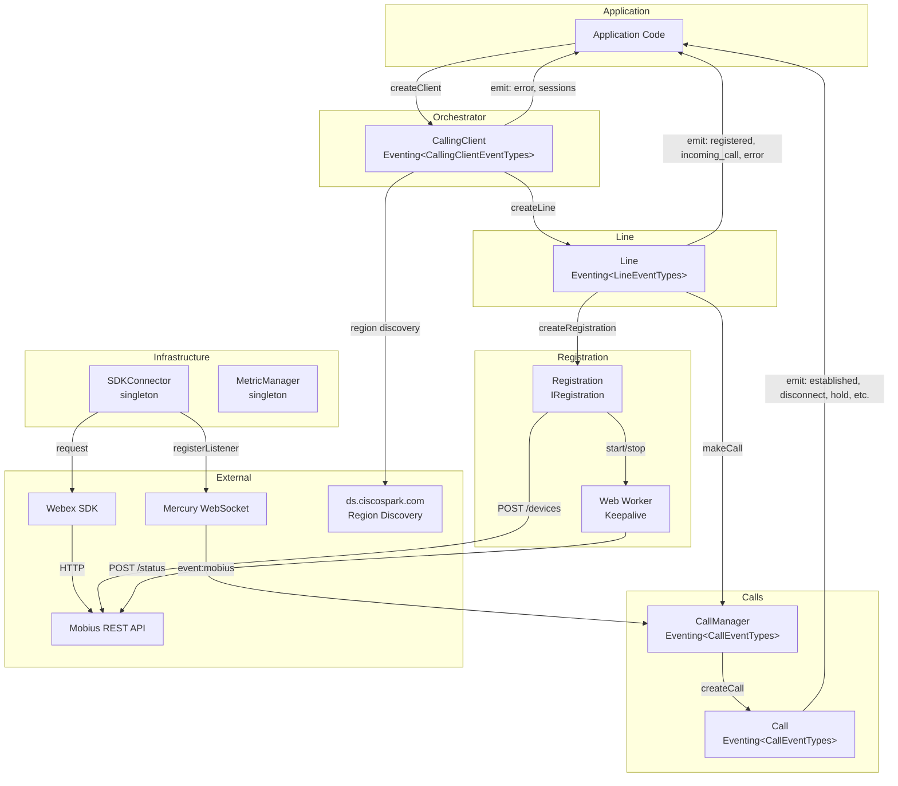
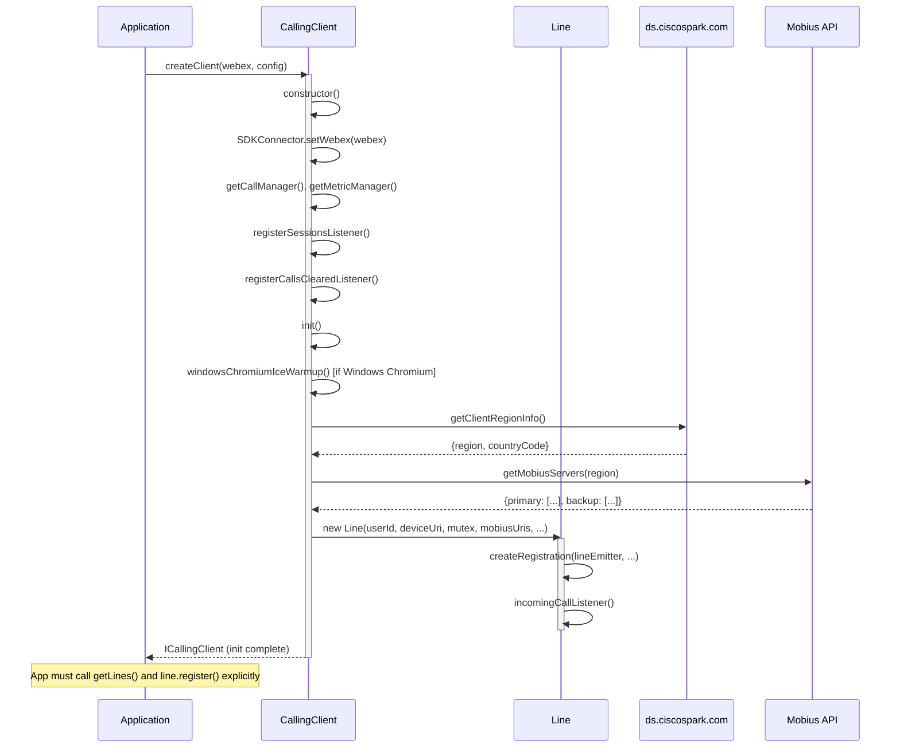
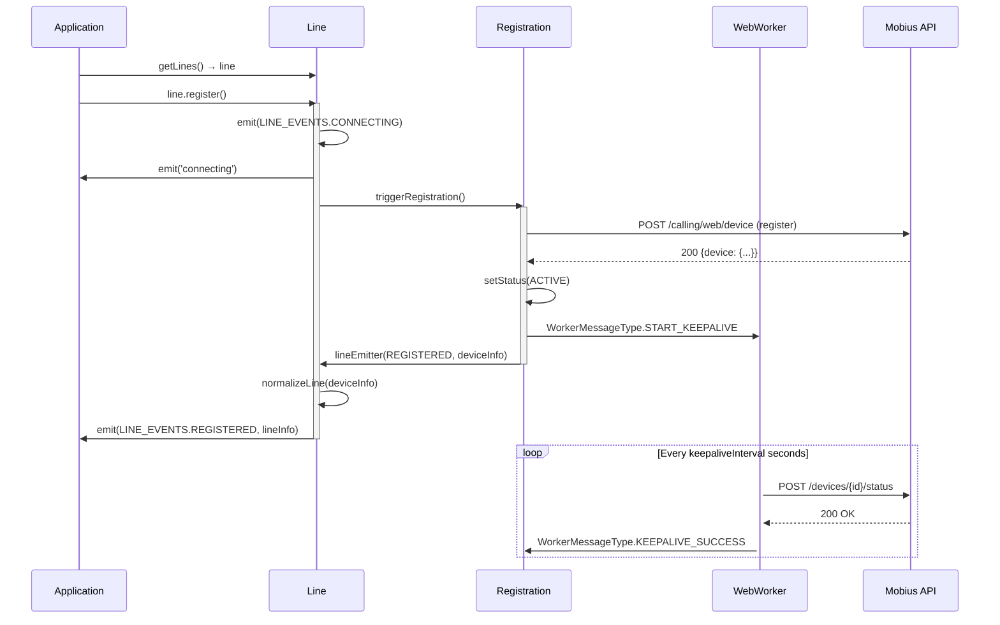
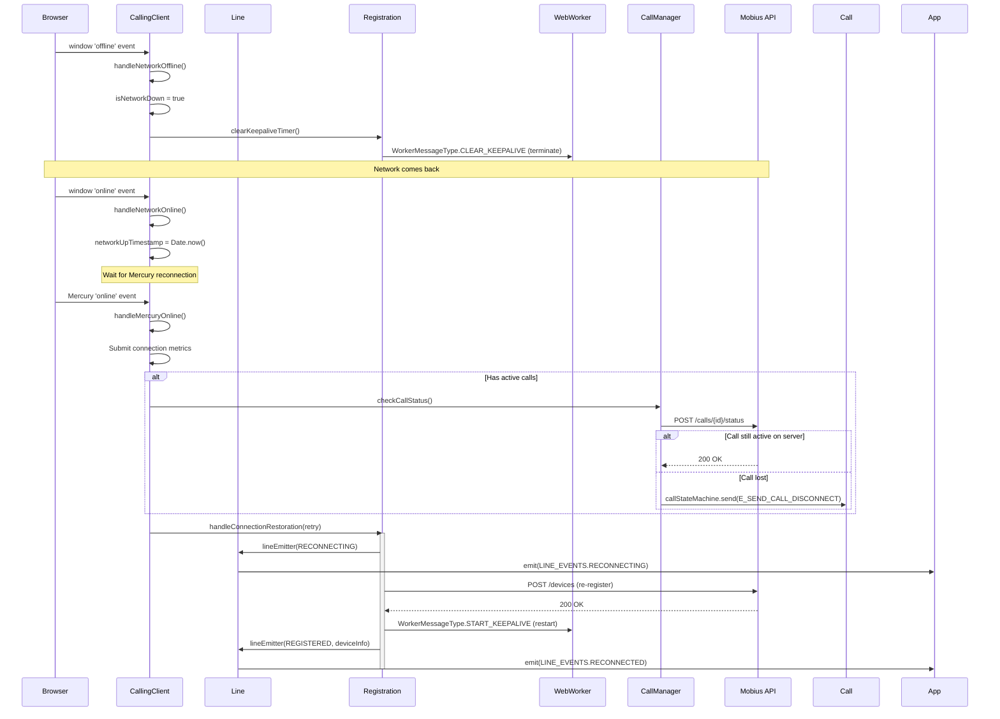
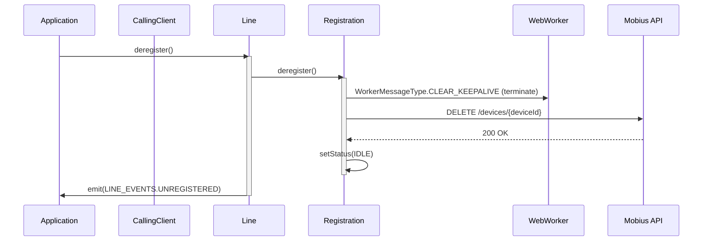

# CallingClient Module — Architecture

## Component Overview

The CallingClient module follows a layered architecture: **Application → CallingClient → Line → Registration / CallManager → SDKConnector → Webex SDK / Mobius API**. Each layer has a distinct responsibility — orchestration (CallingClient), line management (Line), device registration (Registration), call lifecycle (CallManager/Call), and SDK bridging (SDKConnector).

### Component Table

| Layer | Component | File | Key Responsibilities |
|-------|-----------|------|---------------------|
| **Orchestrator** | `CallingClient` | `CallingClient.ts` | Mobius discovery, line creation, network resilience, session listener, media engine config |
| **Line Management** | `Line` | `line/index.ts` | Registration orchestration, call initiation, incoming call forwarding, line event emission |
| **Registration** | `Registration` | `registration/register.ts` | Device register/deregister, keepalive via web worker, failover/failback, reconnection |

> **Note:** `CallManager`, `Call`, and `SDKConnector` are shared entities used across the calling package by all client modules. Their architecture is documented in the package-level source directories.

### Singletons and Factories

| Component | Access Pattern | Lifecycle |
|-----------|---------------|-----------|
| `CallingClient` | `createClient(webex, config)` factory | One per application |
| `SDKConnector` | `import SDKConnector from '../../SDKConnector'` (frozen instance) | Global, set once via `setWebex()` |
| `CallManager` | `getCallManager(webex, indicator)` | Module-level singleton |
| `MetricManager` | `getMetricManager(webex, indicator)` | Module-level singleton |
| `Line` | Created internally by `CallingClient.createLine()` | One per CallingClient, stored in `lineDict` |
| `Registration` | Created internally by `Line` constructor via `createRegistration()` | One per Line |
| `Call` | Created by `CallManager.createCall()` | One per active call |

### File Structure

```
CallingClient/
├── CallingClient.ts                    # Main orchestrator class
├── CallingClient.test.ts               # Unit tests
├── types.ts                            # ICallingClient, CallingClientConfig
├── constants.ts                        # All constants (endpoints, timers, methods)
├── callingClientFixtures.ts            # Test fixtures
├── callRecordFixtures.ts               # Call record test fixtures
├── windowsChromiumIceWarmupUtils.ts    # ICE warmup for Windows Chromium
├── ai-docs/
│   ├── AGENTS.md                       # Module agent doc
│   └── ARCHITECTURE.md                 # This file
├── line/
│   ├── index.ts                        # Line class
│   ├── types.ts                        # ILine, LINE_EVENTS
│   ├── line.test.ts                    # Line unit tests
│   └── ai-docs/
│       ├── AGENTS.md                   # Line-specific agent doc
│       └── ARCHITECTURE.md             # Line-specific architecture
├── registration/
│   ├── index.ts                        # Re-exports
│   ├── register.ts                     # Registration class
│   ├── types.ts                        # IRegistration
│   ├── webWorker.ts                    # Keepalive web worker
│   ├── webWorkerStr.ts                 # Stringified worker for Blob URL
│   ├── registerFixtures.ts             # Test fixtures
│   ├── register.test.ts               # Unit tests
│   ├── webWorker.test.ts              # Worker unit tests
│   └── ai-docs/
│       ├── AGENTS.md                   # Registration-specific agent doc
│       └── ARCHITECTURE.md             # Registration-specific architecture
└── calling/
    ├── index.ts                        # Re-exports
    ├── call.ts                         # Call class (XState)
    ├── call.test.ts                    # Call unit tests
    ├── callManager.ts                  # CallManager class
    ├── callManager.test.ts             # CallManager unit tests
    ├── types.ts                        # ICall, ICallManager
    └── CallerId/
        ├── index.ts                    # Caller ID resolution
        ├── index.test.ts               # Unit tests
        └── types.ts 
```

---

## Data Flows

### Layer Communication Flow



---

## Sequence Diagrams

### 1. CallingClient Initialization



> **Note:** For detailed information on the registration process and its architecture, refer to the [Registration architecture documentation](../registration/ai-docs/ARCHITECTURE.md).


### 2. Line Registration



### 3. Network Disruption and Recovery



### 4. Deregistration and Cleanup



---

## Key Constants

### Timers and Intervals

| Constant | Value | Description |
|----------|-------|-------------|
| `DEFAULT_KEEPALIVE_INTERVAL` | 30s | Keepalive POST frequency |
| `DEFAULT_REHOMING_INTERVAL_MIN` | 60s | Min failback timer |
| `DEFAULT_REHOMING_INTERVAL_MAX` | 120s | Max failback timer |
| `DEFAULT_SESSION_TIMER` | 10 min | Call session timeout |
| `NETWORK_FLAP_TIMEOUT` | 5000ms | Debounce for network flap |
| `REG_TRY_BACKUP_TIMER_VAL_IN_SEC` | 114s | Timer before trying backup servers |
| `REG_FAILBACK_429_MAX_RETRIES` | 5 | Max retries on 429 during failback |
| `MAX_CALL_KEEPALIVE_RETRY_COUNT` | 4 | Max call keepalive retries |

### API Endpoints

| Constant | Value | Description |
|----------|-------|-------------|
| `DEVICES_ENDPOINT_RESOURCE` | `'devices'` | Device registration (full path: `{mobiusUrl}devices`) |
| `CALL_ENDPOINT_RESOURCE` | `'call'` | Single call resource endpoint |
| `CALLS_ENDPOINT_RESOURCE` | `'calls'` | Call collection endpoint (used for call creation) |
| `CALL_STATUS_RESOURCE` | `'status'` | Call status check |
| `MEDIA_ENDPOINT_RESOURCE` | `'media'` | Media/ROAP messaging |

---

## Troubleshooting Guide

### 1. Line Never Reaches REGISTERED State

**Symptoms:** `LINE_EVENTS.REGISTERED` never fires after `line.register()`

**Possible Causes:**
- Mobius server unreachable
- Invalid or expired Webex token
- SDKConnector not initialized with Webex instance

**Debug Steps:**
```typescript
callingClient.on('callingClient:error', (error) => {
  console.error('Client error:', error.getError());
});

line.on('error', (error) => {
  console.error('Line error:', error.getError());
});
```

### 2. Calls Drop After Network Recovery

**Symptoms:** Calls disconnect after temporary network loss

**Possible Causes:**
- Mercury reconnection taking too long
- Call keepalive retry count exceeded (`MAX_CALL_KEEPALIVE_RETRY_COUNT = 4`)
- Mobius server lost the call state

**What happens internally:**
1. `handleNetworkOffline()` clears the keepalive timer
2. `handleMercuryOnline()` triggers `checkCallStatus()` for active calls
3. If the Mobius server no longer has the call, `E_SEND_CALL_DISCONNECT` is sent
4. If no calls are active, `handleConnectionRestoration()` re-registers the device

### 3. Registration Fails with 429

**Symptoms:** Registration fails repeatedly; `LINE_EVENTS.ERROR` with `TOO_MANY_REQUESTS`

**What happens internally:**
- Registration respects `Retry-After` headers from Mobius
- Retries up to `REG_FAILBACK_429_MAX_RETRIES` (5) times
- On exhaustion, falls back to backup Mobius servers

### 4. Keepalive Failures

**Symptoms:** `LINE_EVENTS.RECONNECTING` fires repeatedly

**What happens internally:**
1. Web Worker sends `POST /devices/{id}/status` every `keepaliveInterval` seconds
2. On failure, Worker sends `KEEPALIVE_FAILURE` to main thread
3. Registration emits `RECONNECTING` and attempts recovery
4. On persistent failure, triggers full reconnect via `reconnectOnFailure()`

### 5. No Incoming Calls

**Symptoms:** `LINE_EVENTS.INCOMING_CALL` never fires

**Possible Causes:**
- Mercury WebSocket not connected (`webex.internal.mercury.connected === false`)
- Line not registered (check `line.getStatus() === 'active'`)
- CallManager not listening for Mobius events

**Debug Steps:**
```typescript
console.log('Line status:', line.getStatus());
console.log('Mercury connected:', webex.internal.mercury.connected);
```

---

## Subdirectory Architecture Docs

For detailed architecture of subsystems:

- **Line:** [line/ai-docs/ARCHITECTURE.md](../line/ai-docs/ARCHITECTURE.md) — Line class internals, lineEmitter pattern, call initiation
- **Registration:** [registration/ai-docs/ARCHITECTURE.md](../registration/ai-docs/ARCHITECTURE.md) — Registration flow, keepalive web worker, failover/failback

---

## Related Documentation

- [AGENTS.md](./AGENTS.md) — Overview, examples, public API
