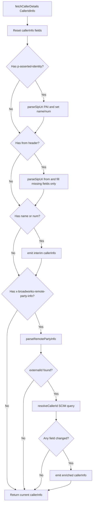

# CallerId Sub-Module - Agent Specification

## Overview

The `CallerId` sub-module resolves caller identity for a `Call` using SIP-style headers delivered by Mobius signaling events. It provides immediate, best-effort display information from headers and then performs asynchronous enrichment through SCIM lookup when BroadWorks metadata includes an `externalId`.

This module is intentionally small and stateful:
- `fetchCallerDetails()` is the public entrypoint.
- It resets and repopulates internal `callerInfo` for each resolution request.
- It emits updates via a callback when new identity data becomes available.

---

## Key Capabilities

### 1. Deterministic Header Priority Resolution
- Parses `p-asserted-identity` first (highest preference).
- Uses `from` header as fallback for missing fields.
- Maintains predictable precedence for name/number population.

### 2. SIP URI Parsing for Name/Number
- Extracts display name from quoted/header prefix.
- Extracts number from SIP URI local part.
- Validates parsed phone tokens using `VALID_PHONE_REGEX`.

### 3. Async SCIM Enrichment from BroadWorks Data
- Parses `x-broadworks-remote-party-info`.
- Detects `externalId` and issues SCIM-driven resolution through `resolveCallerIdDisplay()`.
- Upgrades interim caller details with richer profile fields (`name`, `num`, `avatarSrc`, `id`) when available.

### 4. Incremental Event-Style Updates
- Emits initial caller info early when header parsing yields usable values.
- Emits again only when async resolution actually changes fields.
- Avoids noisy duplicate emissions by checking diffs before callback.

### 5. Logging and Failure Tolerance
- Logs parsing/resolution steps with `{file, method}` context.
- Continues gracefully when external ID is missing or SCIM enrichment fails.
- Preserves best-known caller info instead of failing hard.

---

## Files

| File | Primary Symbol(s) | Description |
|------|--------------------|-------------|
| `index.ts` | `CallerId`, `createCallerId` | Main implementation and factory for caller ID resolution |
| `types.ts` | `ICallerId`, helper types | Public contract for caller detail resolution |
| `index.test.ts` | Jest tests | Priority, fallback, and async enrichment behavior validation |

---

## Public API

## Factory Function

```typescript
export const createCallerId = (webex: WebexSDK, emitterCb: CallEmitterCallBack): ICallerId =>
  new CallerId(webex, emitterCb);
```

## ICallerId Interface

`ICallerId` is the contract consumed by `Call`. It defines a single entrypoint that returns immediate display info while potentially triggering async updates through the emitter callback.

```typescript
export interface ICallerId {
  fetchCallerDetails: (callerId: CallerIdInfo) => DisplayInformation;
}
```

## CallerId Class

### Constructor

```typescript
constructor(webex: WebexSDK, emitter: CallEmitterCallBack)
```

Responsibilities:
- Ensures `SDKConnector` has a valid Webex instance.
- Initializes internal mutable `callerInfo`.
- Stores emitter callback for incremental caller ID updates.

### Core Methods

| Method | Visibility | Purpose |
|--------|------------|---------|
| `fetchCallerDetails(callerId)` | Public | Main entrypoint: resets fields, applies header priority parsing, emits initial data, triggers async BroadWorks enrichment |
| `parseSipUri(paid)` | Private | Parses name and number from SIP-like header string |
| `parseRemotePartyInfo(data)` | Private | Extracts BroadWorks `externalId` and starts SCIM lookup |
| `resolveCallerId(filter)` | Private async | Performs SCIM enrichment and emits only when resolved fields differ |

---

## Resolution Rules (Source of Truth)

1. Reset `callerInfo` (`id`, `avatarSrc`, `name`, `num`) before processing a new event.
2. If `p-asserted-identity` exists, parse and set `name`/`num` directly (highest priority).
3. If `from` exists, parse and fill only fields still unset by step 2.
4. Emit immediate caller update if `name` or `num` is available.
5. If `x-broadworks-remote-party-info` exists, parse `externalId` and run async SCIM enrichment.
6. During enrichment, update only changed fields and emit callback only when at least one field changed.

---

## Control Flow



---

## Testing Expectations

Tests for this module should cover:
- Header precedence: `p-asserted-identity` over `from`.
- Fallback behavior when one/both SIP fields are partially missing.
- Async overwrite by BroadWorks+SCIM enrichment when `externalId` is present.
- No overwrite when `externalId` is absent.
- SCIM failure path preserves already-resolved interim details.
- Emission behavior:
  - Interim emit when `name`/`num` exists.
  - Follow-up emit only when enrichment changes fields.

---

## Agent Rules for Code Generation

When implementing or modifying `CallerId`:
- Keep `fetchCallerDetails()` as the only public resolution entrypoint.
- Preserve the strict precedence order: `p-asserted-identity` -> `from` -> BroadWorks enrichment.
- Keep enrichment non-blocking for initial caller identity delivery.
- Do not introduce direct event emitter dependencies; continue using `CallEmitterCallBack`.
- Use existing logger conventions with `{file, method}` metadata.
- Reuse `DisplayInformation` and `CallerIdInfo` types (no duplicate local types).
- Keep parsing and enrichment side effects minimal and explicit.

### Do Not
- Do not replace the callback-based update mechanism with direct `Call` mutations.
- Do not block return of interim caller details while waiting for SCIM lookup.
- Do not emit duplicate callbacks when resolved data is unchanged.
- Do not weaken validation around parsed number fields.

---

## Quick Validation Checklist

- [ ] `createCallerId()` still returns `ICallerId`.
- [ ] `fetchCallerDetails()` resets stale state before processing input.
- [ ] Header parsing order and fallback semantics remain unchanged.
- [ ] BroadWorks `externalId` parsing still triggers async SCIM lookup.
- [ ] Callback emissions occur for interim and changed enriched data only.
- [ ] Existing `index.test.ts` scenarios remain valid or are updated with behavior-preserving intent.
