# Calling Sub-module - Architecture Specification

## Component Overview

The Calling sub-module is organized around one manager (`CallManager`) and per-call executors (`Call`).  
`CallManager` handles event intake/routing and active call tracking, while each `Call` owns signaling/media state, backend signaling API operations, and event emission.  
`CallerId` is a focused helper used by `Call` for caller identity resolution and incremental updates.
In this document, **Mobius** refers to the backend signaling/control service used by the calling stack.

### Component Responsibilities

| Component | Primary Responsibility | Key Interactions |
|-----------|------------------------|------------------|
| `CallManager` (class) | Owns active call collection, resolves/routes backend events | Backend signaling stream (`event:mobius`), `Call`, `Line` |
| `Call` (class) | Executes call lifecycle operations and state machines | Backend signaling service (`Mobius`) REST APIs, `RoapMediaConnection`, `CallerId`, app listeners |
| `CallerId` | Resolves display identity from headers + SCIM enrichment | `Call` callback emitter, shared identity utilities |
| `Call State Machine` | Signaling transitions and call control actions | Lives in `Call` as `callMachine` and drives handlers (`setup`, `connect`, `disconnect`, `hold/resume`) |
| `Media ROAP State Machine` | ROAP negotiation transitions (`OFFER/ANSWER/OK/ERROR`) | Lives in `Call` as `mediaMachine` and drives ROAP handlers + `RoapMediaConnection` |


## Class Diagram

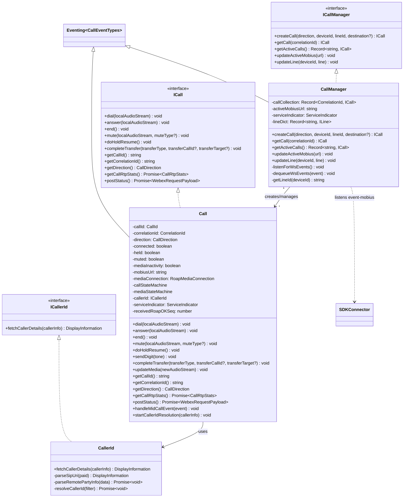
```mermaid
classDiagram
  class Eventing~CallEventTypes~

  class ICallManager {
    <<interface>>
    +createCall(direction, deviceId, lineId, destination?) ICall
    +getCall(correlationId) ICall
    +getActiveCalls() Record~string, ICall~
    +updateActiveMobius(url) void
    +updateLine(deviceId, line) void
  }

  class ICall {
    <<interface>>
    +dial(localAudioStream) void
    +answer(localAudioStream) void
    +end() void
    +mute(localAudioStream, muteType?) void
    +doHoldResume() void
    +completeTransfer(transferType, transferCallId?, transferTarget?) void
    +getCallId() string
    +getCorrelationId() string
    +getDirection() CallDirection
    +getCallRtpStats() Promise~CallRtpStats~
    +postStatus() Promise~WebexRequestPayload~
  }

  class ICallerId {
    <<interface>>
    +fetchCallerDetails(callerInfo) DisplayInformation
  }

  class CallManager {
    -callCollection: Record~CorrelationId, ICall~
    -activeMobiusUrl: string
    -serviceIndicator: ServiceIndicator
    -lineDict: Record~string, ILine~
    +createCall(direction, deviceId, lineId, destination?) ICall
    +getCall(correlationId) ICall
    +getActiveCalls() Record~string, ICall~
    +updateActiveMobius(url) void
    +updateLine(deviceId, line) void
    -listenForWsEvents() void
    -dequeueWsEvents(event) void
    -getLineId(deviceId) string
  }

  class Call {
    -callId: CallId
    -correlationId: CorrelationId
    -direction: CallDirection
    -connected: boolean
    -held: boolean
    -muted: boolean
    -mediaInactivity: boolean
    -mobiusUrl: string
    -mediaConnection: RoapMediaConnection
    -callStateMachine
    -mediaStateMachine
    -callerId: ICallerId
    -serviceIndicator: ServiceIndicator
    -receivedRoapOKSeq: number
    +dial(localAudioStream) void
    +answer(localAudioStream) void
    +end() void
    +mute(localAudioStream, muteType?) void
    +doHoldResume() void
    +sendDigit(tone) void
    +completeTransfer(transferType, transferCallId?, transferTarget?) void
    +updateMedia(newAudioStream) void
    +getCallId() string
    +getCorrelationId() string
    +getDirection() CallDirection
    +getCallRtpStats() Promise~CallRtpStats~
    +postStatus() Promise~WebexRequestPayload~
    +handleMidCallEvent(event) void
    +startCallerIdResolution(callerInfo) void
  }

  class CallerId {
    +fetchCallerDetails(callerInfo) DisplayInformation
    -parseSipUri(paid) DisplayInformation
    -parseRemotePartyInfo(data) Promise~void~
    -resolveCallerId(filter) Promise~void~
  }

  Eventing~CallEventTypes~ <|-- CallManager
  Eventing~CallEventTypes~ <|-- Call
  ICallManager <|.. CallManager
  ICall <|.. Call
  ICallerId <|.. CallerId
  CallManager "1" --> "*" Call : creates/manages
  Call --> CallerId : uses
  CallManager ..> SDKConnector : listens event-mobius
```

---

## Call Construction and Initialization

`Call` creation has two entry paths (inbound and outbound). Both converge at `CallManager.createCall()`, which invokes the `Call` constructor. The constructor runs a deterministic initialization pipeline that sets up identifiers, state defaults, caller ID resolution, metrics, and both XState state machines.

### Entry Paths

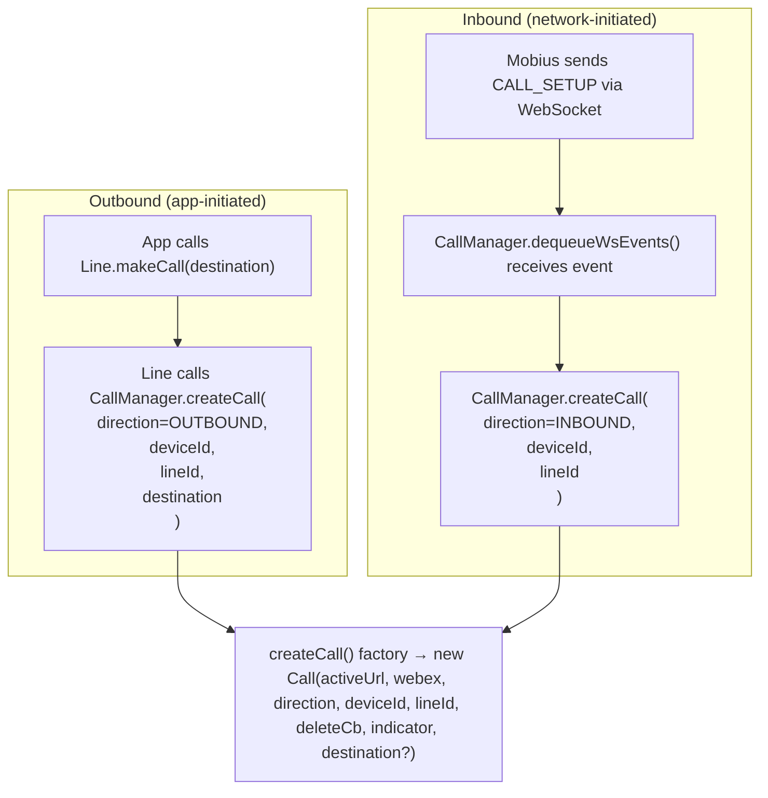
```mermaid
flowchart TD
    subgraph Outbound ["Outbound (app-initiated)"]
        O1["App calls Line.makeCall(destination)"]
        O2["Line calls CallManager.createCall(\n  direction=OUTBOUND,\n  deviceId,\n  lineId,\n  destination\n)"]
        O1 --> O2
    end

    subgraph Inbound ["Inbound (network-initiated)"]
        I1["Mobius sends CALL_SETUP via WebSocket"]
        I2["CallManager.dequeueWsEvents() receives event"]
        I3["CallManager.createCall(\n  direction=INBOUND,\n  deviceId,\n  lineId\n)"]
        I1 --> I2 --> I3
    end

    O2 --> CTOR
    I3 --> CTOR

    CTOR["createCall() factory → new Call(activeUrl, webex, direction, deviceId, lineId, deleteCb, indicator, destination?)"]
```

### Constructor Initialization Pipeline

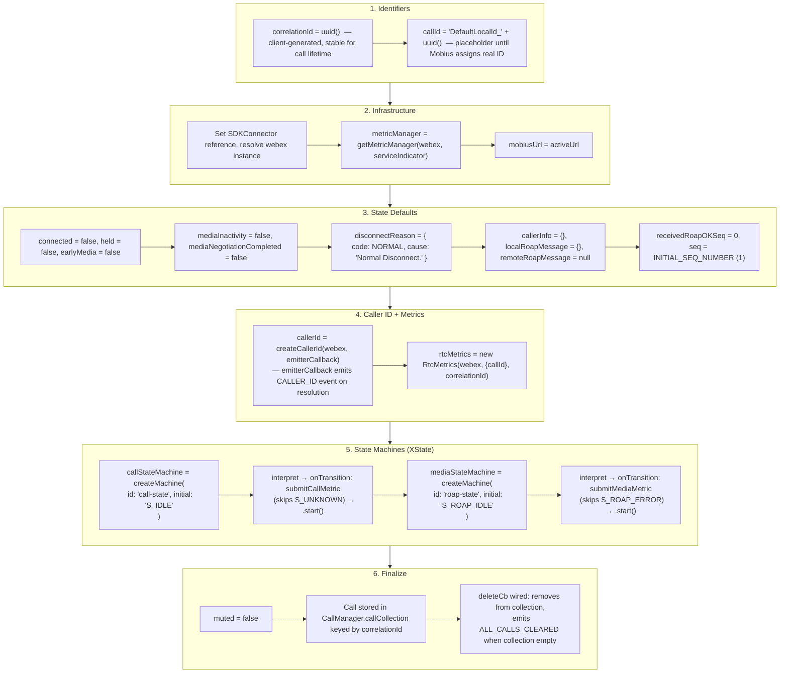
```mermaid
flowchart TD
    subgraph IDs ["1. Identifiers"]
        A1["correlationId = uuid()  — client-generated, stable for call lifetime"]
        A2["callId = 'DefaultLocalId_' + uuid()  — placeholder until Mobius assigns real ID"]
        A1 --> A2
    end

    subgraph Infra ["2. Infrastructure"]
        B1["Set SDKConnector reference, resolve webex instance"]
        B2["metricManager = getMetricManager(webex, serviceIndicator)"]
        B3["mobiusUrl = activeUrl"]
        B1 --> B2 --> B3
    end

    subgraph Defaults ["3. State Defaults"]
        C1["connected = false, held = false, earlyMedia = false"]
        C2["mediaInactivity = false, mediaNegotiationCompleted = false"]
        C3["disconnectReason = { code: NORMAL, cause: 'Normal Disconnect.' }"]
        C4["callerInfo = {}, localRoapMessage = {}, remoteRoapMessage = null"]
        C5["receivedRoapOKSeq = 0, seq = INITIAL_SEQ_NUMBER (1)"]
        C1 --> C2 --> C3 --> C4 --> C5
    end

    subgraph Resolvers ["4. Caller ID + Metrics"]
        D1["callerId = createCallerId(webex, emitterCallback)\n— emitterCallback emits CALLER_ID event on resolution"]
        D2["rtcMetrics = new RtcMetrics(webex, {callId}, correlationId)"]
        D1 --> D2
    end

    subgraph SM ["5. State Machines (XState)"]
        E1["callStateMachine = createMachine(\n  id: 'call-state', initial: 'S_IDLE'\n)"]
        E2["interpret → onTransition: submitCallMetric\n  (skips S_UNKNOWN) → .start()"]
        E3["mediaStateMachine = createMachine(\n  id: 'roap-state', initial: 'S_ROAP_IDLE'\n)"]
        E4["interpret → onTransition: submitMediaMetric\n  (skips S_ROAP_ERROR) → .start()"]
        E1 --> E2 --> E3 --> E4
    end

    subgraph Final ["6. Finalize"]
        F1["muted = false"]
        F2["Call stored in CallManager.callCollection keyed by correlationId"]
        F3["deleteCb wired: removes from collection,\n  emits ALL_CALLS_CLEARED when collection empty"]
        F1 --> F2 --> F3
    end

    IDs --> Infra --> Defaults --> Resolvers --> SM --> Final
```

---

## Call State Machine (XState)

### Complete State Definition


```mermaid
stateDiagram-v2
    [*] --> S_IDLE

    S_IDLE --> S_RECV_CALL_SETUP: E_RECV_CALL_SETUP / incomingCallSetup
    S_IDLE --> S_SEND_CALL_SETUP: E_SEND_CALL_SETUP / outgoingCallSetup
    S_IDLE --> S_RECV_CALL_DISCONNECT: E_RECV_CALL_DISCONNECT / incomingCallDisconnect
    S_IDLE --> S_SEND_CALL_DISCONNECT: E_SEND_CALL_DISCONNECT / outgoingCallDisconnect
    S_IDLE --> S_UNKNOWN: E_UNKNOWN / unknownState

    S_RECV_CALL_SETUP --> S_SEND_CALL_PROGRESS: E_SEND_CALL_ALERTING / outgoingCallAlerting
    S_RECV_CALL_SETUP --> S_RECV_CALL_DISCONNECT: E_RECV_CALL_DISCONNECT / incomingCallDisconnect
    S_RECV_CALL_SETUP --> S_SEND_CALL_DISCONNECT: E_SEND_CALL_DISCONNECT / outgoingCallDisconnect
    S_RECV_CALL_SETUP --> S_UNKNOWN: E_UNKNOWN / unknownState
    S_RECV_CALL_SETUP --> S_CALL_CLEARED: timeout 10000ms

    S_SEND_CALL_SETUP --> S_RECV_CALL_PROGRESS: E_RECV_CALL_PROGRESS / incomingCallProgress
    S_SEND_CALL_SETUP --> S_RECV_CALL_CONNECT: E_RECV_CALL_CONNECT / incomingCallConnect
    S_SEND_CALL_SETUP --> S_RECV_CALL_DISCONNECT: E_RECV_CALL_DISCONNECT / incomingCallDisconnect
    S_SEND_CALL_SETUP --> S_SEND_CALL_DISCONNECT: E_SEND_CALL_DISCONNECT / outgoingCallDisconnect
    S_SEND_CALL_SETUP --> S_UNKNOWN: E_UNKNOWN / unknownState
    S_SEND_CALL_SETUP --> S_CALL_CLEARED: timeout 10000ms

    S_RECV_CALL_PROGRESS --> S_RECV_CALL_CONNECT: E_RECV_CALL_CONNECT / incomingCallConnect
    S_RECV_CALL_PROGRESS --> S_RECV_CALL_DISCONNECT: E_RECV_CALL_DISCONNECT / incomingCallDisconnect
    S_RECV_CALL_PROGRESS --> S_SEND_CALL_DISCONNECT: E_SEND_CALL_DISCONNECT / outgoingCallDisconnect
    S_RECV_CALL_PROGRESS --> S_RECV_CALL_PROGRESS: E_RECV_CALL_PROGRESS / incomingCallProgress
    S_RECV_CALL_PROGRESS --> S_UNKNOWN: E_UNKNOWN / unknownState
    S_RECV_CALL_PROGRESS --> S_CALL_CLEARED: timeout 60000ms

    S_SEND_CALL_PROGRESS --> S_SEND_CALL_CONNECT: E_SEND_CALL_CONNECT / outgoingCallConnect
    S_SEND_CALL_PROGRESS --> S_RECV_CALL_DISCONNECT: E_RECV_CALL_DISCONNECT / incomingCallDisconnect
    S_SEND_CALL_PROGRESS --> S_SEND_CALL_DISCONNECT: E_SEND_CALL_DISCONNECT / outgoingCallDisconnect
    S_SEND_CALL_PROGRESS --> S_UNKNOWN: E_UNKNOWN / unknownState
    S_SEND_CALL_PROGRESS --> S_CALL_CLEARED: timeout 60000ms

    S_RECV_CALL_CONNECT --> S_CALL_ESTABLISHED: E_CALL_ESTABLISHED / callEstablished
    S_RECV_CALL_CONNECT --> S_RECV_CALL_DISCONNECT: E_RECV_CALL_DISCONNECT / incomingCallDisconnect
    S_RECV_CALL_CONNECT --> S_SEND_CALL_DISCONNECT: E_SEND_CALL_DISCONNECT / outgoingCallDisconnect
    S_RECV_CALL_CONNECT --> S_UNKNOWN: E_UNKNOWN / unknownState
    S_RECV_CALL_CONNECT --> S_CALL_CLEARED: timeout 10000ms

    S_SEND_CALL_CONNECT --> S_CALL_ESTABLISHED: E_CALL_ESTABLISHED / callEstablished
    S_SEND_CALL_CONNECT --> S_RECV_CALL_DISCONNECT: E_RECV_CALL_DISCONNECT / incomingCallDisconnect
    S_SEND_CALL_CONNECT --> S_SEND_CALL_DISCONNECT: E_SEND_CALL_DISCONNECT / outgoingCallDisconnect
    S_SEND_CALL_CONNECT --> S_UNKNOWN: E_UNKNOWN / unknownState
    S_SEND_CALL_CONNECT --> S_CALL_CLEARED: timeout 10000ms

    S_CALL_ESTABLISHED --> S_CALL_HOLD: E_CALL_HOLD / initiateCallHold
    S_CALL_ESTABLISHED --> S_CALL_RESUME: E_CALL_RESUME / initiateCallResume
    S_CALL_ESTABLISHED --> S_RECV_CALL_DISCONNECT: E_RECV_CALL_DISCONNECT / incomingCallDisconnect
    S_CALL_ESTABLISHED --> S_SEND_CALL_DISCONNECT: E_SEND_CALL_DISCONNECT / outgoingCallDisconnect
    S_CALL_ESTABLISHED --> S_CALL_ESTABLISHED: E_CALL_ESTABLISHED
    S_CALL_ESTABLISHED --> S_UNKNOWN: E_UNKNOWN / unknownState

    S_CALL_HOLD --> S_RECV_CALL_DISCONNECT: E_RECV_CALL_DISCONNECT / incomingCallDisconnect
    S_CALL_HOLD --> S_SEND_CALL_DISCONNECT: E_SEND_CALL_DISCONNECT / outgoingCallDisconnect
    S_CALL_HOLD --> S_CALL_ESTABLISHED: E_CALL_ESTABLISHED / callEstablished
    S_CALL_HOLD --> S_UNKNOWN: E_UNKNOWN / unknownState

    S_CALL_RESUME --> S_RECV_CALL_DISCONNECT: E_RECV_CALL_DISCONNECT / incomingCallDisconnect
    S_CALL_RESUME --> S_SEND_CALL_DISCONNECT: E_SEND_CALL_DISCONNECT / outgoingCallDisconnect
    S_CALL_RESUME --> S_CALL_ESTABLISHED: E_CALL_ESTABLISHED / callEstablished
    S_CALL_RESUME --> S_UNKNOWN: E_UNKNOWN / unknownState

    S_RECV_CALL_DISCONNECT --> S_CALL_CLEARED: E_CALL_CLEARED
    S_SEND_CALL_DISCONNECT --> S_CALL_CLEARED: E_CALL_CLEARED
    S_UNKNOWN --> S_CALL_CLEARED: E_CALL_CLEARED
    S_ERROR --> S_CALL_CLEARED: E_CALL_CLEARED
    S_CALL_CLEARED --> [*]
```

### State Machine Action Handlers

| Action Name | Handler Method | Triggered On |
|------------|---------------|-------------|
| `incomingCallSetup` | `handleIncomingCallSetup()` | Incoming call received |
| `outgoingCallSetup` | `handleOutgoingCallSetup()` | Outgoing call initiated - POST /call to Mobius |
| `incomingCallProgress` | `handleIncomingCallProgress()` | Remote alerting/progress received |
| `outgoingCallAlerting` | `handleOutgoingCallAlerting()` | Send alerting - PATCH call state to Mobius |
| `incomingCallConnect` | `handleIncomingCallConnect()` | Remote connected, emit CONNECT |
| `outgoingCallConnect` | `handleOutgoingCallConnect()` | Answer call - process buffered ROAP, PATCH connected |
| `callEstablished` | `handleCallEstablished()` | Call fully established, emit ESTABLISHED, start session timer |
| `initiateCallHold` | `handleCallHold()` | POST to /callhold/hold |
| `initiateCallResume` | `handleCallResume()` | POST to /callhold/resume |
| `incomingCallDisconnect` | `handleIncomingCallDisconnect()` | Remote disconnect - cleanup, emit DISCONNECT |
| `outgoingCallDisconnect` | `handleOutgoingCallDisconnect()` | Local disconnect - DELETE call, cleanup |
| `unknownState` | `handleUnknownState()` | Unknown event - cleanup |
| `triggerTimeout` | `handleTimeout()` | State timeout - cleanup, emit error |

---

## Media ROAP State Machine (XState)

### Complete State Definition

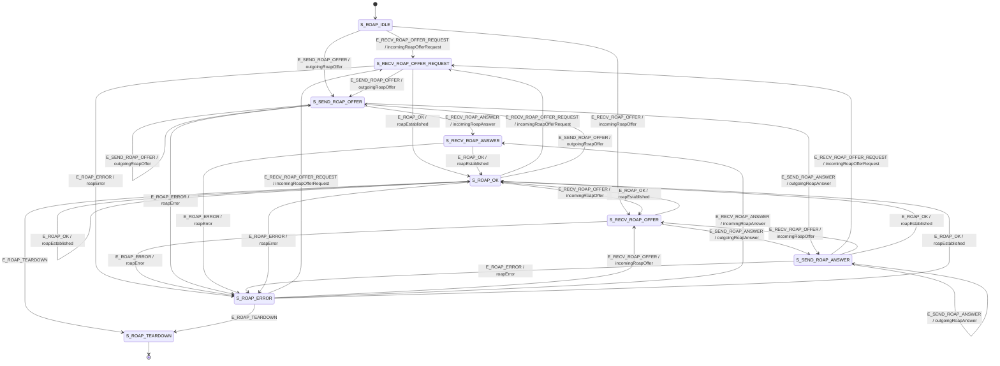
```mermaid
stateDiagram-v2
    [*] --> S_ROAP_IDLE

    S_ROAP_IDLE --> S_RECV_ROAP_OFFER_REQUEST: E_RECV_ROAP_OFFER_REQUEST / incomingRoapOfferRequest
    S_ROAP_IDLE --> S_RECV_ROAP_OFFER: E_RECV_ROAP_OFFER / incomingRoapOffer
    S_ROAP_IDLE --> S_SEND_ROAP_OFFER: E_SEND_ROAP_OFFER / outgoingRoapOffer

    S_RECV_ROAP_OFFER_REQUEST --> S_SEND_ROAP_OFFER: E_SEND_ROAP_OFFER / outgoingRoapOffer
    S_RECV_ROAP_OFFER_REQUEST --> S_ROAP_OK: E_ROAP_OK / roapEstablished
    S_RECV_ROAP_OFFER_REQUEST --> S_ROAP_ERROR: E_ROAP_ERROR / roapError

    S_RECV_ROAP_OFFER --> S_SEND_ROAP_ANSWER: E_SEND_ROAP_ANSWER / outgoingRoapAnswer
    S_RECV_ROAP_OFFER --> S_ROAP_OK: E_ROAP_OK / roapEstablished
    S_RECV_ROAP_OFFER --> S_ROAP_ERROR: E_ROAP_ERROR / roapError

    S_SEND_ROAP_OFFER --> S_RECV_ROAP_ANSWER: E_RECV_ROAP_ANSWER / incomingRoapAnswer
    S_SEND_ROAP_OFFER --> S_SEND_ROAP_ANSWER: E_SEND_ROAP_ANSWER / outgoingRoapAnswer
    S_SEND_ROAP_OFFER --> S_SEND_ROAP_OFFER: E_SEND_ROAP_OFFER / outgoingRoapOffer
    S_SEND_ROAP_OFFER --> S_ROAP_ERROR: E_ROAP_ERROR / roapError

    S_RECV_ROAP_ANSWER --> S_ROAP_OK: E_ROAP_OK / roapEstablished
    S_RECV_ROAP_ANSWER --> S_ROAP_ERROR: E_ROAP_ERROR / roapError

    S_SEND_ROAP_ANSWER --> S_RECV_ROAP_OFFER_REQUEST: E_RECV_ROAP_OFFER_REQUEST / incomingRoapOfferRequest
    S_SEND_ROAP_ANSWER --> S_RECV_ROAP_OFFER: E_RECV_ROAP_OFFER / incomingRoapOffer
    S_SEND_ROAP_ANSWER --> S_ROAP_OK: E_ROAP_OK / roapEstablished
    S_SEND_ROAP_ANSWER --> S_SEND_ROAP_ANSWER: E_SEND_ROAP_ANSWER / outgoingRoapAnswer
    S_SEND_ROAP_ANSWER --> S_ROAP_ERROR: E_ROAP_ERROR / roapError

    S_ROAP_OK --> S_RECV_ROAP_OFFER_REQUEST: E_RECV_ROAP_OFFER_REQUEST / incomingRoapOfferRequest
    S_ROAP_OK --> S_RECV_ROAP_OFFER: E_RECV_ROAP_OFFER / incomingRoapOffer
    S_ROAP_OK --> S_ROAP_OK: E_ROAP_OK / roapEstablished
    S_ROAP_OK --> S_SEND_ROAP_OFFER: E_SEND_ROAP_OFFER / outgoingRoapOffer
    S_ROAP_OK --> S_ROAP_ERROR: E_ROAP_ERROR / roapError
    S_ROAP_OK --> S_ROAP_TEARDOWN: E_ROAP_TEARDOWN

    S_ROAP_ERROR --> S_ROAP_TEARDOWN: E_ROAP_TEARDOWN
    S_ROAP_ERROR --> S_RECV_ROAP_OFFER_REQUEST: E_RECV_ROAP_OFFER_REQUEST / incomingRoapOfferRequest
    S_ROAP_ERROR --> S_RECV_ROAP_OFFER: E_RECV_ROAP_OFFER / incomingRoapOffer
    S_ROAP_ERROR --> S_RECV_ROAP_ANSWER: E_RECV_ROAP_ANSWER / incomingRoapAnswer
    S_ROAP_ERROR --> S_ROAP_OK: E_ROAP_OK / roapEstablished

    S_ROAP_TEARDOWN --> [*]
```

### ROAP Action Handlers

| Action Name | Handler Method | Description |
|------------|---------------|-------------|
| `outgoingRoapOffer` | `handleOutgoingRoapOffer()` | Generate and send SDP offer via `postMedia()` |
| `outgoingRoapAnswer` | `handleOutgoingRoapAnswer()` | Generate and send SDP answer via `postMedia()` |
| `incomingRoapOffer` | `handleIncomingRoapOffer()` | Process received SDP offer, forward to `mediaConnection.roapMessageReceived()` |
| `incomingRoapAnswer` | `handleIncomingRoapAnswer()` | Process received SDP answer, forward to `mediaConnection.roapMessageReceived()` |
| `incomingRoapOfferRequest` | `handleIncomingRoapOfferRequest()` | Handle request from server to generate a new offer |
| `roapEstablished` | `handleRoapEstablished()` | Media negotiation complete, send ROAP OK to server, set `mediaNegotiationCompleted`, transition call state to `E_CALL_ESTABLISHED` |
| `roapError` | `handleRoapError()` | Media error, emit `CALL_ERROR`, disconnect call |

---

## CallManager Event Processing Pipeline

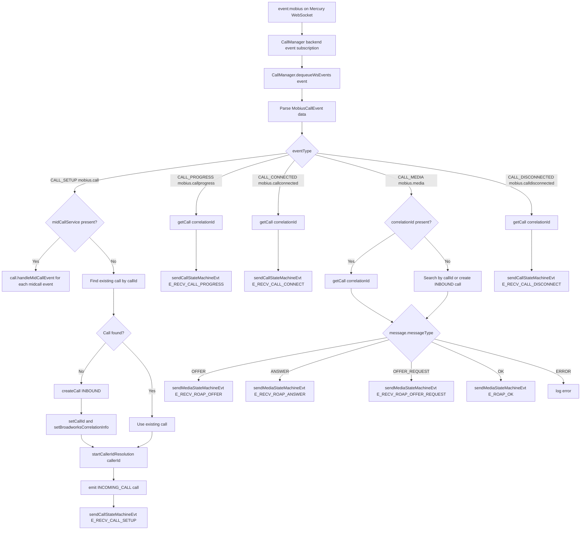
```mermaid
flowchart TD
    A[event:mobius on Mercury WebSocket] --> B[CallManager backend event subscription]
    B --> C[CallManager.dequeueWsEvents event]
    C --> D[Parse MobiusCallEvent data]
    D --> E{eventType}

    E -->|CALL_SETUP mobius.call| F{midCallService present?}
    F -->|Yes| F1[call.handleMidCallEvent for each midcall event]
    F -->|No| F2[Find existing call by callId]
    F2 --> F3{Call found?}
    F3 -->|No| F4[createCall INBOUND]
    F4 --> F5[setCallId and setBroadworksCorrelationInfo]
    F3 -->|Yes| F6[Use existing call]
    F5 --> F7[startCallerIdResolution callerId]
    F6 --> F7
    F7 --> F8[emit INCOMING_CALL call]
    F8 --> F9[sendCallStateMachineEvt E_RECV_CALL_SETUP]

    E -->|CALL_PROGRESS mobius.callprogress| G[getCall correlationId]
    G --> G1[sendCallStateMachineEvt E_RECV_CALL_PROGRESS]

    E -->|CALL_CONNECTED mobius.callconnected| H[getCall correlationId]
    H --> H1[sendCallStateMachineEvt E_RECV_CALL_CONNECT]

    E -->|CALL_MEDIA mobius.media| I{correlationId present?}
    I -->|Yes| I1[getCall correlationId]
    I -->|No| I2[Search by callId or create INBOUND call]
    I1 --> J{message.messageType}
    I2 --> J
    J -->|OFFER| J1[sendMediaStateMachineEvt E_RECV_ROAP_OFFER]
    J -->|ANSWER| J2[sendMediaStateMachineEvt E_RECV_ROAP_ANSWER]
    J -->|OFFER_REQUEST| J3[sendMediaStateMachineEvt E_RECV_ROAP_OFFER_REQUEST]
    J -->|OK| J4[sendMediaStateMachineEvt E_ROAP_OK]
    J -->|ERROR| J5[log error]

    E -->|CALL_DISCONNECTED mobius.calldisconnected| K[getCall correlationId]
    K --> K1[sendCallStateMachineEvt E_RECV_CALL_DISCONNECT]
```

## Event Handling Details

This module has two event layers:
- **Inbound/internal events** consumed by `CallManager`/`Call` (Mobius, media engine, stream/effect events).
- **Public SDK events** emitted from `Call` (and `CallManager`) for app consumers.

### 1) Events We Listen To

| Source | Event | Handler Path | Purpose |
|--------|-------|--------------|---------|
| `CallManager Instantiation` | `event:mobius` | `listenForWsEvents()` -> `dequeueWsEvents()` | Entry point for all signaling/media events from backend |
| `Mobius` | `mobius.call` | `CallManager.dequeueWsEvents()` | Create/resolve call, trigger `E_RECV_CALL_SETUP`, handle mid-call payload |
| `Mobius` | `mobius.callprogress` | `CallManager.dequeueWsEvents()` | Trigger `E_RECV_CALL_PROGRESS` (caller ID refresh is handled in `Call.handleIncomingCallProgress()`) |
| `Mobius` | `mobius.callconnected` | `CallManager.dequeueWsEvents()` | Trigger `E_RECV_CALL_CONNECT` |
| `Mobius` | `mobius.media` | `CallManager.dequeueWsEvents()` -> `call.sendMediaStateMachineEvt(...)` | Route ROAP `OFFER/ANSWER/OFFER_REQUEST/OK` |
| `Mobius` | `mobius.calldisconnected` | `CallManager.dequeueWsEvents()` -> `E_RECV_CALL_DISCONNECT` | Start disconnect cleanup |
| `MediaConnection` | `ROAP_MESSAGE_TO_SEND` | `Call.mediaRoapEventsListener()` | Publish local ROAP back to Mobius (`postMedia`) |
| `MediaConnection` | `REMOTE_TRACK_ADDED` | `Call.mediaTrackListener()` | Emit remote media track to app |
| `LocalMicrophoneStream` | `OutputTrackChange`, `EffectAdded` | `Call.registerListeners()` | Keep media/effect state synchronized (`EffectAdded` registers per-effect `Enabled/Disabled` listeners) |

### 2) Events Emitted By Call Object

| Event Key | Payload | Emitted When |
|-----------|---------|--------------|
| `CALL_EVENT_KEYS.PROGRESS` | `correlationId` | Progress/proceeding signaling received |
| `CALL_EVENT_KEYS.CONNECT` | `correlationId` | Call connected signaling received |
| `CALL_EVENT_KEYS.ESTABLISHED` | `correlationId` | Signaling + media negotiation complete |
| `CALL_EVENT_KEYS.HELD` | `correlationId` | Hold confirmed by mid-call state |
| `CALL_EVENT_KEYS.RESUMED` | `correlationId` | Resume confirmed by mid-call state |
| `CALL_EVENT_KEYS.DISCONNECT` | `correlationId` | Call disconnected (local or remote) |
| `CALL_EVENT_KEYS.REMOTE_MEDIA` | `MediaStreamTrack` | Remote audio track becomes available |
| `CALL_EVENT_KEYS.CALLER_ID` | `{ correlationId: CorrelationId, callerId: DisplayInformation }` | Caller ID resolved/updated |
| `CALL_EVENT_KEYS.CALL_ERROR` | `CallError` | General call or media error |
| `CALL_EVENT_KEYS.HOLD_ERROR` | `CallError` | Hold operation failed/timed out |
| `CALL_EVENT_KEYS.RESUME_ERROR` | `CallError` | Resume operation failed/timed out |
| `CALL_EVENT_KEYS.TRANSFER_ERROR` | `CallError` | Transfer operation failed |

Related manager-level emissions:
- `LINE_EVENT_KEYS.INCOMING_CALL` (from `CallManager`) with `ICall` payload.
- `CALLING_CLIENT_EVENT_KEYS.ALL_CALLS_CLEARED` when active call collection becomes empty.

### 3) How Consumers Should Listen

Listen for incoming calls first, then attach per-call listeners:

```typescript
import {CALL_EVENT_KEYS, ICall, LINE_EVENTS} from '@webex/calling';

line.on(LINE_EVENTS.INCOMING_CALL, (call: ICall) => {
  call.on(CALL_EVENT_KEYS.PROGRESS, (id) => {/* update UI */});
  call.on(CALL_EVENT_KEYS.CONNECT, (id) => {/* ringing -> connected */});
  call.on(CALL_EVENT_KEYS.ESTABLISHED, (id) => {/* media established */});
  call.on(CALL_EVENT_KEYS.REMOTE_MEDIA, (track) => {/* attach remote track */});
  call.on(CALL_EVENT_KEYS.CALLER_ID, ({correlationId, callerId}) => {/* refresh caller display */});
  call.on(CALL_EVENT_KEYS.CALL_ERROR, (err) => {/* show retry/failure */});
  call.on(CALL_EVENT_KEYS.DISCONNECT, (id) => {/* teardown UI */});
});
```

For outbound calls, attach listeners immediately after `createCall`/`makeCall` and before or right after `dial()` to avoid missing early events.

---

## Outgoing Call Flow (Detailed)

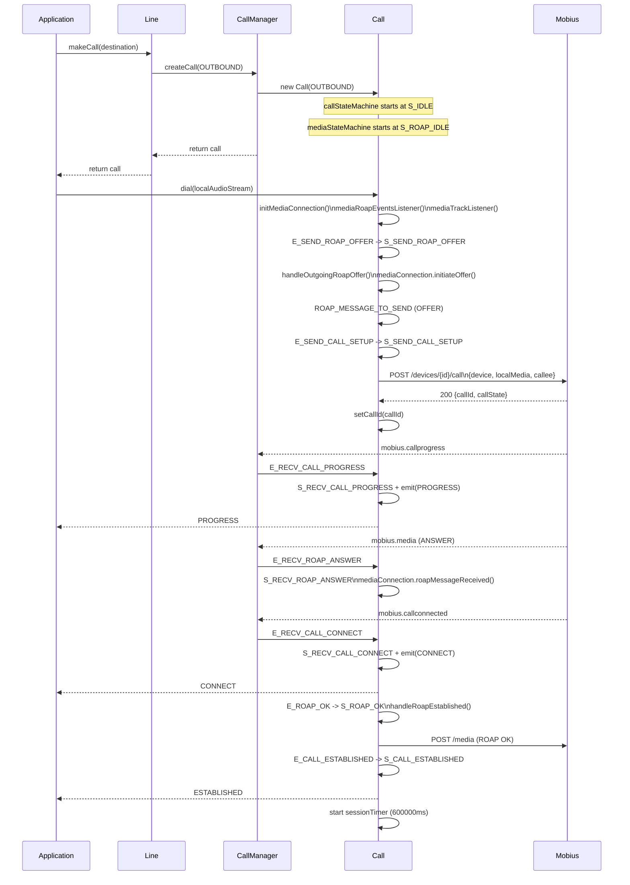
```mermaid
sequenceDiagram
    participant App as Application
    participant Line as Line
    participant CM as CallManager
    participant Call as Call
    participant Mobius as Mobius

    App->>Line: makeCall(destination)
    Line->>CM: createCall(OUTBOUND)
    CM->>Call: new Call(OUTBOUND)
    Note over Call: callStateMachine starts at S_IDLE
    Note over Call: mediaStateMachine starts at S_ROAP_IDLE
    CM-->>Line: return call
    Line-->>App: return call

    App->>Call: dial(localAudioStream)
    Call->>Call: initMediaConnection()\nmediaRoapEventsListener()\nmediaTrackListener()
    Call->>Call: E_SEND_ROAP_OFFER -> S_SEND_ROAP_OFFER
    Call->>Call: handleOutgoingRoapOffer()\nmediaConnection.initiateOffer()
    Call->>Call: ROAP_MESSAGE_TO_SEND (OFFER)

    Call->>Call: E_SEND_CALL_SETUP -> S_SEND_CALL_SETUP
    Call->>Mobius: POST /devices/{id}/call\n{device, localMedia, callee}
    Mobius-->>Call: 200 {callId, callState}
    Call->>Call: setCallId(callId)

    Mobius-->>CM: mobius.callprogress
    CM->>Call: E_RECV_CALL_PROGRESS
    Call->>Call: S_RECV_CALL_PROGRESS + emit(PROGRESS)
    Call-->>App: PROGRESS

    Mobius-->>CM: mobius.media (ANSWER)
    CM->>Call: E_RECV_ROAP_ANSWER
    Call->>Call: S_RECV_ROAP_ANSWER\nmediaConnection.roapMessageReceived()

    Mobius-->>CM: mobius.callconnected
    CM->>Call: E_RECV_CALL_CONNECT
    Call->>Call: S_RECV_CALL_CONNECT + emit(CONNECT)
    Call-->>App: CONNECT

    Call->>Call: E_ROAP_OK -> S_ROAP_OK\nhandleRoapEstablished()
    Call->>Mobius: POST /media (ROAP OK)
    Call->>Call: E_CALL_ESTABLISHED -> S_CALL_ESTABLISHED
    Call-->>App: ESTABLISHED
    Call->>Call: start sessionTimer (600000ms)
```

---

## Incoming Call Flow (Detailed)

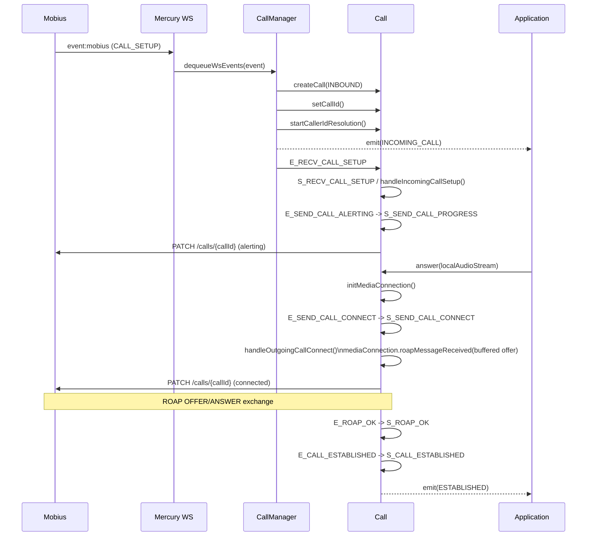
```mermaid
sequenceDiagram
    participant Mobius as Mobius
    participant Mercury as Mercury WS
    participant CM as CallManager
    participant Call as Call
    participant App as Application

    Mobius->>Mercury: event:mobius (CALL_SETUP)
    Mercury->>CM: dequeueWsEvents(event)
    CM->>Call: createCall(INBOUND)
    CM->>Call: setCallId()
    CM->>Call: startCallerIdResolution()
    CM-->>App: emit(INCOMING_CALL)

    CM->>Call: E_RECV_CALL_SETUP
    Call->>Call: S_RECV_CALL_SETUP / handleIncomingCallSetup()
    Call->>Call: E_SEND_CALL_ALERTING -> S_SEND_CALL_PROGRESS
    Call->>Mobius: PATCH /calls/{callId} (alerting)

    App->>Call: answer(localAudioStream)
    Call->>Call: initMediaConnection()
    Call->>Call: E_SEND_CALL_CONNECT -> S_SEND_CALL_CONNECT
    Call->>Call: handleOutgoingCallConnect()\nmediaConnection.roapMessageReceived(buffered offer)
    Call->>Mobius: PATCH /calls/{callId} (connected)

    Note over Call,Mobius: ROAP OFFER/ANSWER exchange
    Call->>Call: E_ROAP_OK -> S_ROAP_OK
    Call->>Call: E_CALL_ESTABLISHED -> S_CALL_ESTABLISHED
    Call-->>App: emit(ESTABLISHED)
```

---

## Hold and Resume Flow

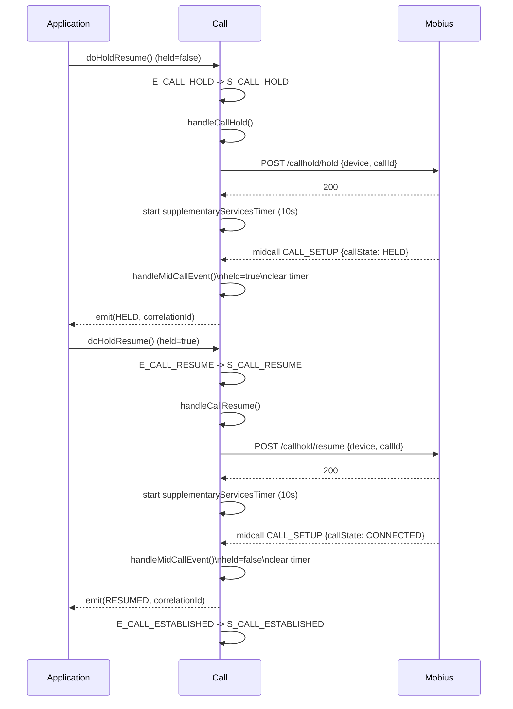
```mermaid
sequenceDiagram
    participant App as Application
    participant Call as Call
    participant Mobius as Mobius

    App->>Call: doHoldResume() (held=false)
    Call->>Call: E_CALL_HOLD -> S_CALL_HOLD
    Call->>Call: handleCallHold()
    Call->>Mobius: POST /callhold/hold {device, callId}
    Mobius-->>Call: 200
    Call->>Call: start supplementaryServicesTimer (10s)
    Mobius-->>Call: midcall CALL_SETUP {callState: HELD}
    Call->>Call: handleMidCallEvent()\nheld=true\nclear timer
    Call-->>App: emit(HELD, correlationId)

    App->>Call: doHoldResume() (held=true)
    Call->>Call: E_CALL_RESUME -> S_CALL_RESUME
    Call->>Call: handleCallResume()
    Call->>Mobius: POST /callhold/resume {device, callId}
    Mobius-->>Call: 200
    Call->>Call: start supplementaryServicesTimer (10s)
    Mobius-->>Call: midcall CALL_SETUP {callState: CONNECTED}
    Call->>Call: handleMidCallEvent()\nheld=false\nclear timer
    Call-->>App: emit(RESUMED, correlationId)
    Call->>Call: E_CALL_ESTABLISHED -> S_CALL_ESTABLISHED
```

---

## Failure Flows

### Outgoing Call Setup Failure

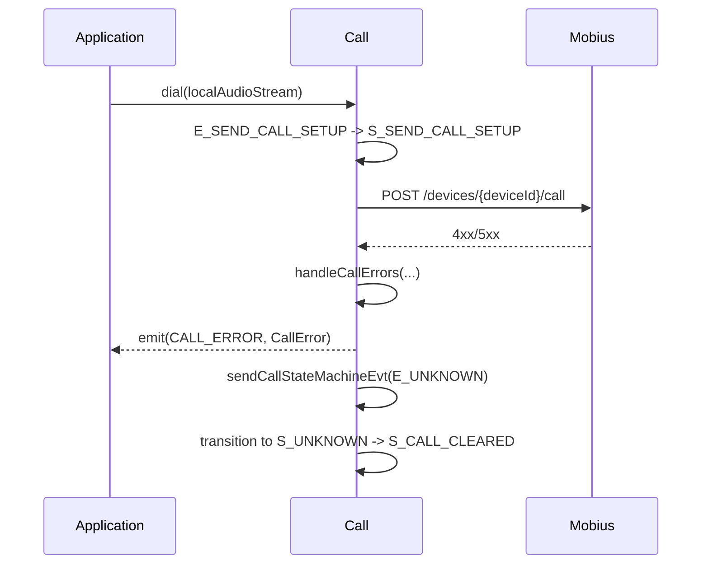
```mermaid
sequenceDiagram
    participant App as Application
    participant Call as Call
    participant Mobius as Mobius

    App->>Call: dial(localAudioStream)
    Call->>Call: E_SEND_CALL_SETUP -> S_SEND_CALL_SETUP
    Call->>Mobius: POST /devices/{deviceId}/call
    Mobius-->>Call: 4xx/5xx
    Call->>Call: handleCallErrors(...)
    Call-->>App: emit(CALL_ERROR, CallError)
    Call->>Call: sendCallStateMachineEvt(E_UNKNOWN)
    Call->>Call: transition to S_UNKNOWN -> S_CALL_CLEARED
```

### Hold/Resume Failure (Error + Timeout)

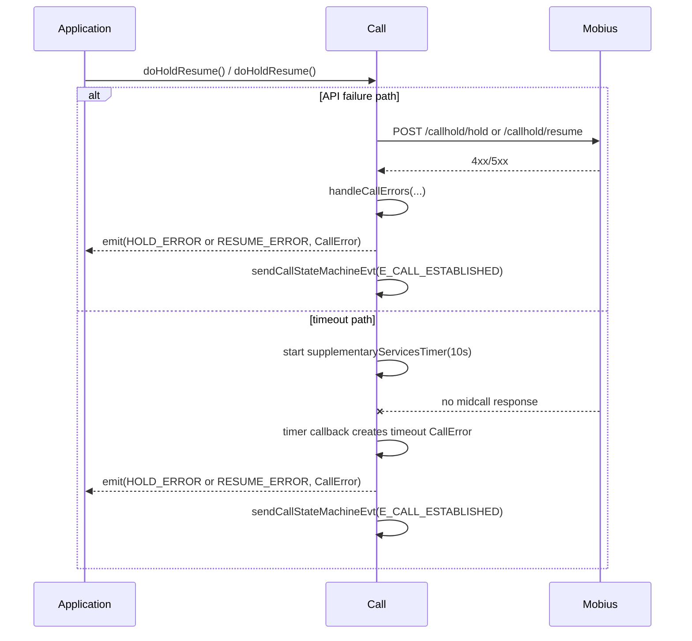
```mermaid
sequenceDiagram
    participant App as Application
    participant Call as Call
    participant Mobius as Mobius

    App->>Call: doHoldResume() / doHoldResume()
    alt API failure path
        Call->>Mobius: POST /callhold/hold or /callhold/resume
        Mobius-->>Call: 4xx/5xx
        Call->>Call: handleCallErrors(...)
        Call-->>App: emit(HOLD_ERROR or RESUME_ERROR, CallError)
        Call->>Call: sendCallStateMachineEvt(E_CALL_ESTABLISHED)
    else timeout path
        Call->>Call: start supplementaryServicesTimer(10s)
        Mobius--x Call: no midcall response
        Call->>Call: timer callback creates timeout CallError
        Call-->>App: emit(HOLD_ERROR or RESUME_ERROR, CallError)
        Call->>Call: sendCallStateMachineEvt(E_CALL_ESTABLISHED)
    end
```

---

## Transfer Flow

### Blind Transfer

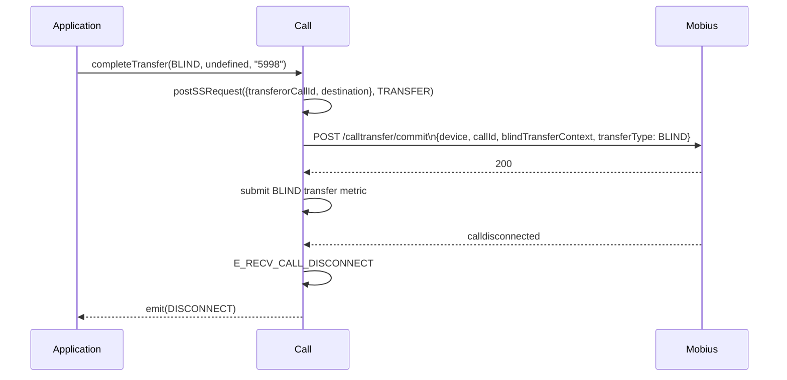
```mermaid
sequenceDiagram
    participant App as Application
    participant Call as Call
    participant Mobius as Mobius

    App->>Call: completeTransfer(BLIND, undefined, "5998")
    Call->>Call: postSSRequest({transferorCallId, destination}, TRANSFER)
    Call->>Mobius: POST /calltransfer/commit\n{device, callId, blindTransferContext, transferType: BLIND}
    Mobius-->>Call: 200
    Call->>Call: submit BLIND transfer metric
    Mobius-->>Call: calldisconnected
    Call->>Call: E_RECV_CALL_DISCONNECT
    Call-->>App: emit(DISCONNECT)
```

### Consult Transfer

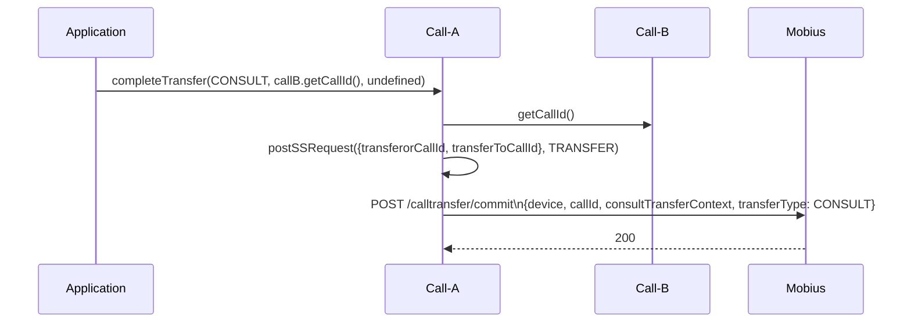
```mermaid
sequenceDiagram
    participant App as Application
    participant CallA as Call-A
    participant CallB as Call-B
    participant Mobius as Mobius

    App->>CallA: completeTransfer(CONSULT, callB.getCallId(), undefined)
    CallA->>CallB: getCallId()
    CallA->>CallA: postSSRequest({transferorCallId, transferToCallId}, TRANSFER)
    CallA->>Mobius: POST /calltransfer/commit\n{device, callId, consultTransferContext, transferType: CONSULT}
    Mobius-->>CallA: 200
```

---

## Media Connection Lifecycle

### Initialization

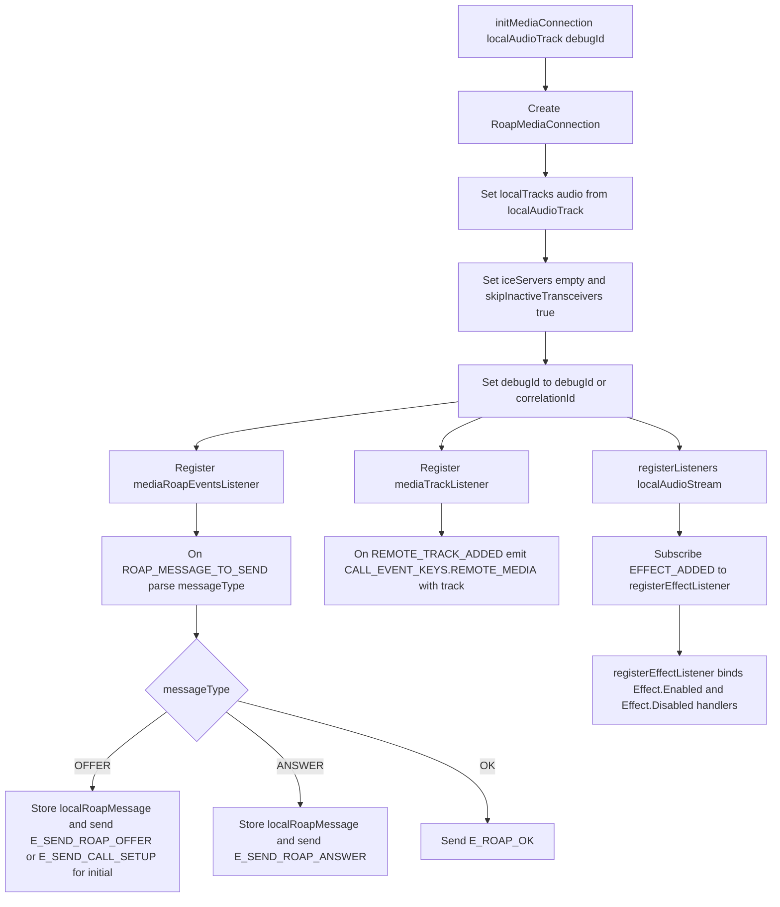
```mermaid
flowchart TD
    A[initMediaConnection localAudioTrack debugId] --> B[Create RoapMediaConnection]
    B --> C[Set localTracks audio from localAudioTrack]
    C --> D[Set iceServers empty and skipInactiveTransceivers true]
    D --> E[Set debugId to debugId or correlationId]

    E --> F[Register mediaRoapEventsListener]
    F --> G[On ROAP_MESSAGE_TO_SEND parse messageType]
    G --> H{messageType}
    H -->|OFFER| H1[Store localRoapMessage and send E_SEND_ROAP_OFFER or E_SEND_CALL_SETUP for initial]
    H -->|ANSWER| H2[Store localRoapMessage and send E_SEND_ROAP_ANSWER]
    H -->|OK| H3[Send E_ROAP_OK]

    E --> I[Register mediaTrackListener]
    I --> J[On REMOTE_TRACK_ADDED emit CALL_EVENT_KEYS.REMOTE_MEDIA with track]

    E --> K[registerListeners localAudioStream]
    K --> L[Subscribe EFFECT_ADDED to registerEffectListener]
    L --> M[registerEffectListener binds Effect.Enabled and Effect.Disabled handlers]
```

### SDP Processing

ROAP handling is bidirectional:

### Direction 1: Mobius -> Call -> MediaConnection (incoming signaling/media event)

When Mobius sends a media event, `CallManager` routes it to the target `Call`, which forwards it into the media state machine and then to `mediaConnection.roapMessageReceived()` for SDP processing.

1. `event:mobius` with `CALL_MEDIA` reaches `CallManager.dequeueWsEvents()`.
2. `CallManager` resolves the correct call by `correlationId` (or fallback by `callId`).
3. `message.messageType` is mapped to media state events:
   - `OFFER` -> `E_RECV_ROAP_OFFER`
   - `ANSWER` -> `E_RECV_ROAP_ANSWER`
   - `OFFER_REQUEST` -> `E_RECV_ROAP_OFFER_REQUEST`
   - `OK` -> `E_ROAP_OK`
4. `Call` action handlers process the event and pass the ROAP payload to media engine APIs when applicable.

### Direction 2: MediaConnection -> Call -> Mobius (outgoing ROAP publish)

When the media engine emits `ROAP_MESSAGE_TO_SEND`, `Call` converts that into state-machine events and publishes ROAP to Mobius via `postMedia()`.

1. `mediaConnection` emits `ROAP_MESSAGE_TO_SEND` (`OFFER`/`ANSWER`/`OK`).
2. `Call.mediaRoapEventsListener()` stores the local ROAP message and sends the corresponding event (`E_SEND_ROAP_OFFER`, `E_SEND_ROAP_ANSWER`, `E_ROAP_OK`).
3. Outgoing action handlers invoke `postMedia()`.
4. `postMedia()` applies `modifySdpForIPv4()` before sending SDP-bearing payloads.

### Complete ROAP Sequence (Inbound Call)

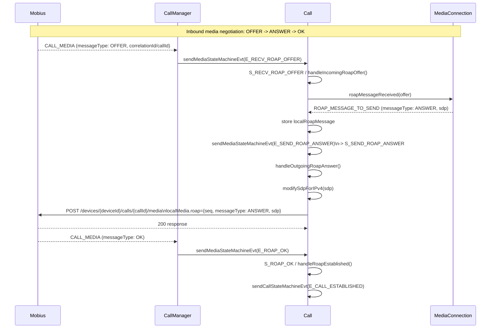
```mermaid
sequenceDiagram
    participant Mobius as Mobius
    participant CM as CallManager
    participant Call as Call
    participant MC as MediaConnection

    Note over Mobius,MC: Inbound media negotiation: OFFER -> ANSWER -> OK

    Mobius-->>CM: CALL_MEDIA (messageType: OFFER, correlationId/callId)
    CM->>Call: sendMediaStateMachineEvt(E_RECV_ROAP_OFFER)
    Call->>Call: S_RECV_ROAP_OFFER / handleIncomingRoapOffer()
    Call->>MC: roapMessageReceived(offer)

    MC-->>Call: ROAP_MESSAGE_TO_SEND (messageType: ANSWER, sdp)
    Call->>Call: store localRoapMessage
    Call->>Call: sendMediaStateMachineEvt(E_SEND_ROAP_ANSWER)\n-> S_SEND_ROAP_ANSWER
    Call->>Call: handleOutgoingRoapAnswer()
    Call->>Call: modifySdpForIPv4(sdp)
    Call->>Mobius: POST /devices/{deviceId}/calls/{callId}/media\nlocalMedia.roap={seq, messageType: ANSWER, sdp}
    Mobius-->>Call: 200 response

    Mobius-->>CM: CALL_MEDIA (messageType: OK)
    CM->>Call: sendMediaStateMachineEvt(E_ROAP_OK)
    Call->>Call: S_ROAP_OK / handleRoapEstablished()
    Call->>Call: sendCallStateMachineEvt(E_CALL_ESTABLISHED)
```

### Complete ROAP Sequence (Outbound Call)

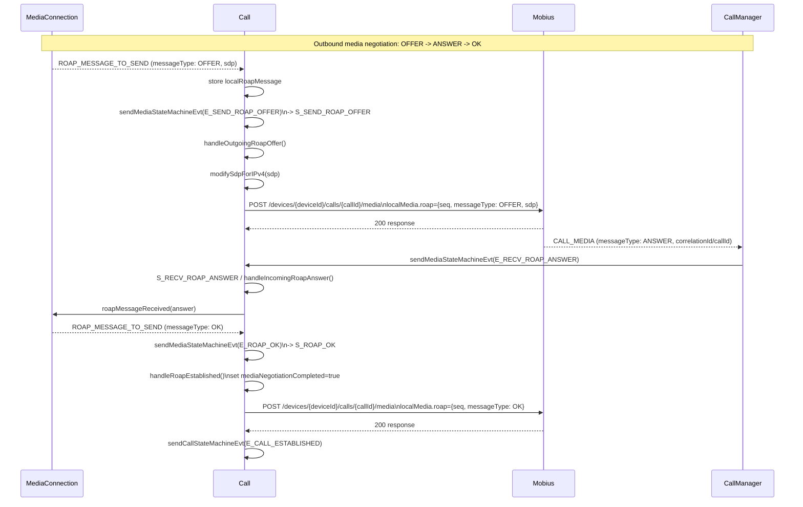
```mermaid
sequenceDiagram
    participant MC as MediaConnection
    participant Call as Call
    participant Mobius as Mobius
    participant CM as CallManager

    Note over MC,CM: Outbound media negotiation: OFFER -> ANSWER -> OK

    MC-->>Call: ROAP_MESSAGE_TO_SEND (messageType: OFFER, sdp)
    Call->>Call: store localRoapMessage
    Call->>Call: sendMediaStateMachineEvt(E_SEND_ROAP_OFFER)\n-> S_SEND_ROAP_OFFER
    Call->>Call: handleOutgoingRoapOffer()
    Call->>Call: modifySdpForIPv4(sdp)
    Call->>Mobius: POST /devices/{deviceId}/calls/{callId}/media\nlocalMedia.roap={seq, messageType: OFFER, sdp}
    Mobius-->>Call: 200 response

    Mobius-->>CM: CALL_MEDIA (messageType: ANSWER, correlationId/callId)
    CM->>Call: sendMediaStateMachineEvt(E_RECV_ROAP_ANSWER)
    Call->>Call: S_RECV_ROAP_ANSWER / handleIncomingRoapAnswer()
    Call->>MC: roapMessageReceived(answer)

    MC-->>Call: ROAP_MESSAGE_TO_SEND (messageType: OK)
    Call->>Call: sendMediaStateMachineEvt(E_ROAP_OK)\n-> S_ROAP_OK
    Call->>Call: handleRoapEstablished()\nset mediaNegotiationCompleted=true
    Call->>Mobius: POST /devices/{deviceId}/calls/{callId}/media\nlocalMedia.roap={seq, messageType: OK}
    Mobius-->>Call: 200 response
    Call->>Call: sendCallStateMachineEvt(E_CALL_ESTABLISHED)
```

ROAP publish payload shape:

```json
{
  "device": { "deviceId": "...", "correlationId": "..." },
  "callId": "...",
  "localMedia": {
    "roap": { "seq": 1, "messageType": "OFFER|ANSWER|OK", "sdp": "..." },
    "mediaId": "..."
  }
}
```

---

## Disconnect and Cleanup Flow

### Local Disconnect (`end()`)

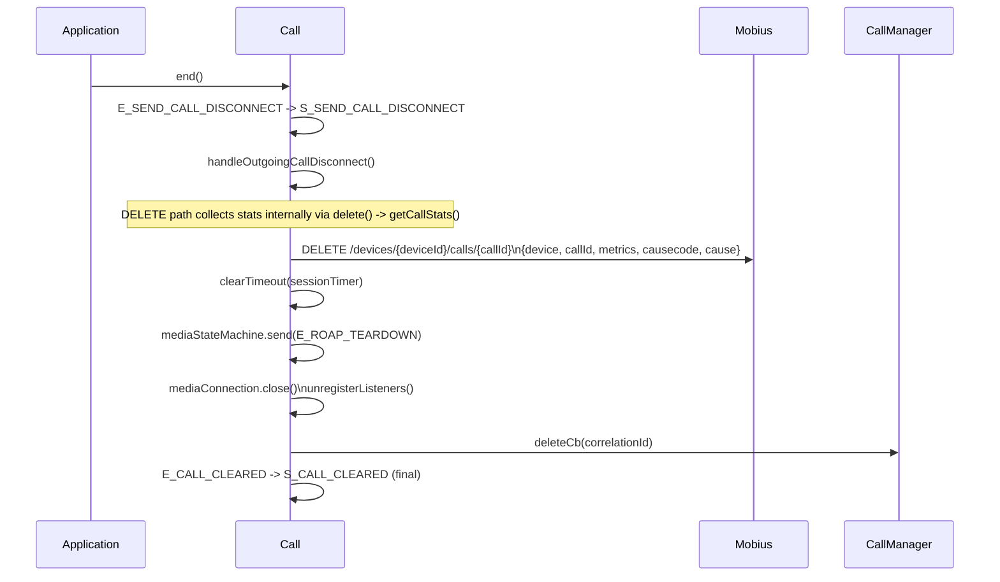
```mermaid
sequenceDiagram
    participant App as Application
    participant Call as Call
    participant Mobius as Mobius
    participant CM as CallManager

    App->>Call: end()
    Call->>Call: E_SEND_CALL_DISCONNECT -> S_SEND_CALL_DISCONNECT
    Call->>Call: handleOutgoingCallDisconnect()
    Note over Call: DELETE path collects stats internally via delete() -> getCallStats()
    Call->>Mobius: DELETE /devices/{deviceId}/calls/{callId}\n{device, callId, metrics, causecode, cause}
    Call->>Call: clearTimeout(sessionTimer)
    Call->>Call: mediaStateMachine.send(E_ROAP_TEARDOWN)
    Call->>Call: mediaConnection.close()\nunregisterListeners()
    Call->>CM: deleteCb(correlationId)
    Call->>Call: E_CALL_CLEARED -> S_CALL_CLEARED (final)
```

### Remote Disconnect

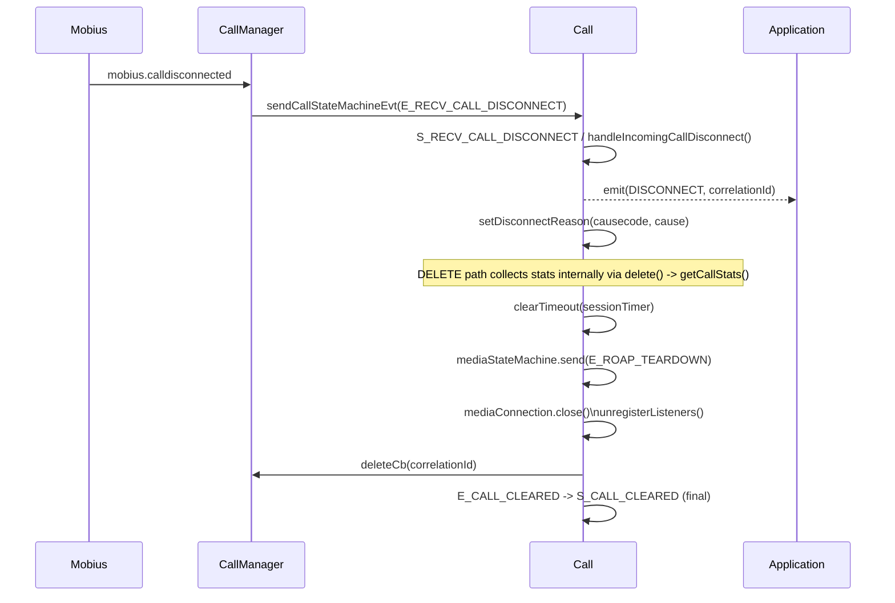
```mermaid
sequenceDiagram
    participant Mobius as Mobius
    participant CM as CallManager
    participant Call as Call
    participant App as Application

    Mobius->>CM: mobius.calldisconnected
    CM->>Call: sendCallStateMachineEvt(E_RECV_CALL_DISCONNECT)
    Call->>Call: S_RECV_CALL_DISCONNECT / handleIncomingCallDisconnect()
    Call-->>App: emit(DISCONNECT, correlationId)
    Call->>Call: setDisconnectReason(causecode, cause)
    Note over Call: DELETE path collects stats internally via delete() -> getCallStats()
    Call->>Call: clearTimeout(sessionTimer)
    Call->>Call: mediaStateMachine.send(E_ROAP_TEARDOWN)
    Call->>Call: mediaConnection.close()\nunregisterListeners()
    Call->>CM: deleteCb(correlationId)
    Call->>Call: E_CALL_CLEARED -> S_CALL_CLEARED (final)
```

## Call Keepalive Flow

Keepalive is active while the call is established. A session timer triggers periodic status checks using `postStatus()`:

- `sessionTimer` starts after call establishment (default interval: `600000ms`).
- On each tick, `Call` sends `POST /devices/{deviceId}/calls/{callId}/status`.
- Success resets keepalive retry tracking and schedules the next keepalive cycle.
- Failure increments `callKeepaliveRetryCount` and schedules retry via `RetryCallBack`.
- On retry exhaustion (`MAX_CALL_KEEPALIVE_RETRY_COUNT`), retry loop stops and no immediate disconnect event is sent.
- Disconnect is triggered only on abort scenarios from `handleCallErrors` (for example keepalive 401/403/404 paths), where `E_SEND_CALL_DISCONNECT` is emitted.

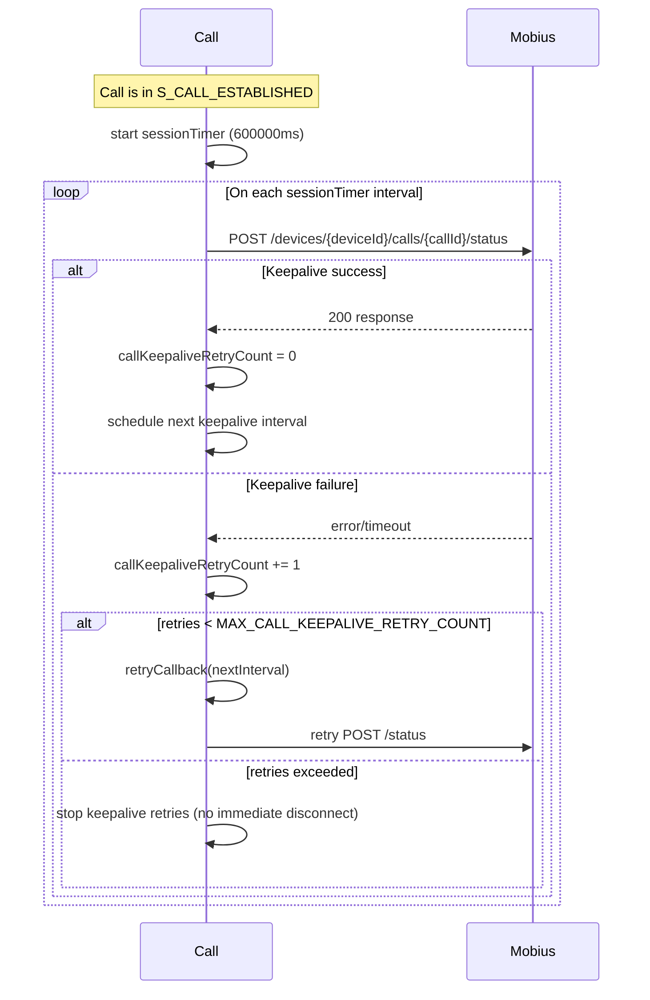
```mermaid
sequenceDiagram
    participant Call as Call
    participant Mobius as Mobius

    Note over Call: Call is in S_CALL_ESTABLISHED
    Call->>Call: start sessionTimer (600000ms)

    loop On each sessionTimer interval
        Call->>Mobius: POST /devices/{deviceId}/calls/{callId}/status
        alt Keepalive success
            Mobius-->>Call: 200 response
            Call->>Call: callKeepaliveRetryCount = 0
            Call->>Call: schedule next keepalive interval
        else Keepalive failure
            Mobius-->>Call: error/timeout
            Call->>Call: callKeepaliveRetryCount += 1
            alt retries < MAX_CALL_KEEPALIVE_RETRY_COUNT
                Call->>Call: retryCallback(nextInterval)
                Call->>Mobius: retry POST /status
            else retries exceeded
                Call->>Call: stop keepalive retries (no immediate disconnect)
            end
        end
    end
```

---

## API Endpoints (Call-Specific)

All endpoints relative to `{mobiusUrl}` (which is `{mobiusHost}/api/v1/calling/web/`).

| Method | Endpoint | Handler | Description |
|--------|----------|---------|-------------|
| `POST` | `/devices/{deviceId}/call` | `post()` | Initiate outgoing call with ROAP offer |
| `PATCH` | `/devices/{deviceId}/calls/{callId}` | `patch()` | Update call state (alerting, connected) |
| `DELETE` | `/devices/{deviceId}/calls/{callId}` | `delete()` | Disconnect call with final stats |
| `POST` | `/devices/{deviceId}/calls/{callId}/media` | `postMedia()` | Send ROAP message (offer, answer, OK) |
| `POST` | `/devices/{deviceId}/calls/{callId}/status` | `postStatus()` | Call keepalive status check |
| `POST` | `/services/callhold/hold` | `postSSRequest()` | Place call on hold |
| `POST` | `/services/callhold/resume` | `postSSRequest()` | Resume call from hold |
| `POST` | `/services/calltransfer/commit` | `postSSRequest()` | Complete blind or consult transfer |

### Request Body

**POST call (outgoing setup):**
```json
{
  "device": { "deviceId": "...", "correlationId": "..." },
  "localMedia": {
    "roap": { "seq": 1, "messageType": "OFFER", "sdp": "..." },
    "mediaId": "uuid"
  },
  "callee": { "type": "uri|tel", "address": "..." }
}
```

**PATCH call (state update):**
```json
{
  "device": { "deviceId": "...", "correlationId": "..." },
  "callId": "...",
  "callState": "sig_alerting|sig_connected",
  "inbandMedia": false
}
```

**POST media (ROAP):**
```json
{
  "device": { "deviceId": "...", "correlationId": "..." },
  "callId": "...",
  "localMedia": {
    "roap": { "seq": 2, "messageType": "ANSWER", "sdp": "..." },
    "mediaId": "uuid"
  }
}
```

**POST supplementary service (hold/resume):**
```json
{
  "device": { "deviceId": "...", "correlationId": "..." },
  "callId": "..."
}
```

**POST transfer (blind):**
```json
{
  "device": { "deviceId": "...", "correlationId": "..." },
  "callId": "...",
  "blindTransferContext": {
    "transferorCallId": "...",
    "destination": "5998"
  },
  "transferType": "BLIND"
}
```

**POST transfer (consult):**
```json
{
  "device": { "deviceId": "...", "correlationId": "..." },
  "callId": "...",
  "consultTransferContext": {
    "transferorCallId": "...",
    "transferToCallId": "..."
  },
  "transferType": "CONSULT"
}
```

---

## Types Reference

### Mobius Types

```typescript
enum MobiusEventType {
  CALL_SETUP = 'mobius.call',
  CALL_PROGRESS = 'mobius.callprogress',
  CALL_CONNECTED = 'mobius.callconnected',
  CALL_MEDIA = 'mobius.media',
  CALL_DISCONNECTED = 'mobius.calldisconnected',
}

enum MediaState {
  OFFER = 'OFFER',
  ANSWER = 'ANSWER',
  OFFER_REQUEST = 'OFFER_REQUEST',
  OK = 'OK',
  ERROR = 'ERROR',
}

enum MobiusCallState {
  PROCEEDING = 'sig_proceeding',
  PROGRESS = 'sig_progress',
  ALERTING = 'sig_alerting',
  CONNECTED = 'sig_connected',
}

type MobiusCallData = {
  callProgressData?: { alerting: boolean; inbandMedia: boolean };
  message?: RoapMessage;
  callerId: { from: string };
  midCallService?: Array<MidCallEvent>;
  callId: CallId;
  callUrl: string;
  deviceId: string;
  correlationId: string;
  eventType: MobiusEventType;
  broadworksCorrelationInfo?: string;
};
```

### Call Types

```typescript
enum DisconnectCode { BUSY = 115, NORMAL = 0, MEDIA_INACTIVITY = 131 }
enum DisconnectCause { BUSY = 'User Busy.', NORMAL = 'Normal Disconnect.', MEDIA_INACTIVITY = 'Media Inactivity.' }
type DisconnectReason = { code: DisconnectCode; cause: DisconnectCause };

enum TransferType { BLIND = 'BLIND', CONSULT = 'CONSULT' }
enum MUTE_TYPE { USER = 'user_mute', SYSTEM = 'system_mute' }
enum MidCallEventType { CALL_INFO = 'callInfo', CALL_STATE = 'callState' }

type TransferContext = {
  transferorCallId: CallId;
  destination?: string;
  transferToCallId?: CallId;
};

type CallRtpStats = {
  'rtp-rxstat': ReceiveStatistics;
  'rtp-txstat': TransmitStatistics;
};
```

### Callback Types

```typescript
type DeleteRecordCallBack = (callId: CallId) => void;
type CallEmitterCallBack = (callerInfo: DisplayInformation) => void;
type CallErrorEmitterCallBack = (error: CallError) => void;
type RetryCallBack = (interval: number) => void;
```

### State Machine Event Types

```typescript
// From ../../Events/types

type CallEvent =
  | {type: 'E_RECV_CALL_SETUP'; data?: unknown}
  | {type: 'E_RECV_CALL_PROGRESS'; data?: unknown}
  | {type: 'E_RECV_CALL_CONNECT'; data?: unknown}
  | {type: 'E_RECV_CALL_DISCONNECT'; data?: unknown}
  | {type: 'E_SEND_CALL_SETUP'; data?: unknown}
  | {type: 'E_SEND_CALL_ALERTING'; data?: unknown}
  | {type: 'E_SEND_CALL_CONNECT'; data?: unknown}
  | {type: 'E_SEND_CALL_DISCONNECT'; data?: unknown}
  | {type: 'E_CALL_ESTABLISHED'; data?: unknown}
  | {type: 'E_CALL_INFO'; data?: unknown}
  | {type: 'E_UNKNOWN'; data?: unknown}
  | {type: 'E_CALL_CLEARED'; data?: unknown}
  | {type: 'E_CALL_HOLD'; data?: unknown}
  | {type: 'E_CALL_RESUME'; data?: unknown};

type RoapEvent =
  | {type: 'E_SEND_ROAP_OFFER'; data?: unknown}
  | {type: 'E_SEND_ROAP_ANSWER'; data?: unknown}
  | {type: 'E_RECV_ROAP_OFFER'; data?: unknown}
  | {type: 'E_RECV_ROAP_ANSWER'; data?: unknown}
  | {type: 'E_ROAP_ERROR'; data?: unknown}
  | {type: 'E_ROAP_OK'; data?: unknown}
  | {type: 'E_RECV_ROAP_OFFER_REQUEST'; data?: unknown}
  | {type: 'E_ROAP_TEARDOWN'; data?: unknown};
```

### ROAP Message Type

```typescript
// From ../../Events/types

interface RoapMessage {
  seq: number;
  messageType: 'OFFER' | 'ANSWER' | 'OK' | 'ERROR' | 'OFFER_REQUEST';
  offererSessionId?: string;
  answererSessionId?: string;
  sdp?: string;
  version?: string;
  tieBreaker?: string;
  errorType?: string;
}
```

### Response Types

```typescript
// From ./types (local types.ts)

type MobiusCallResponse = {
  statusCode: number;
  body: {
    device: { deviceId: string; correlationId: string };
    callId: CallId;
    callData?: { callState: MobiusCallState };
  };
};

type PatchResponse = {
  statusCode: number;
  body: {
    device: { deviceId: string; correlationId: string };
    callId: CallId;
  };
};

type SSResponse = {
  statusCode: number;
  body: {
    device: { deviceId: string; correlationId: string };
    callId: CallId;
  };
};

type MobiusCallEvent = {
  id: string;
  data: MobiusCallData;
  timestamp: number;
  trackingId: string;
};
```

### Other Types

```typescript
// From ../../common/types
type CallDetails = {
  type: CallType;
  address: string;
};

// From ../../Events/types
enum SUPPLEMENTARY_SERVICES {
  HOLD = 'hold',
  RESUME = 'resume',
  DIVERT = 'divert',
  TRANSFER = 'transfer',
  PARK = 'park',
}
```

### Event Key Enums

```typescript
// All from ../../Events/types

enum CALL_EVENT_KEYS {
  ALERTING = 'alerting',
  CALL_ERROR = 'call_error',
  CALLER_ID = 'caller_id',
  CONNECT = 'connect',
  DISCONNECT = 'disconnect',
  ESTABLISHED = 'established',
  HELD = 'held',
  HOLD_ERROR = 'hold_error',
  PROGRESS = 'progress',
  REMOTE_MEDIA = 'remote_media',
  RESUME_ERROR = 'resume_error',
  RESUMED = 'resumed',
  TRANSFER_ERROR = 'transfer_error',
}

enum LINE_EVENT_KEYS {
  INCOMING_CALL = 'incoming_call',
}

enum CALLING_CLIENT_EVENT_KEYS {
  ERROR = 'callingClient:error',
  OUTGOING_CALL = 'callingClient:outgoing_call',
  USER_SESSION_INFO = 'callingClient:user_recent_sessions',
  ALL_CALLS_CLEARED = 'callingClient:all_calls_cleared',
}

enum MOBIUS_MIDCALL_STATE {
  HELD = 'HELD',
  CONNECTED = 'CONNECTED',
}
```

---

## Constants

All constants are imported from `../constants` (`CallingClient/constants.ts`).

| Constant | Value | Description |
|----------|-------|-------------|
| `DEFAULT_SESSION_TIMER` | `600000` (10 minutes) | Keepalive interval after call establishment |
| `SUPPLEMENTARY_SERVICES_TIMEOUT` | `10000` (10 seconds) | Timeout for hold/resume mid-call response |
| `MAX_CALL_KEEPALIVE_RETRY_COUNT` | `4` | Maximum keepalive retries before retry loop stops |
| `INITIAL_SEQ_NUMBER` | `1` | Starting ROAP sequence number |
| `DEVICES_ENDPOINT_RESOURCE` | `'devices'` | URL path segment |
| `CALL_ENDPOINT_RESOURCE` | `'call'` | URL path segment (singular, for POST) |
| `CALLS_ENDPOINT_RESOURCE` | `'calls'` | URL path segment (plural, for PATCH/DELETE/media/status) |
| `MEDIA_ENDPOINT_RESOURCE` | `'media'` | URL path segment |
| `CALL_STATUS_RESOURCE` | `'status'` | URL path segment |
| `CALL_HOLD_SERVICE` | `'callhold'` | Supplementary service path segment |
| `CALL_TRANSFER_SERVICE` | `'calltransfer'` | Supplementary service path segment |
| `HOLD_ENDPOINT` | `'hold'` | Hold action endpoint |
| `RESUME_ENDPOINT` | `'resume'` | Resume action endpoint |
| `TRANSFER_ENDPOINT` | `'commit'` | Transfer action endpoint |

---

## Error Handling

All call errors use the `CallError` class with `ERROR_LAYER` distinguishing call control vs media errors.

### Error Enums

```typescript
// From ../../Errors/types

enum ERROR_LAYER {
  CALL_CONTROL = 'call_control',
  MEDIA = 'media',
}

enum ERROR_TYPE {
  CALL_ERROR = 'call_error',
  DEFAULT = 'default_error',
  BAD_REQUEST = 'bad_request',
  FORBIDDEN_ERROR = 'forbidden',
  NOT_FOUND = 'not_found',
  REGISTRATION_ERROR = 'registration_error',
  SERVICE_UNAVAILABLE = 'service_unavailable',
  TIMEOUT = 'timeout',
  TOKEN_ERROR = 'token_error',
  TOO_MANY_REQUESTS = 'too_many_requests',
  SERVER_ERROR = 'server_error',
}

enum ERROR_CODE {
  UNAUTHORIZED = 401,
  FORBIDDEN = 403,
  DEVICE_NOT_FOUND = 404,
  INTERNAL_SERVER_ERROR = 500,
  NOT_IMPLEMENTED = 501,
  SERVICE_UNAVAILABLE = 503,
  BAD_REQUEST = 400,
  REQUEST_TIMEOUT = 408,
  TOO_MANY_REQUESTS = 429,
}

enum CALL_ERROR_CODE {
  INVALID_STATUS_UPDATE = 111,
  DEVICE_NOT_REGISTERED = 112,
  CALL_NOT_FOUND = 113,
  ERROR_PROCESSING = 114,
  USER_BUSY = 115,
  PARSING_ERROR = 116,
  TIMEOUT_ERROR = 117,
  NOT_ACCEPTABLE = 118,
  CALL_REJECTED = 119,
  NOT_AVAILABLE = 120,
}
```

### CallError Class

```typescript
// From ../../Errors/catalog/CallError.ts

class CallError extends ExtendedError {
  private correlationId: CorrelationId;
  private errorLayer: ERROR_LAYER;

  constructor(
    msg: ErrorMessage,
    context: ErrorContext,
    type: ERROR_TYPE,
    correlationId: CorrelationId,
    errorLayer: ERROR_LAYER
  );

  public setCallError(error: CallErrorObject): void;
  public getCallError(): CallErrorObject;
}

// Factory function
const createCallError = (
  msg: ErrorMessage,
  context: ErrorContext,
  type: ERROR_TYPE,
  correlationId: CorrelationId,
  errorLayer: ERROR_LAYER
) => new CallError(msg, context, type, correlationId, errorLayer);
```

### handleCallErrors Utility

This is a standalone function from `../../common/Utils.ts` (not a method on `Call`). It processes HTTP error responses from Mobius and maps them to `CallError` instances.

```typescript
// From ../../common/Utils

async function handleCallErrors(
  emitterCb: CallErrorEmitterCallBack,
  errorLayer: ERROR_LAYER,
  retryCb: RetryCallBack,
  correlationId: CorrelationId,
  err: WebexRequestPayload,
  caller: string,       // METHODS constant identifying which function made the request
  file: string          // File name for logging context
): Promise<boolean>     // Returns true if the caller should abort further operations
```

Behavior:
- Handles HTTP status codes: 401, 403, 404, 500, 503, 429
- Extracts service error codes from the response body and maps `CALL_ERROR_CODE` values to user-facing messages
- Supports `retry-after` header for rate limiting (429 and 503)
- Special handling for keepalive calls: returns `abort: true` for 401, 403, 404 during keepalive

### Error Emission Pattern

```typescript
handleCallErrors(
  (error: CallError) => {
    this.emit(CALL_EVENT_KEYS.CALL_ERROR, error);
    this.submitCallErrorMetric(error);
    this.sendCallStateMachineEvt({type: 'E_UNKNOWN', data: errData});
  },
  ERROR_LAYER.CALL_CONTROL,
  retryCallback,
  this.getCorrelationId(),
  errData,
  methodName,
  fileName
);
```

### Error Scenarios

| Scenario | Error Event | Recovery |
|----------|------------|---------|
| Call setup POST fails | `CALL_ERROR` | Transition to `S_UNKNOWN`, upload logs |
| Call alerting PATCH fails | `CALL_ERROR` | Transition to `S_UNKNOWN`, upload logs |
| Hold POST fails | `HOLD_ERROR` | Transition back to `S_CALL_ESTABLISHED`, upload logs |
| Resume POST fails | `RESUME_ERROR` | Transition back to `S_CALL_ESTABLISHED`, upload logs |
| Hold/Resume timeout (10s) | `HOLD_ERROR` / `RESUME_ERROR` | Timer fires, emit timeout error |
| Transfer fails | `TRANSFER_ERROR` | Upload logs |
| ROAP error | `CALL_ERROR` (MEDIA layer) | Disconnect call |
| State timeout | `CALL_ERROR` | Transition to `S_CALL_CLEARED`, upload logs |
| No local audio track | `DISCONNECT` | Immediate disconnect or delete from collection |
| Call keepalive fails | `E_SEND_CALL_DISCONNECT` | Disconnect call (max 4 retries) |
