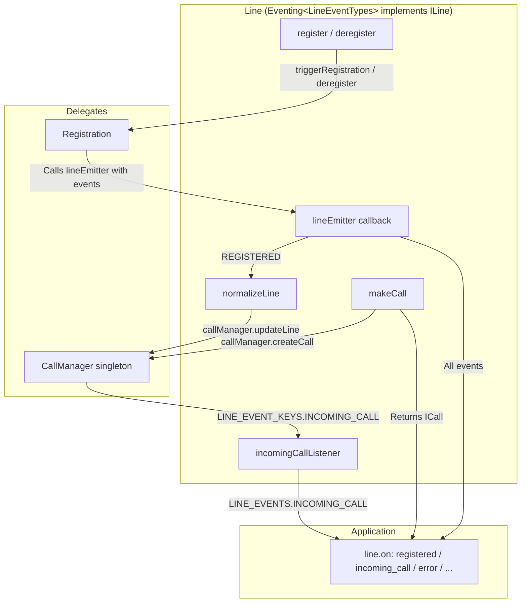
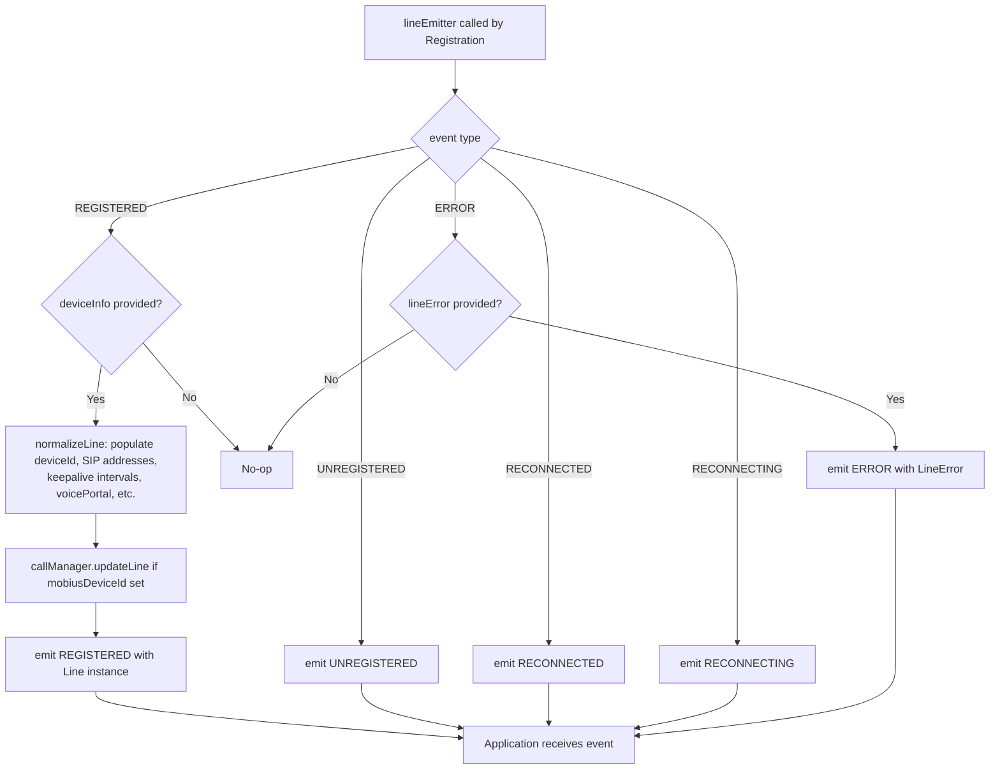
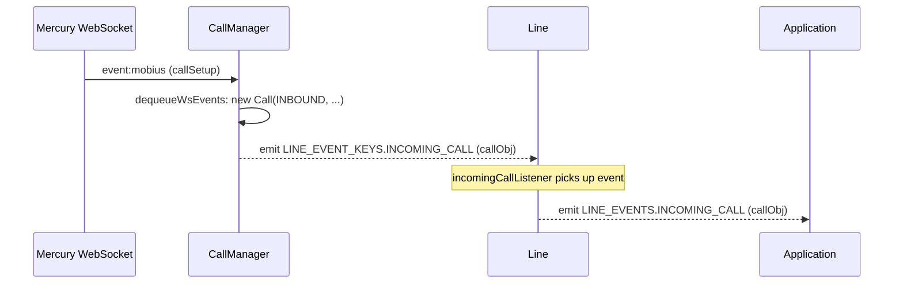
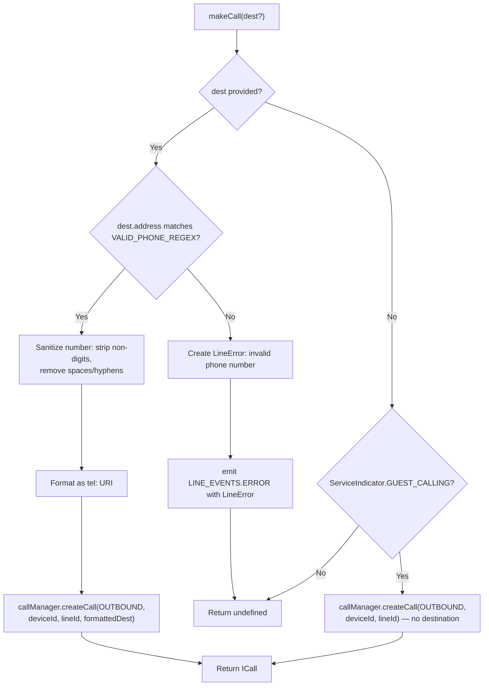

# Line Module — Architecture

## File Structure

```
line/
├── index.ts          # Line class implementation
├── types.ts          # ILine interface, LINE_EVENTS enum, callback types
├── line.test.ts      # Unit tests
└── ai-docs/
    ├── AGENTS.md     # Overview, API, examples
    └── ARCHITECTURE.md  # This file
```

---

## Component Overview

The `Line` class acts as the bridge between the application, the `Registration` subsystem, and the `CallManager`. It does not perform registration or call management itself — instead, it orchestrates these subsystems and provides a unified event interface to the application.

## Internal Architecture



---

## lineEmitter Pattern

The `lineEmitter` is the critical callback passed from `Line` to `Registration` during construction. It is the **only mechanism** by which `Registration` communicates state changes back to `Line`.

### How It Works

1. `Line` constructor creates `Registration` and passes `this.lineEmitter` as a callback
2. `Registration` calls `lineEmitter(event, deviceInfo?, lineError?)` at key points
3. `lineEmitter` handles each event type:



### normalizeLine

When `REGISTERED` is received, `normalizeLine(deviceInfo)` extracts following fields from the registration response. Note that `phoneNumber` is set at construction time (from provisioning data passed to the `Line` constructor), not from the registration response.

| Field                     | Source                                          |
| ------------------------- | ----------------------------------------------- |
| `mobiusDeviceId`          | `deviceInfo.device.deviceId`                    |
| `mobiusUri`               | `deviceInfo.device.uri`                         |
| `lastSeen`                | `deviceInfo.device.lastSeen`                    |
| `keepaliveInterval`       | `deviceInfo.keepaliveInterval` (or default 30s) |
| `callKeepaliveInterval`   | `deviceInfo.callKeepaliveInterval` (or default) |
| `rehomingIntervalMin/Max` | From `deviceInfo` (or defaults 60s/120s)        |
| `voicePortalNumber`       | `deviceInfo.voicePortalNumber`                  |
| `voicePortalExtension`    | `deviceInfo.voicePortalExtension`               |

---

## Incoming Call Listener

The `incomingCallListener()` method subscribes to `CallManager`'s `incoming_call` event and re-emits it as a `LINE_EVENTS.INCOMING_CALL`:



This indirection ensures that:

- `CallManager` remains decoupled from `Line`
- `Line` controls which events reach the application
- The application gets a consistent `LINE_EVENTS` interface

---

## makeCall Flow

The behavior of `makeCall` varies by `ServiceIndicator`:

- **`ServiceIndicator.CALLING`** (licensed users): `destination` is mandatory and validated. A `CallDetails` object with a valid `type` and `address` must be provided.
- **`ServiceIndicator.GUEST_CALLING`**: Destination is optional. It's omitted, and a call is created without a destination (the destination is determined through the jwe token).
- **`ServiceIndicator.CONTACT_CENTER`**: Destination **must** be provided. There is no special handling for this indicator in `makeCall` — if `dest` is omitted, `makeCall` returns `undefined` and no call is created.



The returned `Call` object is then used by the application to `dial()`, listen for events, and control the call.

---

## Registration API

### register()

The actual implementation uses `this.#mutex.runExclusive()` to prevent concurrent registrations:

```typescript
async register(): Promise<void> {
  await this.#mutex.runExclusive(async () => {
    // Emit CONNECTING to notify application
    this.emit(LINE_EVENTS.CONNECTING);
    // Set servers before triggering
    this.registration.setMobiusServers(this.#primaryMobiusUris, this.#backupMobiusUris);
    // Delegate to Registration
    await this.registration.triggerRegistration();
  });
}
```

### deregister()

```typescript
async deregister(): Promise<void> {
  // Delegate to Registration
  await this.registration.deregister();
  // Set status to IDLE
  this.registration.setStatus(RegistrationStatus.IDLE);
}
```

---

## Related Documentation

- [Line AGENTS.md](./AGENTS.md) — Public API, events, examples
- [Registration ARCHITECTURE.md](../../registration/ai-docs/ARCHITECTURE.md) — Registration internals
- [CallingClient ARCHITECTURE.md](../../ai-docs/ARCHITECTURE.md) — Parent module architecture
