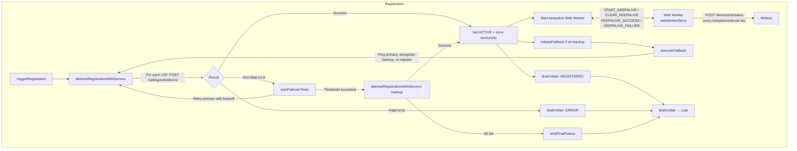
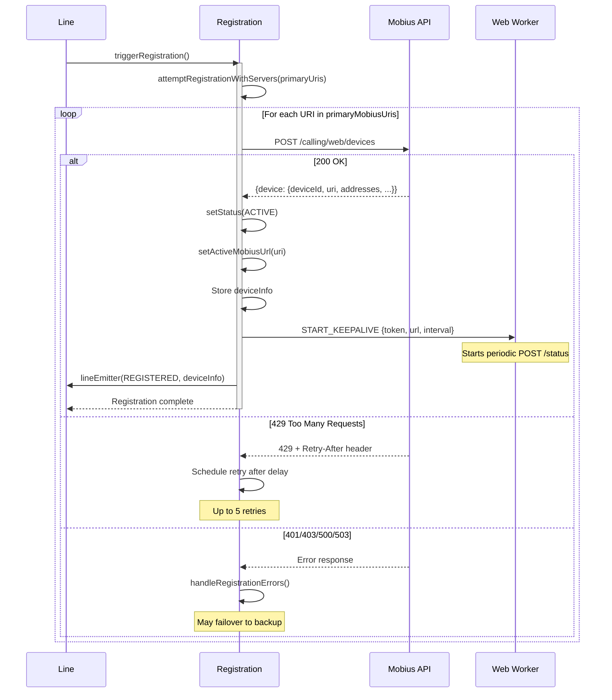
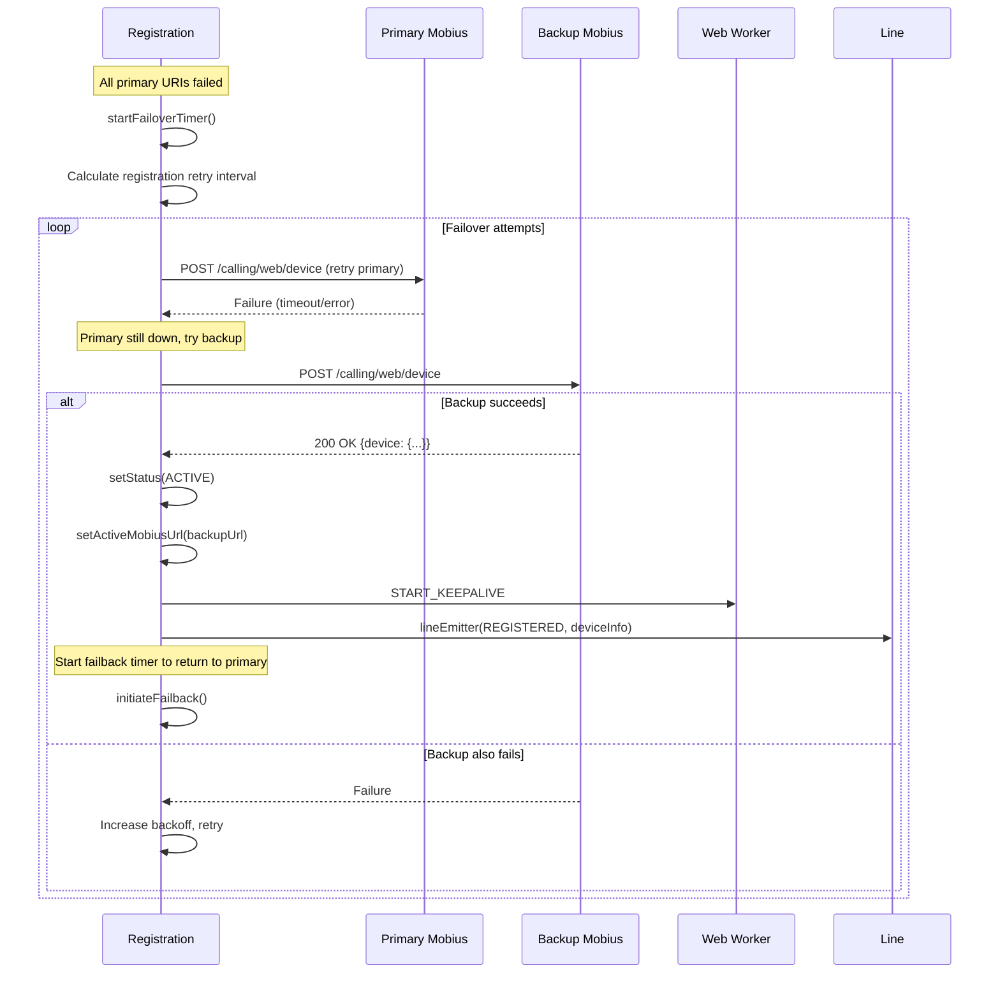
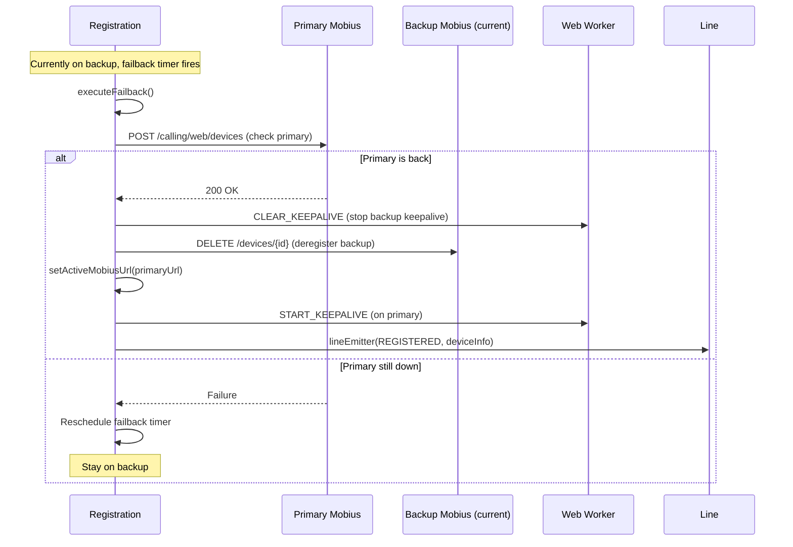
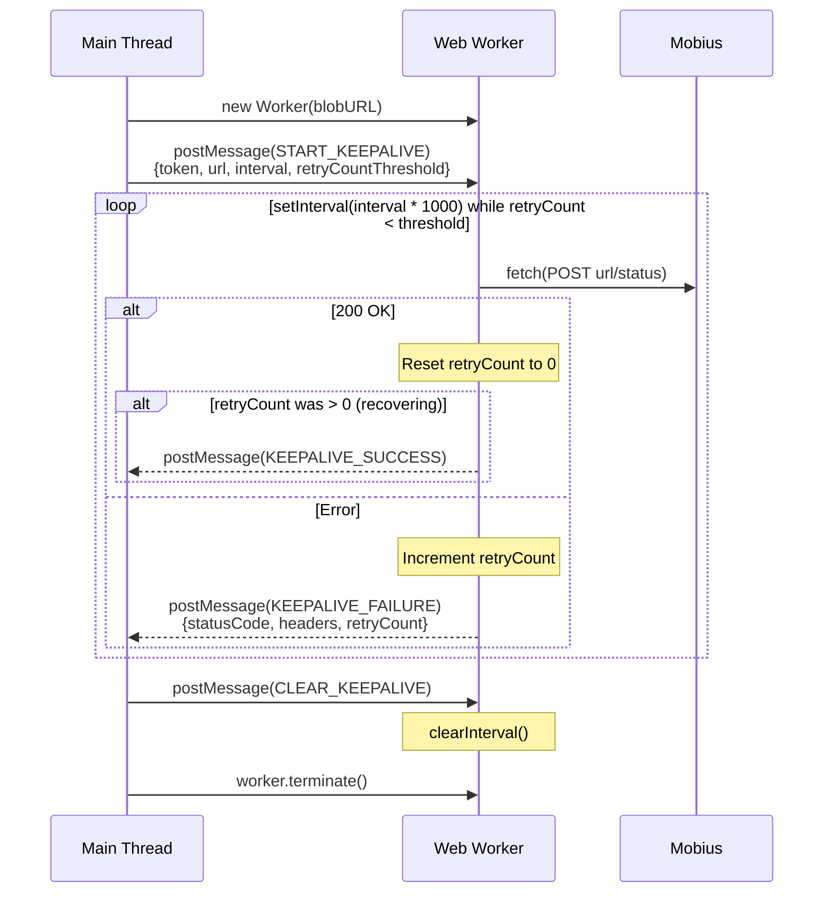
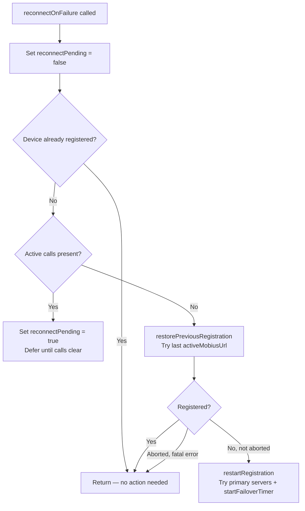
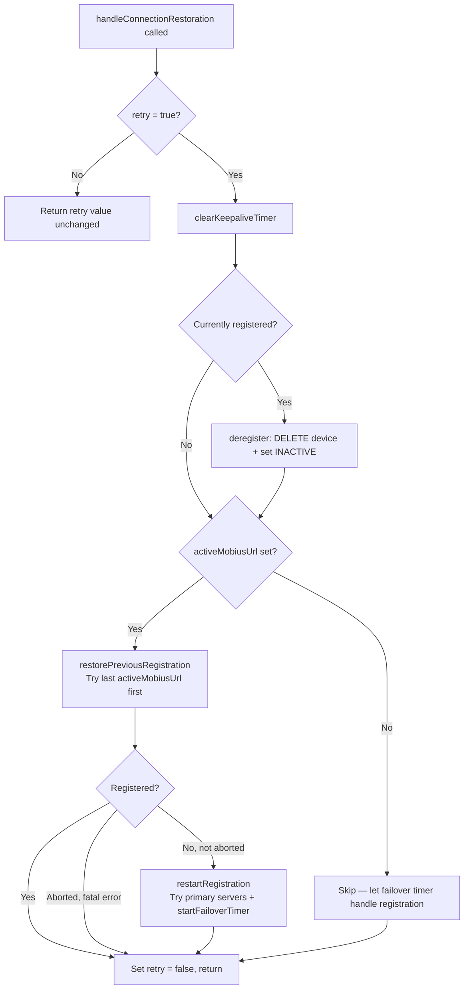
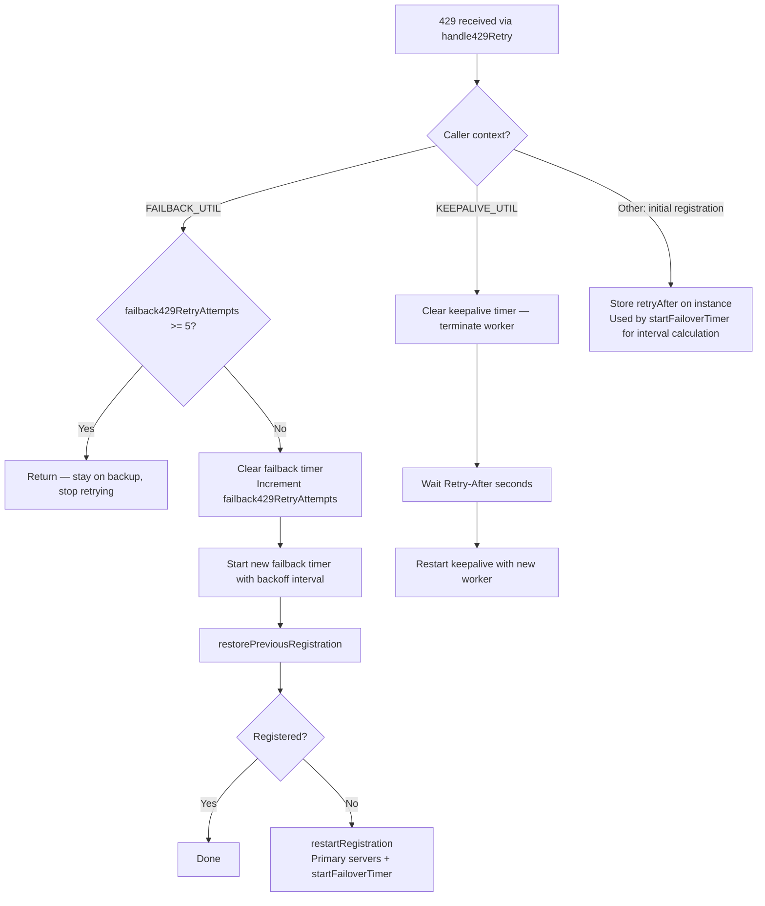
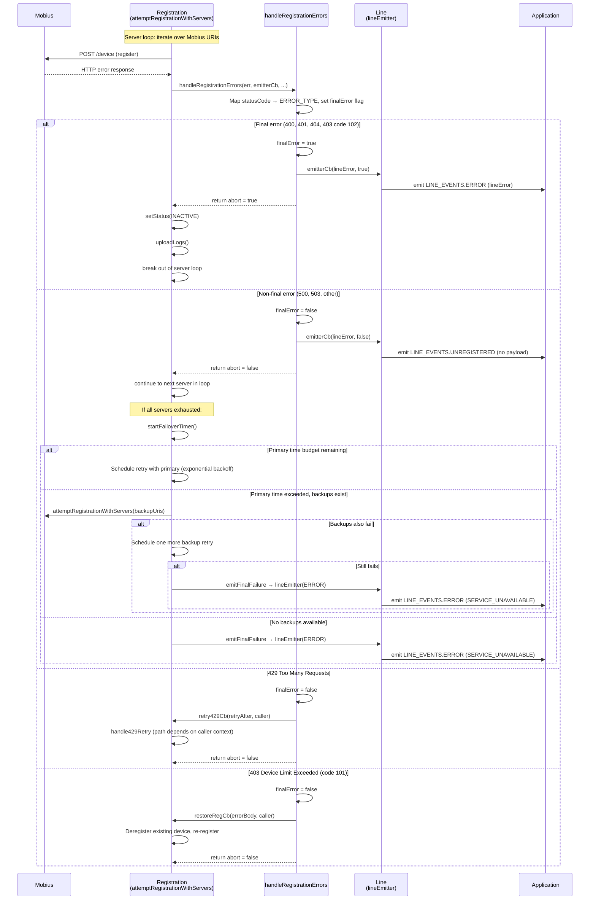

# Registration Module — Architecture

## Component Overview

The `Registration` class is the most complex subsystem in the CallingClient module. It manages the full lifecycle of device registration with Mobius, including initial registration, keepalive heartbeats, server failover, failback, 429 retry handling, and reconnection after network disruption.

## File Structure

```
registration/
├── index.ts               # Re-exports from register.ts
├── register.ts            # Registration class (main logic)
├── types.ts               # IRegistration, type aliases
├── webWorker.ts           # Keepalive worker (direct module)
├── webWorkerStr.ts        # Stringified worker for Blob URL
├── registerFixtures.ts    # Test fixtures
├── register.test.ts       # Unit tests
├── webWorker.test.ts      # Web Worker unit tests
└── ai-docs/
    ├── AGENTS.md          # Overview, API, examples
    └── ARCHITECTURE.md    # This file
```

---

### Responsibilities

| Concern | Implementation |
|---------|---------------|
| Initial registration | `triggerRegistration()` → `attemptRegistrationWithServers()` |
| Keepalive | Web Worker sends periodic `POST /status` |
| Failover (primary → backup) | `startFailoverTimer()` with exponential backoff |
| Failback (backup → primary) | `initiateFailback()` → `executeFailback()` |
| 429 handling | `Retry-After` header with retry budget |
| Reconnection | `handleConnectionRestoration()` / `reconnectOnFailure()` |
| Deregistration | `DELETE /devices/{id}` + worker termination |

---

## Internal Architecture



---

## Registration Flow

### Initial Registration Sequence



### Failover Flow



### Failback Flow



---

## Keepalive Web Worker

### Architecture

The keepalive runs in a **Web Worker** to ensure heartbeats are not blocked by main-thread work (long computations, UI rendering, etc.).



### Worker Messages

| Message | Direction | Payload | Description |
|---------|-----------|---------|-------------|
| `START_KEEPALIVE` | Main → Worker | `{accessToken, deviceUrl, interval, retryCountThreshold, url}` | Start sending keepalive requests |
| `CLEAR_KEEPALIVE` | Main → Worker | _(none)_ | Stop sending keepalive requests |
| `KEEPALIVE_SUCCESS` | Worker → Main | _(none)_ | Keepalive POST succeeded |
| `KEEPALIVE_FAILURE` | Worker → Main | `{statusCode, body, retryCount}` | Keepalive POST failed |

### Worker Creation

The worker is created from a stringified JavaScript source to avoid separate file bundling:

```typescript
// webWorkerStr.ts contains the worker code as a string
const blob = new Blob([webWorkerStr], {type: 'application/javascript'});
const url = URL.createObjectURL(blob);
this.webWorker = new Worker(url);
URL.revokeObjectURL(url);
```

### Keepalive Failure Handling

When the main thread receives `KEEPALIVE_FAILURE`:

1. **Emit `RECONNECTING`** via `lineEmitter` to notify the application
2. **Check retry count** against threshold (`MAX_CALL_KEEPALIVE_RETRY_COUNT = 4 for contact center and 5 otherwise`)
3. **If within threshold:** Log warning, wait for next keepalive cycle
4. **If threshold exceeded:** Trigger `reconnectOnFailure()` for full re-registration
5. **Submit metrics** for keepalive failure

---

## Reconnection

### reconnectOnFailure()

Called when keepalive failures exceed the threshold or when CallingClient detects all calls have cleared after a network disruption.



### handleConnectionRestoration()

Called by `CallingClient` after Mercury reconnection. Runs inside `mutex.runExclusive`.



---

## 429 Retry Logic

`handle429Retry(retryAfter, caller)` handles 429 differently depending on the calling context:



---

## Key Constants

| Constant | Value | Description |
|----------|-------|-------------|
| `DEFAULT_KEEPALIVE_INTERVAL` | 30s | Default keepalive frequency |
| `REG_TRY_BACKUP_TIMER_VAL_IN_SEC` | 114s | Time before trying backup servers |
| `REG_FAILBACK_429_MAX_RETRIES` | 5 | Max 429 retries before failover |
| `BASE_REG_RETRY_TIMER_VAL_IN_SEC` | 30 | Base retry timer (seconds) |
| `BASE_REG_TIMER_MFACTOR` | 2 | Multiplication factor for exponential backoff |
| `REG_RANDOM_T_FACTOR_UPPER_LIMIT` | 10000 | Randomization upper bound (milliseconds) |
| `RETRY_TIMER_UPPER_LIMIT` | 60 | Max retry timer value (seconds) |

---

## Error Handling

Registration errors are mapped through `handleRegistrationErrors()`. Fatal errors (`abort = true`) stop the registration loop and emit `LINE_EVENTS.ERROR`. Non-fatal errors allow the loop to continue to the next server or schedule a retry via the failover timer.

| HTTP Status | ERROR_TYPE | Fatal? | Action |
|-------------|-----------|--------|--------|
| 400 | `BAD_REQUEST` | Yes | Abort — emit error |
| 401 | `TOKEN_ERROR` | Yes | Abort — emit error (token expired/invalid) |
| 403 (code 101) | `FORBIDDEN_ERROR` | No | Device limit exceeded — `restoreRegistrationCallBack`: deregister existing + re-register |
| 403 (code 102) | `FORBIDDEN_ERROR` | Yes | Device creation disabled — abort, emit error |
| 403 (code 103/other) | `FORBIDDEN_ERROR` | No | Device creation failed — continue retry |
| 404 | `NOT_FOUND` | Yes | Abort — emit error |
| 429 | `TOO_MANY_REQUESTS` | No | Call `handle429Retry` with `Retry-After` value |
| 500 | `SERVER_ERROR` | No | Continue to next server or schedule retry |
| 503 | `SERVICE_UNAVAILABLE` | No | Continue to next server or schedule retry |
| Other | `DEFAULT` | No | Continue to next server or schedule retry |

### Final vs Non-Final Error Flow



> **Source references:**
> - Server loop and error branching: `attemptRegistrationWithServers` in `src/CallingClient/registration/register.ts`
> - Error classification and callback invocation: `handleRegistrationErrors` in `src/common/Utils.ts`
> - Failover timer and final failure: `startFailoverTimer` in `register.ts`, `emitFinalFailure` in `src/common/Utils.ts`
> - `lineEmitter` branching on `finalError`: the `emitterCb` closure in `attemptRegistrationWithServers` — emits `LINE_EVENTS.ERROR` for `finalError = true`, `LINE_EVENTS.UNREGISTERED` for `finalError = false`

---

## Related Documentation

- [Registration AGENTS.md](./AGENTS.md) — Public API, key concepts
- [Line ARCHITECTURE.md](../../line/ai-docs/ARCHITECTURE.md) — lineEmitter pattern, Line ↔ Registration interaction
- [CallingClient ARCHITECTURE.md](../../ai-docs/ARCHITECTURE.md) — Network resilience, initialization
