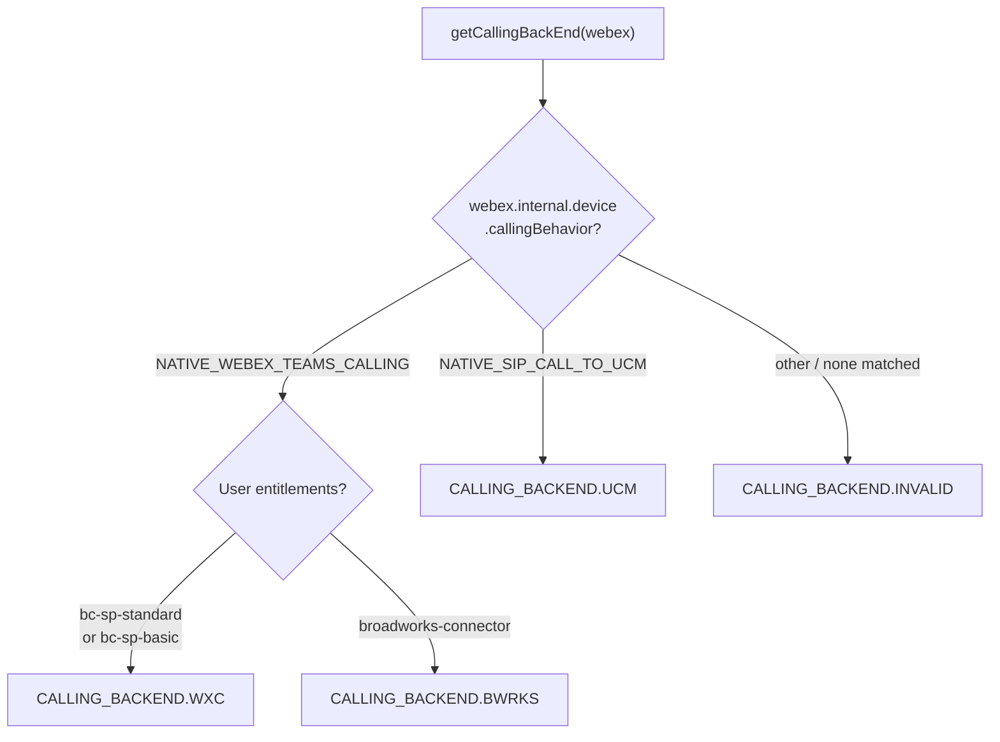

# @webex/calling — Source Package Guide

## Overview

`@webex/calling` is a browser-based TypeScript SDK for Webex Calling services. It provides a unified API surface for line registration, real-time call control, call history, call settings, contacts management, and voicemail — working transparently across three calling backends: **Webex Calling (WxC)**, **Broadworks (BWRKS)**, and **Unified Communications Manager (UCM)**.

The package is organized as a modular monolith inside `packages/calling/src/`. Each subdirectory owns a domain concern and exposes its contract through TypeScript interfaces. Shared infrastructure (SDK bridge, logging, metrics, eventing, errors) is consumed by all domain modules.

---

## Module Map

| Module | Directory | Purpose |
|---|---|---|
| **CallingClient** | `CallingClient/` | Top-level orchestrator for line registration and call control (Mobius) |
| **CallHistory** | `CallHistory/` | Retrieve, update, and delete call history records (Janus) |
| **CallSettings** | `CallSettings/` | Get/set call waiting, DND, call forwarding, voicemail settings |
| **Contacts** | `Contacts/` | CRUD operations on user contacts and contact groups |
| **Voicemail** | `Voicemail/` | Voicemail listing, playback, read/unread state, deletion, transcription |
| **SDKConnector** | `SDKConnector/` | Singleton bridge to the Webex JS SDK for HTTP and Mercury WebSocket |
| **Logger** | `Logger/` | Leveled structured logging wrapper (delegates to Webex SDK logger) |
| **Metrics** | `Metrics/` | Telemetry submission for registration, calls, media, voicemail, connectivity |
| **Events** | `Events/` | Typed `EventEmitter` base class (`Eventing<T>`) and all event type maps |
| **Errors** | `Errors/` | Custom error hierarchy — `ExtendedError`, `CallError`, `LineError`, `CallingClientError` |
| **common** | `common/` | Shared types, constants, and utility functions used across all modules |

---

## Key Interfaces Quick Reference

### ICallingClient

Top-level orchestrator for line registration and calling — provides APIs to manage lines, track active calls, and access the media engine. Defined in `src/CallingClient/types.ts`.

```typescript
interface ICallingClient extends Eventing<CallingClientEventTypes> {
  mediaEngine: typeof Media;
  getLines(): Record<string, ILine>;
  getActiveCalls(): Record<string, ICall[]>;
  getConnectedCall(): ICall | undefined;
  getDevices(userId?: string): Promise<DeviceType[]>;
}
```

### ICallHistory

Provides APIs for retrieving, updating, and deleting recent call history records via the Janus service. Defined in `src/CallHistory/types.ts`.

```typescript
interface ICallHistory extends Eventing<CallHistoryEventTypes> {
  getCallHistoryData(days: number, limit: number, sort: SORT, sortBy: SORT_BY): Promise<JanusResponseEvent>;
  updateMissedCalls(endTimeSessionIds: EndTimeSessionId[]): Promise<UpdateMissedCallsResponse>;
  deleteCallHistoryRecords(deleteSessionIds: EndTimeSessionId[]): Promise<DeleteCallHistoryRecordsResponse>;
}
```

### ICallSettings

Provides APIs to retrieve and update user call settings — call waiting, DND, call forwarding, and voicemail configuration. Uses the Strategy pattern to select a backend-specific connector (WXC or UCM). Defined in `src/CallSettings/types.ts`.

```typescript
interface ICallSettings {
  getCallWaitingSetting(): Promise<CallSettingResponse>;
  getDoNotDisturbSetting(): Promise<CallSettingResponse>;
  setDoNotDisturbSetting(flag: boolean): Promise<CallSettingResponse>;
  getCallForwardSetting(): Promise<CallSettingResponse>;
  setCallForwardSetting(request: CallForwardSetting): Promise<CallSettingResponse>;
  getVoicemailSetting(): Promise<CallSettingResponse>;
  setVoicemailSetting(request: VoicemailSetting): Promise<CallSettingResponse>;
  getCallForwardAlwaysSetting(directoryNumber?: string): Promise<CallSettingResponse>;
}
```

### IContacts

Provides APIs for fetching, creating, and deleting user contacts and contact groups. Defined in `src/Contacts/types.ts`.

```typescript
interface IContacts {
  getContacts(): Promise<ContactResponse>;
  createContactGroup(displayName: string, encryptionKeyUrl?: string, groupType?: GroupType): Promise<ContactResponse>;
  deleteContactGroup(groupId: string): Promise<ContactResponse>;
  createContact(contactInfo: Contact): Promise<ContactResponse>;
  deleteContact(contactId: string): Promise<ContactResponse>;
}
```

### IVoicemail

Provides APIs for retrieving and managing voicemail — listing, playback content, read/unread state, deletion, summary counts, and transcription. Uses the Strategy pattern to select a backend-specific connector (WXC or UCM). Defined in `src/Voicemail/types.ts`.

```typescript
interface IVoicemail {
  init(): VoicemailResponseEvent | Promise<VoicemailResponseEvent>;
  getVoicemailList(offset: number, offsetLimit: number, sort: SORT, refresh?: boolean): Promise<VoicemailResponseEvent>;
  getVoicemailContent(messageId: string): Promise<VoicemailResponseEvent>;
  getVoicemailSummary(): Promise<VoicemailResponseEvent | null>;
  voicemailMarkAsRead(messageId: string): Promise<VoicemailResponseEvent>;
  voicemailMarkAsUnread(messageId: string): Promise<VoicemailResponseEvent>;
  deleteVoicemail(messageId: string): Promise<VoicemailResponseEvent>;
  getVMTranscript(messageId: string): Promise<VoicemailResponseEvent | null>;
  resolveContact(callingPartyInfo: CallingPartyInfo): Promise<DisplayInformation | null>;
}
```

### ISDKConnector

Singleton bridge to the Webex JS SDK — provides access to the `webex` instance for HTTP requests and manages Mercury WebSocket listener registration/unregistration. Defined in `src/SDKConnector/types.ts`.

```typescript
interface ISDKConnector {
  setWebex(webexInstance: WebexSDK): void;
  getWebex(): WebexSDK;
  registerListener<T>(event: string, cb: (data?: T) => unknown): void;
  unregisterListener(event: string): void;
}
```
---

## Public API Surface

The package has two export files:

### `index.ts` — Consumer-facing exports

This is the primary entry point for external consumers. Factory functions for creating client module instances:

```typescript
import {
  createClient,            // CallingClient
  createCallHistoryClient, // CallHistory
  createCallSettingsClient,// CallSettings
  createContactsClient,    // Contacts
  createVoicemailClient,   // Voicemail
  Logger,                  // Logger singleton
} from '@webex/calling';
```

Media-related re-exports from `@webex/media-helpers`:

```typescript
import {
  createMicrophoneStream,   // Factory to create a microphone media stream
  NoiseReductionEffect,     // Background noise reduction effect
  LocalMicrophoneStream,    // Local microphone stream class
} from '@webex/calling';
```

Key interfaces and types re-exported:

- `ICallingClient`, `ILine`, `ICall` — calling & line control
- `ICallHistory`, `JanusResponseEvent`, `UserSession` — call history
- `ICallSettings`, `CallForwardSetting`, `VoicemailSetting`, `ToggleSetting` — settings
- `IContacts`, `Contact`, `ContactResponse`, `GroupType` — contacts
- `IVoicemail`, `SummaryInfo`, `VoicemailResponseEvent` — voicemail
- `CallError`, `LineError`, `ERROR_LAYER`, `ERROR_TYPE` — errors
- Event key enums: `CALLING_CLIENT_EVENT_KEYS`, `CALL_EVENT_KEYS`, `LINE_EVENT_KEYS`, `COMMON_EVENT_KEYS`
- Common types: `CallDetails`, `CallDirection`, `CallType`, `SORT`, `SORT_BY`, `ServiceIndicator`, `DisplayInformation`
- `CallingClientConfig`, `LOGGER`, `TransferType`, `CallerIdDisplay`, `Disposition`

### `api.ts` — API reference documentation exports

`api.ts` is used for API reference documentation generation. It re-exports concrete classes (`CallingClient`, `CallHistory`, `CallSettings`, `ContactsClient`, `Voicemail`) in addition to interfaces and factory functions. It is **not** an entry point for external consumers — use `index.ts` for all consumer-facing imports.

---

## Factory Functions

All client module instances are created via factory functions. This is the **only** supported instantiation path.

| Factory | Returns | Parameters |
|---|---|---|
| `createClient(webex, config)` | `ICallingClient` | `WebexSDK`, `CallingClientConfig` |
| `createCallHistoryClient(webex, logger)` | `ICallHistory` | `WebexSDK`, `LoggerInterface` |
| `createCallSettingsClient(webex, logger)` | `ICallSettings` | `WebexSDK`, `LoggerInterface` |
| `createContactsClient(webex, logger)` | `IContacts` | `WebexSDK`, `LoggerInterface` |
| `createVoicemailClient(webex, logger)` | `IVoicemail` | `WebexSDK`, `LoggerInterface` |

Every factory internally calls `SDKConnector.setWebex(webex)` if not already initialized.

---

## Configuration

`CallingClientConfig` controls the `CallingClient` client module. Each field serves a specific purpose:

```typescript
interface CallingClientConfig {
  logger?: LoggerConfig;            // Sets the logging verbosity level for the CallingClient module
  discovery?: {
    country: string;                // Country code used for Mobius region discovery to find the nearest server
    region: string;                 // Client region hint to optimize server selection
  };
  serviceData?: {
    indicator: ServiceIndicator;    // Identifies the type of calling service: 'calling' (standard),
                                    // 'contactcenter' (contact center agents), or 'guestcalling' (guest users)
    domain?: string;                // Optional domain override for service endpoint resolution
  };
  jwe?: string;                     // JWE (JSON Web Encryption) token required for guest calling authentication
}

interface LoggerConfig {
  level: LOGGER;                    // 'error' | 'warn' | 'info' | 'log' | 'trace'
}
```

- **`logger`**: Controls the verbosity of log output. Defaults to minimal logging if not set. See the Logging Levels section for the level hierarchy.
- **`discovery`**: Provides geographic hints so the SDK can discover the closest Mobius servers for optimal call quality and latency.
- **`serviceData`**: Identifies the calling service type. The `indicator` determines which Mobius service endpoints are used. Standard calling uses `'calling'`, contact center agents use `'contactcenter'`, and guest/anonymous callers use `'guestcalling'`.
- **`jwe`**: A JWE token for guest calling scenarios where the caller does not have a Webex account. Required only when `serviceData.indicator` is `'guestcalling'`.

All other client modules (`CallHistory`, `CallSettings`, `Contacts`, `Voicemail`) accept `{ level: LOGGER }` as their logger configuration.

---

## Calling Backend Detection

Certain client modules (`CallSettings`, `Voicemail`) need to determine the user's calling backend at instantiation time so they can select the appropriate backend connector (Strategy pattern). The `CallingClient` module also detects the backend during initialization.

Backend detection is performed by the `getCallingBackEnd(webex)` function in `common/Utils.ts`. It uses a two-level branching approach:

1. **First level**: Check `webex.internal.device.callingBehavior`
2. **Second level**: If the behavior is `NATIVE_WEBEX_TEAMS_CALLING`, check user entitlements to distinguish WXC from BWRKS



| Backend | callingBehavior | Entitlement | Enum |
|---|---|---|---|
| Webex Calling | `NATIVE_WEBEX_TEAMS_CALLING` | `bc-sp-standard` or `bc-sp-basic` | `CALLING_BACKEND.WXC` |
| Broadworks | `NATIVE_WEBEX_TEAMS_CALLING` | `broadworks-connector` | `CALLING_BACKEND.BWRKS` |
| UCM | `NATIVE_SIP_CALL_TO_UCM` | (not checked) | `CALLING_BACKEND.UCM` |

The `CallSettings` and `Voicemail` modules use the detected backend to select the appropriate backend connector class at construction time. The `CallingClient` module always communicates with the Mobius service regardless of backend.

---

## Event System

All modules that emit events extend `Eventing<T>`, a generic typed `EventEmitter` from `Events/impl`. Event type maps are defined in `Events/types.ts`.

| Module | Event Type Map | Key Events (enum references) |
|---|---|---|
| `ICallingClient` | `CallingClientEventTypes` | `CALLING_CLIENT_EVENT_KEYS.ERROR`, `CALLING_CLIENT_EVENT_KEYS.OUTGOING_CALL`, `CALLING_CLIENT_EVENT_KEYS.USER_SESSION_INFO`, `CALLING_CLIENT_EVENT_KEYS.ALL_CALLS_CLEARED` |
| `ICallHistory` | `CallHistoryEventTypes` | `COMMON_EVENT_KEYS.CALL_HISTORY_USER_SESSION_INFO`, `COMMON_EVENT_KEYS.CALL_HISTORY_USER_VIEWED_SESSIONS`, `COMMON_EVENT_KEYS.CALL_HISTORY_USER_SESSIONS_DELETED` |
| `IVoicemail` | `VoicemailEventTypes` | `COMMON_EVENT_KEYS.CB_VOICEMESSAGE_CONTENT_GET` |

For detailed `ILine` and `ICall` event information, refer to the sub-module documentation for `CallingClient`.

---

## Error Hierarchy

All custom errors extend `ExtendedError`:

```
ExtendedError (Errors/catalog/ExtendedError.ts)
├── CallError        — correlationId, errorLayer (call_control | media)
├── LineError        — status (RegistrationStatus)
└── CallingClientError (file: CallingDeviceError.ts) — status (RegistrationStatus)
```

> **Note**: The `CallingClientError` class is defined in `Errors/catalog/CallingDeviceError.ts` but exported as `CallingClientError`. It takes `status: RegistrationStatus` as a constructor parameter (not `correlationId`/`errorLayer`).

Errors carry `ERROR_TYPE` (semantic category) and `ERROR_CODE` (HTTP or SDK status code). Factory functions `createCallError()` and `createClientError()` are the standard instantiation path.

---

## Logging Levels

The `Logger` module uses a numeric level hierarchy defined in `LOGGING_LEVEL` (`Logger/types.ts`):

| Level | Value | Includes |
|---|---|---|
| `error` | 1 | Errors only |
| `warn` | 2 | Errors + warnings |
| `info` | 3 | + general messages |
| `log` | 4 | + informational |
| `trace` | 5 | + full stack traces |

The `LOGGER` enum defines the string values: `'error'`, `'warn'`, `'info'`, `'log'`, `'trace'`.

Log format: `Calling SDK: <UTC timestamp>: [LEVEL]: file:<filename> - method:<methodName> - message:<content>`

---

## Metrics

The `MetricManager` singleton (`Metrics/index.ts`) is initialized via `getMetricManager(webex, indicator)` and submits client metrics through `webex.internal.metrics.submitClientMetrics()`. Metric categories are defined by the `METRIC_EVENT` enum:

| Metric Event | Description | Key Fields |
|---|---|---|
| `REGISTRATION` / `REGISTRATION_ERROR` | Line registration success/failure | action, device_id, service_indicator, server_type, tracking_id |
| `KEEPALIVE_ERROR` | Keepalive heartbeat failure | action, device_id, keepalive_count, error |
| `CALL` / `CALL_ERROR` | Call control events | action, device_id, call_id, correlation_id |
| `MEDIA` / `MEDIA_ERROR` | Media negotiation events | action, device_id, call_id, local/remote SDP |
| `CONNECTION_ERROR` | Network connectivity changes | action, device_id, down_timestamp, up_timestamp |
| `VOICEMAIL` / `VOICEMAIL_ERROR` | Voicemail operations | action, device_id, message_id, status_code |
| `BNR_ENABLED` / `BNR_DISABLED` | Background Noise Reduction toggle | device_id, call_id, correlation_id |
| `UPLOAD_LOGS_SUCCESS` / `UPLOAD_LOGS_FAILED` | Log upload results | tracking_id, feedback_id, correlation_id |
| `MOBIUS_DISCOVERY` | Mobius server discovery (region info and server lists) | mobius_host, client_region, country_code |

Each metric submission includes common tags (`device_id`, `service_indicator`) and fields (`device_url`, `mobius_url`, `calling_sdk_version`) for traceability.

---

## Sub-Module Documentation

For detailed documentation on specific modules, refer to the `ai-docs/` folder within each subdirectory:

| Module | Path |
|---|---|
| CallingClient | `CallingClient/ai-docs/AGENTS.md`, `CallingClient/ai-docs/ARCHITECTURE.md` |
| CallingClient > Line | `CallingClient/line/ai-docs/AGENTS.md`, `CallingClient/line/ai-docs/ARCHITECTURE.md` |
| CallingClient > Registration | `CallingClient/registration/ai-docs/AGENTS.md`, `CallingClient/registration/ai-docs/ARCHITECTURE.md` |
