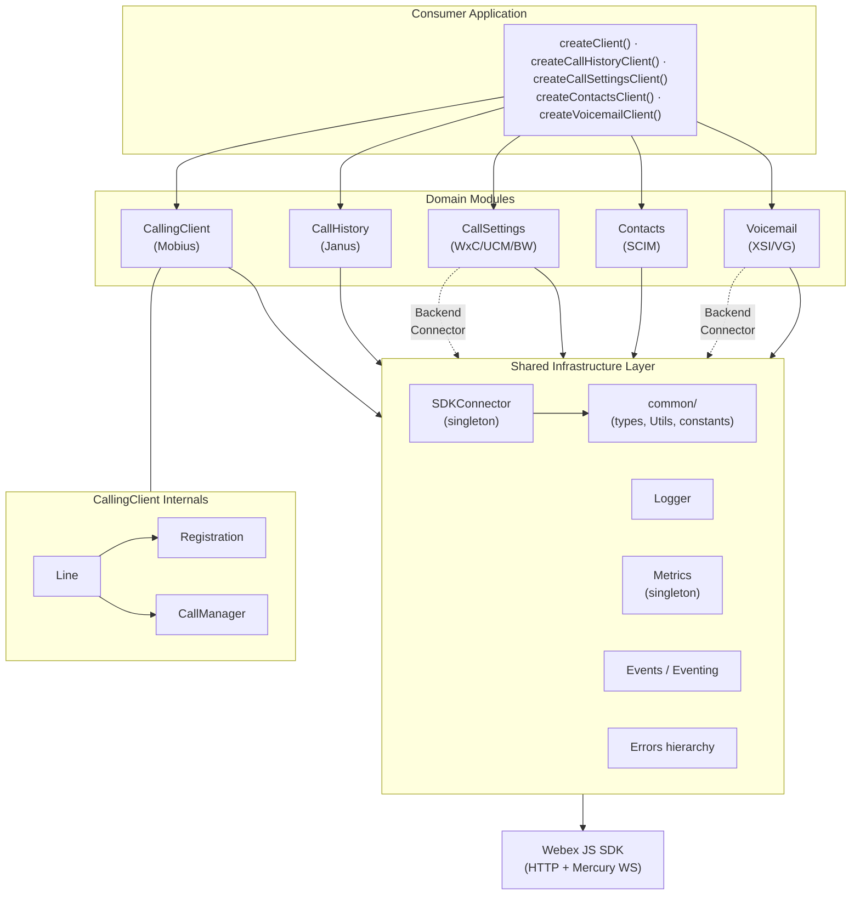
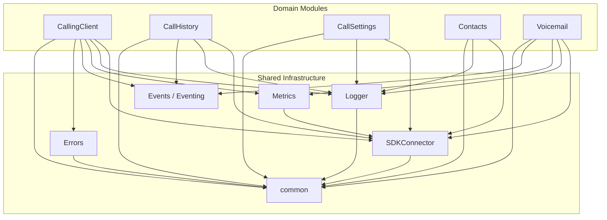
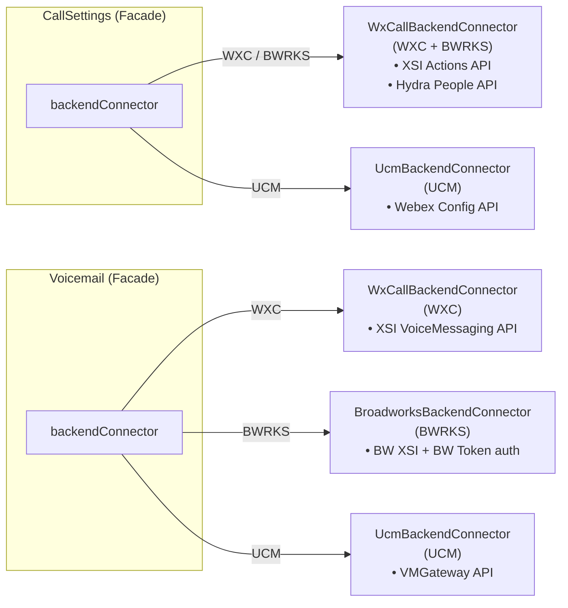
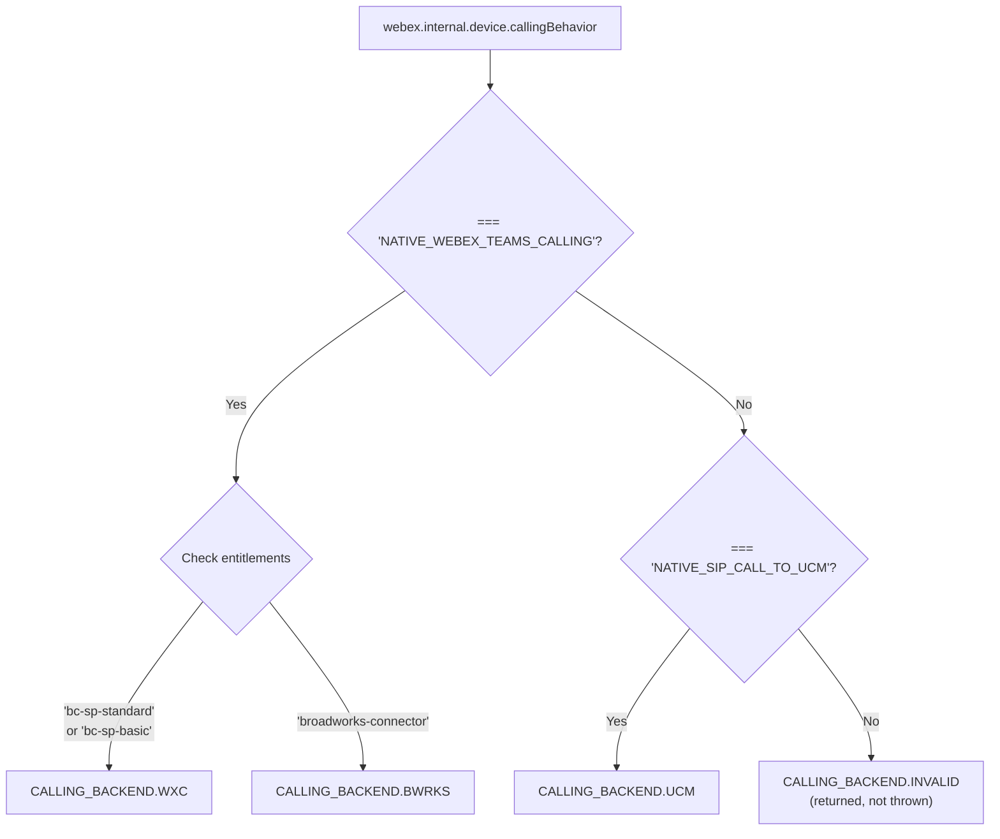

# @webex/calling — Architecture

## High-Level Architecture



---

## File Structure

```
src/
├── index.ts                    # Public exports (factory functions, interfaces, types)
├── api.ts                      # Extended exports (includes classes for internal use)
│
├── CallingClient/              # Orchestrator: registration + call control
│   ├── CallingClient.ts        # Main class, creates Lines, discovers Mobius servers
│   ├── types.ts                # ICallingClient, CallingClientConfig
│   ├── constants.ts            # Mobius URLs, timeouts, version
│   ├── calling/                # Call management sub-module
│   │   ├── call.ts             # Call class with XState FSMs
│   │   ├── callManager.ts      # CallManager singleton, WebSocket event router
│   │   ├── types.ts            # ICall interface
│   │   └── CallerId/           # Caller ID resolution
│   ├── line/                   # Line management sub-module
│   │   ├── index.ts            # Line class (registration + call bridge)
│   │   └── types.ts            # ILine, LINE_EVENTS
│   └── registration/           # Device registration sub-module
│       ├── register.ts         # Registration class (Mobius device lifecycle)
│       ├── webWorker.ts        # Keepalive Web Worker logic
│       └── types.ts            # IRegistration
│
├── CallHistory/                # Call history records (Janus API)
│   ├── CallHistory.ts          # Class extending Eventing<CallHistoryEventTypes>
│   ├── types.ts                # ICallHistory, response types
│   └── constants.ts            # Endpoints, limits
│
├── CallSettings/               # Call settings (DND, CF, CW, VM settings)
│   ├── CallSettings.ts         # Facade class — delegates to backend connector
│   ├── WxCallBackendConnector.ts  # Webex Calling / BW backend (XSI API)
│   ├── UcmBackendConnector.ts     # UCM backend (Webex API)
│   ├── types.ts                # ICallSettings, setting types
│   └── constants.ts            # Endpoints
│
├── Contacts/                   # Contacts management (contacts-service)
│   ├── ContactsClient.ts       # CRUD on contacts/groups with KMS encryption
│   ├── types.ts                # IContacts, Contact, ContactGroup
│   └── constants.ts            # SCIM schemas, endpoints
│
├── Voicemail/                  # Voicemail operations
│   ├── Voicemail.ts            # Facade class — delegates to backend connector
│   ├── WxCallBackendConnector.ts  # Webex Calling backend (XSI API)
│   ├── BroadworksBackendConnector.ts # Broadworks backend (XSI + BW token)
│   ├── UcmBackendConnector.ts     # UCM backend (VMGateway API)
│   ├── types.ts                # IVoicemail, message types
│   └── constants.ts            # Endpoints, format constants
│
├── SDKConnector/               # Webex SDK bridge (frozen singleton)
│   ├── index.ts                # SDKConnector class — set-once Webex reference
│   ├── types.ts                # ISDKConnector, WebexSDK interface
│   └── utils.ts                # validateWebex()
│
├── Logger/                     # Structured logging
│   ├── index.ts                # Log functions: log, info, warn, error, trace
│   └── types.ts                # LOGGER enum, LOGGING_LEVEL, LOG_PREFIX
│
├── Metrics/                    # Telemetry
│   ├── index.ts                # MetricManager class (singleton)
│   └── types.ts                # IMetricManager, METRIC_EVENT, METRIC_TYPE
│
├── Events/                     # Typed eventing
│   ├── impl/index.ts           # Eventing<T> base class
│   └── types.ts                # All event key enums & event type maps
│
├── Errors/                     # Error hierarchy
│   ├── index.ts                # Re-exports: CallError, LineError, CallingClientError
│   ├── types.ts                # ERROR_TYPE, ERROR_CODE, ERROR_LAYER, error object shapes
│   └── catalog/
│       ├── ExtendedError.ts    # Base error class
│       ├── CallError.ts        # Call-specific error (correlationId, errorLayer)
│       ├── LineError.ts        # Line/registration error (status: RegistrationStatus)
│       └── CallingDeviceError.ts # CallingClient-level error — class is named CallingClientError, takes status: RegistrationStatus
│
└── common/                     # Shared utilities
    ├── types.ts                # CALLING_BACKEND, HTTP_METHODS, MobiusServers, DeviceType, etc.
    ├── constants.ts            # API strings, entitlement keys, endpoint constants
    ├── Utils.ts                # Utility functions (error handlers, backend detection, SCIM, etc.)
    ├── index.ts                # Re-exports Utils
    └── testUtil.ts             # Test helpers (getTestUtilsWebex, flushPromises)
```

---

## Module Dependency Graph



---

## Backend Connector Architecture

The `CallSettings` and `Voicemail` modules use the Strategy pattern to handle three distinct calling backends through a unified interface:



### Backend Detection Logic (`getCallingBackEnd()` in `common/Utils.ts`)

The detection uses a two-level branching: first on `callingBehavior`, then on entitlements:



---

## Shared Infrastructure Details

### SDKConnector

The `SDKConnector` is a frozen singleton providing controlled access to the Webex JS SDK. All modules obtain their `webex` reference through it.

**Key behaviors:**
- `setWebex(webexInstance)`: Set-once; validates via `validateWebex()` then stores. Throws an error if called more than once.
- `getWebex()`: Returns the stored Webex SDK reference
- `registerListener<T>(event, cb)`: Proxies to `webex.internal.mercury.on(event, cb)`
- `unregisterListener(event)`: Proxies to `webex.internal.mercury.off(event)`

The `WebexSDK` interface (in `SDKConnector/types.ts`) defines the typed contract for the Webex SDK features the calling package consumes: `internal.device`, `internal.mercury`, `internal.services`, `internal.metrics`, `internal.encryption`, `people`, `credentials`, `request()`, etc.

### Logger

Module-scoped singleton with five log levels. Delegates to the Webex SDK logger (`webex.logger`) when set via `setWebexLogger()`, falling back to `console`.

All log messages include structured context: `file` and `method` fields for traceability.

### Metrics (MetricManager)

Singleton (`getMetricManager()`) that submits client metrics through `webex.internal.metrics.submitClientMetrics()`. Categories:

| Metric Event | Tags | Fields |
|---|---|---|
| Registration | action, device_id, service_indicator | device_url, mobius_url, sdk_version, tracking_id, server_type |
| Call Control | action, device_id, service_indicator | call_id, correlation_id, sdk_version |
| Media | action, device_id, service_indicator | call_id, local_sdp, remote_sdp |
| Connection | action, device_id | down_timestamp, up_timestamp |
| Voicemail | action, device_id | message_id, status_code |
| Upload Logs | action, device_id | tracking_id, feedback_id, correlation_id |

### Events (Eventing<T>)

Generic base class extending `EventEmitter` with `typed-emitter`:

```typescript
export class Eventing<T> extends (EventEmitter as { new <T>(): TypedEmitter<T> })<T> {
  on(event, listener): this;
  off(event, listener): this;
  emit(event, ...args): boolean;
}
```

Emitting logs the event name via `Logger` for observability.

### Errors

Four-class hierarchy with factory functions:

| Class | Factory | Extra Fields |
|---|---|---|
| `ExtendedError` | — | `message`, `type` (ERROR_TYPE), `context` (file/method) |
| `CallError` | `createCallError()` | `correlationId`, `errorLayer` (call_control / media) |
| `LineError` | `createLineError()` | `status` (RegistrationStatus) |
| `CallingClientError` (file: `CallingDeviceError.ts`) | `createClientError()` | `status` (RegistrationStatus) |

Error handler utilities in `common/Utils.ts`:
- `handleCallErrors(err, ...)` — maps HTTP status codes to `CallError` instances
- `handleCallingClientErrors(err, ...)` — maps HTTP status codes to `CallingClientError`
- `serviceErrorCodeHandler(err)` — generic service error mapper

### common/

| File | Purpose |
|---|---|
| `types.ts` | Shared type aliases (`CallId`, `CorrelationId`, `CallDetails`, `MobiusServers`, etc.), enums (`CALLING_BACKEND`, `HTTP_METHODS`, `SORT`, `ServiceIndicator`, `RegistrationStatus`), and complex interfaces (`IDeviceInfo`, `WebexRequestPayload`, `SCIMListResponse`) |
| `constants.ts` | String constants for API paths, entitlement names, Webex API base URLs, status messages |
| `Utils.ts` | ~1,764 lines of utility functions: backend detection (`getCallingBackEnd`), XSI endpoint resolution, UUID inference, SCIM queries, voicemail list caching, RTP stats parsing, error handlers, log upload, keepalive interval calculation |
| `testUtil.ts` | `getTestUtilsWebex()` — builds a mock Webex SDK instance; `flushPromises()`, `waitForMsecs()` |

---

## Network Communication

All HTTP traffic flows through the Webex JS SDK's `request()` method via `SDKConnector`. The SDK handles:
- OAuth token management and refresh
- Service URL catalog resolution (by service name, e.g., `mobius`, `janus`)
- Retry and circuit-breaking

Real-time events arrive through Mercury (Cisco's WebSocket service). Modules register for specific event scopes:

| Scope | Consumer | Events |
|---|---|---|
| `event:mobius` | CallManager | Call setup, progress, connect, disconnect, call info |
| `event:janus.user_recent_sessions` | CallHistory, CallingClient | New/updated call history records |
| `event:janus.user_viewed_sessions` | CallHistory | Missed call read state changes |
| `event:janus.user_sessions_deleted` | CallHistory | Deleted call records |

---

## Concurrency and Threading

- `CallingClient` uses `async-mutex` (`Mutex`) to serialize line creation and prevent duplicate registrations during concurrent initialization.
- `Registration` uses a **Web Worker** for keepalive heartbeats. The worker source is inlined as a string (`webWorkerStr.ts`) and instantiated via `Blob` URL, keeping the main thread free from timer blocking.
- `CallManager` maintains a `callCollection` map and routes WebSocket events to the correct `Call` instance by `correlationId`.

---

## Service Endpoints

| Service | Discovery | Protocol |
|---|---|---|
| **Mobius** (Call Control) | `webex.internal.services` catalog → `mobius` | REST + Mercury WS |
| **Janus** (Call History) | `webex.internal.services` catalog → `janus` | REST + Mercury WS |
| **XSI Actions** (Settings/VM) | Fetched from `organizations?callingData=true` endpoint | REST (XML) |
| **VMGateway** (UCM VM) | Fetched from `services` endpoint | REST |
| **Contacts Service** | `webex.internal.services` catalog → contacts | REST |
| **Hydra** (People API) | `webex.internal.services` catalog → `hydra` | REST |

---

## Testing Architecture

- **Runner**: Jest with `jsdom` environment
- **File convention**: Co-located `*.test.ts` files (e.g., `CallHistory.test.ts` next to `CallHistory.ts`)
- **Mocking**:
  - `getTestUtilsWebex()` in `common/testUtil.ts` provides a comprehensive mock Webex SDK
  - Module-level singletons are mocked via `jest.mock()` with `jest.fn()` stubs
  - Backend connectors have dedicated test fixture files (e.g., `callHistoryFixtures.ts`, `voicemailFixture.ts`)
- **Async patterns**: `flushPromises()` drains the microtask queue; `waitForMsecs(n)` for timer-dependent tests
- **Custom matchers**: `toBeCalledOnceWith(args)` for precise single-invocation assertions
- **Configuration**: `jest.config.js` at package root; `jest-preload.js` for global setup

---

## Troubleshooting Guide

| Symptom | Likely Cause | Investigation |
|---|---|---|
| `SDKConnector.getWebex()` returns undefined | Factory not called, or `setWebex()` called with invalid SDK | Check that `createClient()` or module factory was called before accessing other modules |
| Registration fails with 403 | Invalid/expired token, or user not entitled for calling | Verify user entitlements; check `webex.credentials` token state |
| Registration fails with 429 | Too many registration attempts | The SDK has built-in 429 retry with exponential backoff; check `Registration` retry logic |
| Keepalive failures | Network disruption or Mobius server issue | Check `Registration` logs for keepalive errors; verify Mercury connection status |
| No incoming calls | Mercury WebSocket disconnected, or line not registered | Verify `line.getStatus() === 'active'`; check Mercury connection; inspect `CallManager` listeners |
| Backend connector errors | Wrong backend detected | Log `CALLING_BACKEND` value; verify user entitlements match expected backend |
| Call state stuck | XState machine in unexpected state | Enable `trace` logging; inspect Call FSM transitions; check for unhandled events |
| Metrics not reporting | MetricManager not initialized | Ensure `getMetricManager()` was called with valid `webex` instance |
| Event listeners not firing | Wrong event key or listener registered after emission | Verify event key enum matches; register listeners before triggering actions |
